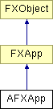

# AFXApp

该类负责提供一些高级 GUI 控制方法。

### AFXApp(appName=Abaqus/CAE, vendorName=SIMULIA, productName='', majorNumber=-1, minorNumber=-1, updateNumber=-1, prerelease=False)

构造函数。
| **参数** | **类型** | **默认值** | **描述** |
| --- | --- | --- | --- |
| appName | String | Abaqus/CAE | 应用程序注册表项。 |
| vendorName | String | SIMULIA | 供应商注册表项。 |
| productName | String | '' | 产品名称。 |
| majorNumber | Int | -1 | 版本号。 |
| minorNumber | Int | -1 | 发布号。 |
| updateNumber | Int | -1 | 更新号。 |
| prerelease | Bool | False | 官方/预发布标志。 |

### create()

为应用程序创建窗口。

从 FXApp 重新实现。

### getAFXMainWindow()

返回指向 AFXMainWindow 的指针。

### getBasePrerelease()

如果基础产品是预发布版本，则返回 True。

### getBaseProductName()

返回基础产品名称。

### getBaseVersionNumbers(majorNumber, minorNumber, updateNumber)

返回基础产品的主要、次要和更新编号。
| **参数** | **类型** | **默认值** | **描述** |
| --- | --- | --- | --- |
| majorNumber | Int |  | 版本号。 |
| minorNumber | Int |  | 发布号。 |
| updateNumber | Int |  | 更新号。 |

### getKernelInitializationCommand()

返回应用程序启动时将发出的命令字符串。

### getPrerelease()

如果是预发布版本，则返回 True。

### getProductName()

返回产品名称。

### getVersionNumbers()

返回主要、次要和更新编号。

### init(argc, argv)

初始化应用程序并连接到 kernel。
| **参数** | **类型** | **默认值** | **描述** |
| --- | --- | --- | --- |
| argc | Int |  |  |
| argv | String |  |  |

### isLocked()

如果 GUI 被锁定则返回 True，否则返回 False。

从 FXApp 重新实现。

### isProductCAE()

如果基础产品是 Abaqus/CAE，则返回 True。

### isProductViewer()

如果基础产品是 Abaqus/Viewer，则返回 True。

### isStudentEdition()

如果基础产品是学生版，则返回 True。

### lock()

锁定 GUI（在命令和模式处理期间通常使用）。

### run()

运行主应用程序事件循环，直到调用 stop()。

从 FXApp 重新实现。

### runUntil(condition)

运行事件循环直到某个标志变为非零。

从 FXApp 重新实现。
| **参数** | **类型** | **默认值** | **描述** |
| --- | --- | --- | --- |
| condition | Int |  |  |

### unlock()

解锁 GUI。

### 类标志

### **消息 ID。**

| **ID_QUERY_GUILOCK** | 用于查询 GUI 是否被锁定。 |
| --- | --- |
| **ID_SHOW_HOURGLASS** | 用于更改光标。 |

