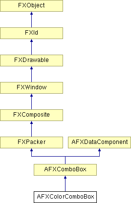

# AFXColorComboBox

该类允许用户从预定义的颜色调色板中选择颜色。

### AFXColorComboBox(p, text, tgt=None, sel=0, opts=0, x=0, y=0, w=0, h=0, pl=DEFAULT_PAD, pr=DEFAULT_PAD, pt=DEFAULT_PAD, pb=DEFAULT_PAD)

构造函数。
| **参数** | **类型** | **默认值** | **描述** |
| --- | --- | --- | --- |
| p | FXComposite |  | 父 widget。 |
| text | String |  | 标签字符串。 |
| tgt | FXObject | None | 消息目标。 |
| sel | Int | 0 | 消息 ID。 |
| opts | Int | 0 | 选项和提示。 |
| x | Int | 0 | 原点 X 坐标。 |
| y | Int | 0 | 原点 Y 坐标。 |
| w | Int | 0 | widget 的宽度。 |
| h | Int | 0 | widget 的宽度。 |
| pl | Int | DEFAULT_PAD | 左边距。 |
| pr | Int | DEFAULT_PAD | 右边距。 |
| pt | Int | DEFAULT_PAD | 顶边距。 |
| pb | Int | DEFAULT_PAD | 底边距。 |

### 全局标志

### **颜色选择器选项的标志。**

| **AFXCOLORCOMBOBOX_INCLUDE_AS_IS** | 包含"原样"颜色。 |
| --- | --- |
| **AFXCOLORCOMBOBOX_INCLUDE_DEFAULT** | 包含"默认"颜色。 |

