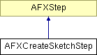

# AFXCreateSketchStep

该类用于在 GUI 过程中提供拾取步骤。

### AFXCreateSketchStep(owner, keyword, sheetSize, prompt='Create a sketch')

构造函数。
| **参数** | **类型** | **默认值** | **描述** |
| --- | --- | --- | --- |
| owner | AFXProcedure |  | 创建该步骤的过程。 |
| keyword | AFXObjectKeyword |  | 包含拾取变量的对象关键字。属于 AFXGuiCommand 的一部分。 |
| sheetSize | float |  | 创建时的草图纸张大小。 |
| prompt | String | 'Create a sketch' | 步骤的提示文本，显示在提示区域。 |

### onCancel()

当步骤被取消时调用。

从 AFXStep 重新实现。

### onExecute()

当执行 getFirstStep 和 getNextStep 返回的步骤时调用。

从 AFXStep 重新实现。

### onResume()

当步骤恢复时调用。

从 AFXStep 重新实现。

### onSuspend()

当步骤被挂起时调用。

从 AFXStep 重新实现。

