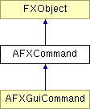

# AFXCommand

该类是 由模式处理的命令类的抽象基类。

### AFXCommand(mode, method, objectName='', registerQuery=False)

构造函数。
| **参数** | **类型** | **默认值** | **描述** |
| --- | --- | --- | --- |
| mode | AFXMode |  | 宿主模式。 |
| method | String |  | 方法。 |
| objectName | String | '' | 对象名称。 |
| registerQuery | Bool | False | 如果在为 GUI 使用命令时应注册查询，则为 True。 |

### activate()

激活命令；活动命令将在命令生成期间被处理。

### deactivate()

停用命令；非活动命令将在命令生成期间不被处理。

### getCommandString()

根据活动关键字的当前值返回命令字符串。

### getExpandedObjectName()

返回已扩展的对象名称，其中所有"%s"都被当前名称替换。

### getKeyword(name)

返回具有给定名称的关键字（如果未找到则返回 0）。
| **参数** | **类型** | **默认值** | **描述** |
| --- | --- | --- | --- |
| name | String |  | 关键字名称。 |

### getKeyword(index)

返回给定索引处的关键字（如果索引超出范围则返回 0）。
| **参数** | **类型** | **默认值** | **描述** |
| --- | --- | --- | --- |
| index | Int |  | 关键字索引（从零开始）。 |

### getMethod()

返回命令的方法。

### getNumKeywords()

返回关键字数量。

### getObjectName()

返回对象名称（未扩展，可能包含"%s"）。

### isActive()

如果命令处于活动状态，则返回 True。

### isQueryNeeded()

如果命令需要为 kernel 状态注册查询，则返回 True。

### isRequired()

如果此命令即使没有任何关键字被修改也将被发送，则返回 True，否则返回 False。

### setKeywordValuesToDefaults(ignoreUnspecified=False)

将所有关键字的值设置为其默认值。
| **参数** | **类型** | **默认值** | **描述** |
| --- | --- | --- | --- |
| ignoreUnspecified | Bool | False | 如果默认值未指定，则忽略设置值。 |

### setKeywordValuesToPrevious()

将所有关键字的值设置为其之前的值。

### setMethod(method)

设置命令的方法。
| **参数** | **类型** | **默认值** | **描述** |
| --- | --- | --- | --- |
| method | String |  | 方法。 |

### setObjectName(objectName)

设置对象名称。
| **参数** | **类型** | **默认值** | **描述** |
| --- | --- | --- | --- |
| objectName | String |  | 对象名称。 |

### setRequired(val)

将此命令设置为必需或可选；如果为 True，命令将始终被发送；如果为 False，命令将仅在其有关键字被修改或没有任何关键字时被发送。
| **参数** | **类型** | **默认值** | **描述** |
| --- | --- | --- | --- |
| val | Bool |  |  |

### syncKeywordPreviousValues()

同步所有关键字的当前值和之前的值。

### verify()

如果任何关键字包含无效数据则抛出异常。

