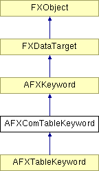

# AFXComTableKeyword

该类管理在命令中作为表格发送的值。

### AFXComTableKeyword(command, name, isRequired=False, minLength=0, maxLength=-1, opts=0)

构造函数。
| **参数** | **类型** | **默认值** | **描述** |
| --- | --- | --- | --- |
| command | AFXCommand |  | 宿主命令。 |
| name | String |  | 关键字名称。 |
| isRequired | Bool | False | 如果此关键字是必需参数，则为 True。 |
| minLength | Int | 0 | 最小（也是默认）行长度。 |
| maxLength | Int | -1 | 最大行长度（-1 表示无限制）。 |
| opts | Int | 0 | 选项。 |

### equal(index, a, b)

如果两个表格元素值比较相等，则返回 True（未使用索引）。
| **参数** | **类型** | **默认值** | **描述** |
| --- | --- | --- | --- |
| index | Int |  | 元素索引（未使用）。 |
| a | String |  | 第一个值。 |
| b | String |  | 第二个值。 |

### getColumnStyle(index)

返回列元素的样式。永远不会返回 AFXTABLE_STYLE_DEFAULT！
| **参数** | **类型** | **默认值** | **描述** |
| --- | --- | --- | --- |
| index | Int |  | 列索引。 |

### getColumnType(index)

返回列元素的类型。永远不会返回 AFXTABLE_TYPE_DEFAULT！
| **参数** | **类型** | **默认值** | **描述** |
| --- | --- | --- | --- |
| index | Int |  | 列索引。 |

### getDefaultStyle()

返回表格元素的默认样式。

### getDefaultType()

返回表格元素的默认类型。

### getDefaultValues()

返回此表格的默认值。

### getFormattedValue(row, column)

返回适合放置在命令中的表格元素的格式化值。如果元素具有 AFXTABLE_EVALUATE 样式且其内容无效，则会抛出异常。
| **参数** | **类型** | **默认值** | **描述** |
| --- | --- | --- | --- |
| row | Int |  | 行索引。 |
| column | Int |  | 列索引。 |

### getMaxNumColumns()

返回最大列数，或 -1 表示无界。

### getMinNumColumns()

返回最小列数。

### getNumColumns(row)

返回该行中的列数。
| **参数** | **类型** | **默认值** | **描述** |
| --- | --- | --- | --- |
| row | Int |  | 行索引。 |

### getNumRows()

返回表格中的行数。

### getRow(row)

返回包含表格行内容的字符串。
| **参数** | **类型** | **默认值** | **描述** |
| --- | --- | --- | --- |
| row | Int |  | 行索引。 |

### getTypeName()

返回表格关键字类型的名称。

实现 AFXKeyword。

在 AFXTableKeyword 中重新实现。

### getValue(row, column)

返回表格元素的值。
| **参数** | **类型** | **默认值** | **描述** |
| --- | --- | --- | --- |
| row | Int |  | 行索引。 |
| column | Int |  | 列索引。 |

### getValueAsDouble()

以浮点数返回关键字的值；失败时返回 False。

### getValueAsInt()

以整数返回关键字的值；失败时返回 False。

### getValueAsString()

返回表示命令中当前关键字值的格式化字符串。

实现 AFXKeyword。

### getValueForBlank(column)

返回该列空白替换的元素值。
| **参数** | **类型** | **默认值** | **描述** |
| --- | --- | --- | --- |
| column | Int |  | 列索引。 |

### getValues()

返回包含元组元素值的字符串。由用户输入。

### getValuesForBlanks()

返回所有表格列空白替换值的字符串。

### insertColumns(index, numColumns)

从给定索引开始插入列。
| **参数** | **类型** | **默认值** | **描述** |
| --- | --- | --- | --- |
| index | Int |  | 起始索引。 |
| numColumns | Int |  | 要插入的列数。 |

### insertRows(index, numRows)

从给定索引开始插入行。
| **参数** | **类型** | **默认值** | **描述** |
| --- | --- | --- | --- |
| index | Int |  | 起始索引。 |
| numRows | Int |  | 要插入的行数。 |

### isValueChanged()

如果关键字值与其之前的值不同，则返回 True。

实现 AFXKeyword。

### removeColumns(index, numColumns)

从给定索引开始移除列。
| **参数** | **类型** | **默认值** | **描述** |
| --- | --- | --- | --- |
| index | Int |  | 起始索引。 |
| numColumns | Int |  | 要移除的列数。 |

### removeRows(index, numRows)

从给定索引开始移除行。
| **参数** | **类型** | **默认值** | **描述** |
| --- | --- | --- | --- |
| index | Int |  | 起始索引。 |
| numRows | Int |  | 要移除的行数。 |

### setColumnStyle(index, style)

设置列元素的样式。
| **参数** | **类型** | **默认值** | **描述** |
| --- | --- | --- | --- |
| index | Int |  | 列索引。 |
| style | Int |  | 新列样式。 |

### setColumnType(index, type)

设置列元素的类型。
| **参数** | **类型** | **默认值** | **描述** |
| --- | --- | --- | --- |
| index | Int |  | 列索引。 |
| type | Int |  | 新列类型。 |

### setDefaultStyle(style)

设置表格元素的默认样式。
| **参数** | **类型** | **默认值** | **描述** |
| --- | --- | --- | --- |
| style | Int |  | 新默认样式。 |

### setDefaultType(type)

设置表格元素的默认类型。
| **参数** | **类型** | **默认值** | **描述** |
| --- | --- | --- | --- |
| type | Int |  | 新默认类型。 |

### setDefaultValues(values)

设置此表格的默认值。
| **参数** | **类型** | **默认值** | **描述** |
| --- | --- | --- | --- |
| values | String |  | 带默认值的序列字符串。 |

### setMaxNumColumns(length)

设置最大列数。
| **参数** | **类型** | **默认值** | **描述** |
| --- | --- | --- | --- |
| length | Int |  | 新最大列数，或 -1 表示无界。 |

### setMinNumColumns(length)

设置最小列数。
| **参数** | **类型** | **默认值** | **描述** |
| --- | --- | --- | --- |
| length | Int |  | 新最小长度。 |

### setNumColumnsRange(minLength, maxLength)

设置列数的允许范围。
| **参数** | **类型** | **默认值** | **描述** |
| --- | --- | --- | --- |
| minLength | Int |  | 新最小列数。 |
| maxLength | Int |  | 新最大列数，或 -1 表示无界。 |

### setRow(row, seq)

设置表格行的内容。
| **参数** | **类型** | **默认值** | **描述** |
| --- | --- | --- | --- |
| row | Int |  | 行索引。 |
| seq | String |  | 带元素的序列。 |

### setValue(row, column, value)

设置表格元素的值。
| **参数** | **类型** | **默认值** | **描述** |
| --- | --- | --- | --- |
| row | Int |  | 行索引。 |
| column | Int |  | 列索引。 |
| value | String |  | 新值。 |

### setValueForBlank(column, value)

设置该列空白替换的元素值。
| **参数** | **类型** | **默认值** | **描述** |
| --- | --- | --- | --- |
| column | Int |  | 列索引。 |
| value | String |  | 新值。 |

### setValues(values)

设置所有表格元素的值。
| **参数** | **类型** | **默认值** | **描述** |
| --- | --- | --- | --- |
| values | String |  | 带新值的表格字符串。 |

### setValuesForBlanks(values)

设置所有表格列空白替换的值。
| **参数** | **类型** | **默认值** | **描述** |
| --- | --- | --- | --- |
| values | String |  | 包含逗号分隔值的字符串。 |

### setValueToDefault(ignoreUnspecified=False)

将关键字值设置为其默认值。
| **参数** | **类型** | **默认值** | **描述** |
| --- | --- | --- | --- |
| ignoreUnspecified | Bool | False | 如果默认值是未指定的值，是否应忽略。 |

### setValueToPrevious()

将关键字值设置为其之前的值。

实现 AFXKeyword。

### syncPreviousValue()

将关键字之前的值设置为其当前值。

实现 AFXKeyword。

### 类标志

### **消息 ID。**

| **ID_TABLE** | AFXTable widgets 的 ID。 |
| --- | --- |
| **ID_VALUE** | 交换数组字符串的 widgets 的 ID。 |
| **ID_PRINTSNIPPET** | 用于调试。 |

### 全局标志

### **表格选项的标志。**

| **AFXTABLE_TYPE_ANY** | 接受任何类型。 |
| --- | --- |
| **AFXTABLE_TYPE_DEFAULT** | 列类型与表格默认类型相同。 |
| **AFXTABLE_TYPE_INT** | 列存储整数。 |
| **AFXTABLE_TYPE_FLOAT** | 列存储浮点数。 |
| **AFXTABLE_TYPE_STRING** | 列存储字符串值。 |
| **AFXTABLE_TYPE_BOOL** | 列存储 True 或 False。 |
| **AFXTABLE_TYPE_MASK** | 列类型的掩码。 |
| **AFXTABLE_ALLOW_EMPTY** | 允许列元素的空值。 |
| **AFXTABLE_DEFAULT_IF_EMPTY** | 始终用默认值替换空值。 |
| **AFXTABLE_EVALUATE** | 求值整数和浮点元素。 |
| **AFXTABLE_STYLE_DEFAULT** | 使用表格默认列样式。 |
| **AFXTABLE_STYLE_MASK** | 列样式的掩码。 |

