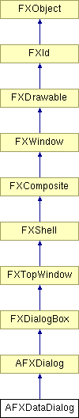

# AFXDataDialog

该类是所有数据对话框的基类，数据对话框从用户收集数据，通常与模式协作来处理数据。

### AFXDataDialog(mode, title, actionButtonIds=0, opts=DIALOG_NORMAL, x=0, y=0, w=0, h=0)

创建遮挡主窗口的对话框的构造函数。
| **参数** | **类型** | **默认值** | **描述** |
| --- | --- | --- | --- |
| mode | AFXGuiMode |  | 宿主模式。 |
| title | String |  | 标题字符串。 |
| actionButtonIds | Int | 0 | 要创建的操作按钮的 ID。 |
| opts | Int | DIALOG_NORMAL | 选项和提示。 |
| x | Int | 0 | 原点 X 坐标。 |
| y | Int | 0 | 原点 Y 坐标。 |
| w | Int | 0 | widget 的宽度。 |
| h | Int | 0 | widget 的高度。 |

### AFXDataDialog(mode, owner, title, actionButtonIds=0, opts=DIALOG_NORMAL, x=0, y=0, w=0, h=0)

创建遮挡其所有者 widget 的对话框的构造函数。
| **参数** | **类型** | **默认值** | **描述** |
| --- | --- | --- | --- |
| mode | AFXGuiMode |  | 宿主模式。 |
| owner | FXWindow |  | 所有者 widget。 |
| title | String |  | 标题字符串。 |
| actionButtonIds | Int | 0 | 要创建的操作按钮的 ID。 |
| opts | Int | DIALOG_NORMAL | 选项和提示。 |
| x | Int | 0 | 原点 X 坐标。 |
| y | Int | 0 | 原点 Y 坐标。 |
| w | Int | 0 | widget 的宽度。 |
| h | Int | 0 | widget 的高度。 |

### addTransition(target, op, value, tgt, sel, ptr=None)

向对话框添加有限状态转换。当表达式"target.getValue() op value"求值为 True 时，将向 tgt 对象发送 sel 消息。
| **参数** | **类型** | **默认值** | **描述** |
| --- | --- | --- | --- |
| target | AFXIntTarget |  | 目标。 |
| op | AFXTransition::Operator |  | 运算符类型。 |
| value | Int |  | 参考值。 |
| tgt | FXObject |  | 消息目标。 |
| sel | Int |  | 消息选择器。 |
| ptr | String | None | 消息数据。 |

### addTransition(target, op, value, tgt, sel, ptr=None)

向对话框添加有限状态转换。当表达式"target.getValue() op value"求值为 True 时，将向 tgt 对象发送 sel 消息。
| **参数** | **类型** | **默认值** | **描述** |
| --- | --- | --- | --- |
| target | AFXFloatTarget |  | 目标。 |
| op | AFXTransition::Operator |  | 运算符类型。 |
| value | Float |  | 参考值。 |
| tgt | FXObject |  | 消息目标。 |
| sel | Int |  | 消息选择器。 |
| ptr | String | None | 消息数据。 |

### addTransition(keyword, op, value, tgt, sel, ptr=None)

向对话框添加有限状态转换。当表达式"keyword.getValue() op value"求值为 True 时，将向 tgt 对象发送 sel 消息。
| **参数** | **类型** | **默认值** | **描述** |
| --- | --- | --- | --- |
| keyword | AFXTogglableKeyword |  | 关键字。 |
| op | AFXTransition::Operator |  | 运算符类型。 |
| value | Int |  | 参考值。 |
| tgt | FXObject |  | 消息目标。 |
| sel | Int |  | 消息选择器。 |
| ptr | String | None | 消息数据。 |

### addTransition(keyword, op, value, tgt, sel, ptr=None)

向对话框添加有限状态转换。当表达式"keyword.getValue() op value"求值为 True 时，将向 tgt 对象发送 sel 消息。
| **参数** | **类型** | **默认值** | **描述** |
| --- | --- | --- | --- |
| keyword | AFXIntKeyword |  | 关键字。 |
| op | AFXTransition::Operator |  | 运算符类型。 |
| value | Int |  | 参考值。 |
| tgt | FXObject |  | 消息目标。 |
| sel | Int |  | 消息选择器。 |
| ptr | String | None | 消息数据。 |

### addTransition(keyword, op, value, tgt, sel, ptr=None)

向对话框添加有限状态转换。当表达式"keyword.getValue() op value"求值为 True 时，将向 tgt 对象发送 sel 消息。
| **参数** | **类型** | **默认值** | **描述** |
| --- | --- | --- | --- |
| keyword | AFXFloatKeyword |  | 关键字。 |
| op | AFXTransition::Operator |  | 运算符类型。 |
| value | Float |  | 参考值。 |
| tgt | FXObject |  | 消息目标。 |
| sel | Int |  | 消息选择器。 |
| ptr | String | None | 消息数据。 |

### addTransition(keyword, op, value, tgt, sel, ptr=None)

向对话框添加有限状态转换。当表达式"keyword.getValue() op value"求值为 True 时，将向 tgt 对象发送 sel 消息。
| **参数** | **类型** | **默认值** | **描述** |
| --- | --- | --- | --- |
| keyword | AFXBoolKeyword |  | 关键字。 |
| op | AFXTransition::Operator |  | 运算符类型。 |
| value | Bool |  | 参考值。 |
| tgt | FXObject |  | 消息目标。 |
| sel | Int |  | 消息选择器。 |
| ptr | String | None | 消息数据。 |

### bailout()

执行检查以确定是否可以取消对话框。此类的实现始终返回 True，派生类应重新实现此方法以执行特定检查。

从 AFXDialog 重新实现。

### getMode()

返回对话框的宿主模式。

### onKeywordError(kwd)

处理给定关键字或目标包含无效内容时发生的错误。此方法将选择为该关键字或目标设置的 widget 内容（通过 setWidgetForKeyword()）。如果未明确指定此类 widget，它将选择以该关键字或目标作为其消息目标的 widget 内容。
| **参数** | **类型** | **默认值** | **描述** |
| --- | --- | --- | --- |
| kwd | FXObject |  | 包含无效内容的对象。 |

### onTableError(tableKwd, row, col)

处理给定表格关键字或目标包含无效元素时发生的错误。此方法将选择为该关键字或目标的元素设置的 widget 内容（通过 setWidgetForKeyword()）。如果未明确指定此类 widget，它将选择以该关键字或目标作为其消息目标的 widget 内容。
| **参数** | **类型** | **默认值** | **描述** |
| --- | --- | --- | --- |
| tableKwd | FXObject |  | 包含无效元素的对象。 |
| row | Int |  | 行索引。 |
| col | Int |  | 列索引。 |

### onTupleError(tupleKwd, index)

处理给定元组关键字或目标包含无效元素时发生的错误。此方法将选择为该关键字或目标的元素设置的 widget 内容（通过 setWidgetForKeyword()）。如果未明确指定此类 widget，它将选择以该关键字或目标作为其消息目标的 widget 内容。
| **参数** | **类型** | **默认值** | **描述** |
| --- | --- | --- | --- |
| tupleKwd | FXObject |  | 包含无效元素的对象。 |
| index | Int |  | 元素索引。 |

### processUpdates()

在 GUI 更新周期期间执行状态处理。此类提供了此方法的空实现，如果派生类需要处理状态更新，应重新定义此方法。

### 类标志

### **消息 ID。**

| **ID_UPDATE_STATE** | 用于更新状态。 |
| --- | --- |

### 全局标志

### **数据对话框选项的标志。**

| **DATADIALOG_BAILOUT** | 单击"取消"按钮时执行 bailout 检查。 |
| --- | --- |

