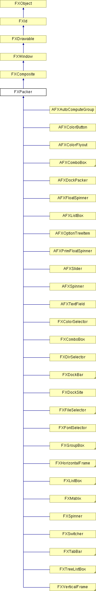

# FXPacker

Packer 是一个布局管理器，它自动将其区域内的子窗口放置在左侧、右侧、顶部或底部。每次放置子窗口时，剩余空间会减少子窗口所占用的空间量。子窗口放置的侧面由子窗口给出的 LAYOUT_SIDE_TOP、LAYOUT_SIDE_BOTTOM、LAYOUT_SIDE_LEFT 和 LAYOUT_SIDE_RIGHT 提示决定。其他来自子窗口的布局提示会被尽可能地遵循。例如，放置在右侧边缘的子窗口仍然可以具有 LAYOUT_FILL_Y 或 LAYOUT_TOP 等属性。最后一个子窗口可能同时具有 LAYOUT_FILL_X 和 LAYOUT_FILL_Y，在这种情况下，它将被放置以占据所有剩余空间。

### FXPacker(p, opts=0, x=0, y=0, w=0, h=0, pl=DEFAULT_SPACING, pr=DEFAULT_SPACING, pt=DEFAULT_SPACING, pb=DEFAULT_SPACING, hs=DEFAULT_SPACING, vs=DEFAULT_SPACING)

构造 packer 布局管理器。
| **参数** | **类型** | **默认值** | **描述** |
| --- | --- | --- | --- |
| p | FXComposite |  |  |
| opts | Int | 0 |  |
| x | Int | 0 |  |
| y | Int | 0 |  |
| w | Int | 0 |  |
| h | Int | 0 |  |
| pl | Int | DEFAULT_SPACING |  |
| pr | Int | DEFAULT_SPACING |  |
| pt | Int | DEFAULT_SPACING |  |
| pb | Int | DEFAULT_SPACING |  |
| hs | Int | DEFAULT_SPACING |  |
| vs | Int | DEFAULT_SPACING |  |

### getBaseColor()

获取基本 GUI 颜色。

### getBorderColor()

获取边框颜色。

### getBorderWidth()

获取边框宽度。

### getDefaultHeight()

返回默认高度。

从 FXComposite 重新实现。

在 FXComboBox、FXDockSite、FXGroupBox、FXHorizontalFrame、FXListBox、FXMatrix、FXSpinner、FXStatusbar、FXSwitcher、FXTabBar、FXTabBook、FXToolbar、FXTreeListBox、FXVerticalFrame、AFXToolbarGroup、AFXPrimFloatSpinner、AFXSlider 和 AFXVerticalAligner 中重新实现。

### getDefaultWidth()

返回默认宽度。

从 FXComposite 重新实现。

在 FXComboBox、FXDockSite、FXGroupBox、FXHorizontalFrame、FXListBox、FXMatrix、FXSpinner、FXStatusbar、FXSwitcher、FXTabBar、FXToolbar、FXTreeListBox、FXVerticalFrame、AFXToolbarGroup、AFXOptionTreeItem、AFXPrimFloatSpinner、AFXSlider、AFXTextField 和 AFXVerticalAligner 中重新实现。

### getFrameStyle()

获取当前框架样式。

### getHiliteColor()

获取高亮颜色。

### getHSpacing()

返回当前子窗口间水平间距。

### getPackingHints()

返回打包提示。

### getPadBottom()

获取底部内部填充。

### getPadLeft()

获取左侧内部填充。

### getPadRight()

获取右侧内部填充。

### getPadTop()

获取顶部内部填充。

### getShadowColor()

获取阴影颜色。

### getVSpacing()

返回当前子窗口间垂直间距。

### setBaseColor(clr)

更改基本 GUI 颜色。
| **参数** | **类型** | **默认值** | **描述** |
| --- | --- | --- | --- |
| clr | FXColor |  |  |

### setBorderColor(clr)

更改边框颜色。
| **参数** | **类型** | **默认值** | **描述** |
| --- | --- | --- | --- |
| clr | FXColor |  |  |

### setFrameStyle(style)

更改框架样式。
| **参数** | **类型** | **默认值** | **描述** |
| --- | --- | --- | --- |
| style | Int |  |  |

### setHiliteColor(clr)

更改高亮颜色。
| **参数** | **类型** | **默认值** | **描述** |
| --- | --- | --- | --- |
| clr | FXColor |  |  |

### setHSpacing(hs)

更改水平子窗口间间距。
| **参数** | **类型** | **默认值** | **描述** |
| --- | --- | --- | --- |
| hs | Int |  |  |

### setPackingHints(ph)

更改打包提示。
| **参数** | **类型** | **默认值** | **描述** |
| --- | --- | --- | --- |
| ph | Int |  |  |

### setPadBottom(pb)

更改底部填充。
| **参数** | **类型** | **默认值** | **描述** |
| --- | --- | --- | --- |
| pb | Int |  |  |

### setPadLeft(pl)

更改左侧填充。
| **参数** | **类型** | **默认值** | **描述** |
| --- | --- | --- | --- |
| pl | Int |  |  |

### setPadRight(pr)

更改右侧填充。
| **参数** | **类型** | **默认值** | **描述** |
| --- | --- | --- | --- |
| pr | Int |  |  |

### setPadTop(pt)

更改顶部填充。
| **参数** | **类型** | **默认值** | **描述** |
| --- | --- | --- | --- |
| pt | Int |  |  |

### setShadowColor(clr)

更改阴影颜色。
| **参数** | **类型** | **默认值** | **描述** |
| --- | --- | --- | --- |
| clr | FXColor |  |  |

### setVSpacing(vs)

更改垂直子窗口间间距。
| **参数** | **类型** | **默认值** | **描述** |
| --- | --- | --- | --- |
| vs | Int |  |  |

