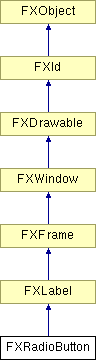

# FXRadioButton

单选按钮是一种三态按钮。通常，它可以是 True 或 False；第三种状态 MAYBE 可用于表示用户尚未做出选择，或状态不明确。当按下单选按钮时，它将其状态设置为 True 并向目标发送 SEL_COMMAND，消息数据设置为单选按钮的状态，类型为 FXbool。如果单选按钮包含在组框中，组框中的其他单选按钮将被设置为 False 并也会发送消息。

### FXRadioButton(p, text, tgt=None, sel=0, opts=RADIOBUTTON_NORMAL, x=0, y=0, w=0, h=0, pl=DEFAULT_PAD, pr=DEFAULT_PAD, pt=DEFAULT_PAD, pb=DEFAULT_PAD)

构造新的单选按钮。
| **参数** | **类型** | **默认值** | **描述** |
| --- | --- | --- | --- |
| p | FXComposite |  |  |
| text | String |  |  |
| tgt | FXObject | None |  |
| sel | Int | 0 |  |
| opts | Int | RADIOBUTTON_NORMAL |  |
| x | Int | 0 |  |
| y | Int | 0 |  |
| w | Int | 0 |  |
| h | Int | 0 |  |
| pl | Int | DEFAULT_PAD |  |
| pr | Int | DEFAULT_PAD |  |
| pt | Int | DEFAULT_PAD |  |
| pb | Int | DEFAULT_PAD |  |

### canFocus()

返回 True，因为单选按钮可以接收焦点。

从 FXWindow 重新实现。

### getCheck()

获取单选按钮状态（True、False 或 MAYBE）。

### getDefaultHeight()

获取默认高度。

从 FXLabel 重新实现。

### getDefaultWidth()

获取默认宽度。

从 FXLabel 重新实现。

### setCheck(s=True)

设置单选按钮状态（True、False 或 MAYBE）。
| **参数** | **类型** | **默认值** | **描述** |
| --- | --- | --- | --- |
| s | Bool | True |  |

### 全局标志

### **RadioButton 标志**

| **RADIOBUTTON_AUTOGRAY** | 在未更新时自动变灰。 |
| --- | --- |
| **RADIOBUTTON_AUTOHIDE** | 在未更新时自动隐藏。 |

