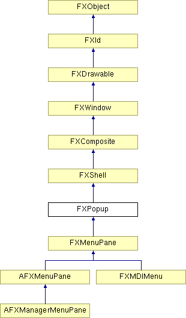

# FXPopup

弹出窗口。

### FXPopup(owner, opts=POPUP_VERTICAL| FRAME_RAISED| FRAME_THICK, x=0, y=0, w=0, h=0)

构造弹出面板。
| **参数** | **类型** | **默认值** | **描述** |
| --- | --- | --- | --- |
| owner | FXWindow |  |  |
| opts | Int | POPUP_VERTICAL| FRAME_RAISED| FRAME_THICK |  |
| x | Int | 0 |  |
| y | Int | 0 |  |
| w | Int | 0 |  |
| h | Int | 0 |  |

### getBaseColor()

返回基本颜色。

### getBorderColor()

返回边框颜色。

### getBorderWidth()

返回边框宽度。

### getDefaultHeight()

返回此窗口的默认高度。

从 FXComposite 重新实现。

### getDefaultWidth()

返回此窗口的默认宽度。

从 FXComposite 重新实现。

### getFrameStyle()

返回框架样式。

### getGrabOwner()

返回当前捕获所有者。

### getHiliteColor()

返回高亮颜色。

### getOrientation()

返回弹出方向。

### getShadowColor()

返回阴影颜色。

### getShrinkWrap()

返回收缩包装模式。

### popdown()

弹出菜单。

### popup(grabto, x, y, w=0, h=0)

弹出菜单并捕获到给定所有者。
| **参数** | **类型** | **默认值** | **描述** |
| --- | --- | --- | --- |
| grabto | FXWindow |  |  |
| x | Int |  |  |
| y | Int |  |  |
| w | Int | 0 |  |
| h | Int | 0 |  |

### setBaseColor(clr)

更改基本颜色。
| **参数** | **类型** | **默认值** | **描述** |
| --- | --- | --- | --- |
| clr | FXColor |  |  |

### setBorderColor(clr)

更改边框颜色。
| **参数** | **类型** | **默认值** | **描述** |
| --- | --- | --- | --- |
| clr | FXColor |  |  |

### setFrameStyle(style)

更改框架样式。
| **参数** | **类型** | **默认值** | **描述** |
| --- | --- | --- | --- |
| style | Int |  |  |

### setHiliteColor(clr)

更改高亮颜色。
| **参数** | **类型** | **默认值** | **描述** |
| --- | --- | --- | --- |
| clr | FXColor |  |  |

### setOrientation(orient)

更改弹出方向。
| **参数** | **类型** | **默认值** | **描述** |
| --- | --- | --- | --- |
| orient | Int |  |  |

### setShadowColor(clr)

更改阴影颜色。
| **参数** | **类型** | **默认值** | **描述** |
| --- | --- | --- | --- |
| clr | FXColor |  |  |

### setShrinkWrap(sw)

更改收缩包装模式。
| **参数** | **类型** | **默认值** | **描述** |
| --- | --- | --- | --- |
| sw | Bool |  |  |

### 全局标志

### **弹出窗口内部方向**

| **POPUP_VERTICAL** | 垂直方向。 |
| --- | --- |
| **POPUP_HORIZONTAL** | 水平方向。 |
| **POPUP_SHRINKWRAP** | 收缩包装到内容。 |

