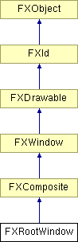

# FXRootWindow

根窗口。

### FXRootWindow(a, vis)

构造根窗口。
| **参数** | **类型** | **默认值** | **描述** |
| --- | --- | --- | --- |
| a | FXApp |  |  |
| vis | FXVisual |  |  |

### create()

根窗口不需要创建。

从 FXComposite 重新实现。

### destroy()

根窗口不能被销毁。

从 FXComposite 重新实现。

### detach()

根窗口不能被分离。

从 FXComposite 重新实现。

### getDefaultHeight()

返回根窗口的高度。

从 FXComposite 重新实现。

### getDefaultWidth()

返回根窗口的宽度。

从 FXComposite 重新实现。

### move(x, y)

根窗口不能被移动。

从 FXWindow 重新实现。
| **参数** | **类型** | **默认值** | **描述** |
| --- | --- | --- | --- |
| x | Int |  |  |
| y | Int |  |  |

### position(x, y, w, h)

根窗口不能被定位。

从 FXWindow 重新实现。
| **参数** | **类型** | **默认值** | **描述** |
| --- | --- | --- | --- |
| x | Int |  |  |
| y | Int |  |  |
| w | Int |  |  |
| h | Int |  |  |

### recalc()

无操作。

从 FXWindow 重新实现。

### resize(w, h)

根窗口不能调整大小。

从 FXWindow 重新实现。
| **参数** | **类型** | **默认值** | **描述** |
| --- | --- | --- | --- |
| w | Int |  |  |
| h | Int |  |  |

