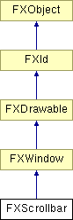

# FXScrollbar

当文档的内容可能超出可见区域时使用滚动条。范围是文档的总大小，页面是文档中可见的部分。滚动条滑块的大小会调整以反馈每个的相对大小。滚动条可以通过左鼠标（正常滚动）、右鼠标（游标或精细滚动）或中鼠标（与左鼠标相同，只是滚动位置可以跳转到点击的位置）进行操作。最后，如果鼠标有滚轮，滚动条也可以通过鼠标滚轮进行操作。在滚轮移动时按住 Control 键会使滚动比正常更快。在滚动滚动条时，会向目标发送类型为 SEL_CHANGED 的消息，消息数据将反映类型为 FXint 的当前位置。在交互结束时，滚动条将发送类型为 SEL_COMMAND 的消息以通知目标最终位置。

### FXScrollbar(p, tgt=None, sel=0, opts=SCROLLBAR_VERTICAL, x=0, y=0, w=0, h=0)

构造滚动条。
| **参数** | **类型** | **默认值** | **描述** |
| --- | --- | --- | --- |
| p | FXComposite |  |  |
| tgt | FXObject | None |  |
| sel | Int | 0 |  |
| opts | Int | SCROLLBAR_VERTICAL |  |
| x | Int | 0 |  |
| y | Int | 0 |  |
| w | Int | 0 |  |
| h | Int | 0 |  |

### getBorderColor()

更改边框颜色。

### getDefaultHeight()

返回默认高度。

从 FXWindow 重新实现。

### getDefaultWidth()

返回默认宽度。

从 FXWindow 重新实现。

### getHiliteColor()

返回高亮颜色。

### getLine()

返回行增量。

### getPage()

返回页面大小。

### getPosition()

返回滚动位置。

### getRange()

返回内容大小范围。

### getScrollbarStyle()

更改滚动条样式。

### getShadowColor()

返回阴影颜色。

### setBorderColor(clr)

返回边框颜色。
| **参数** | **类型** | **默认值** | **描述** |
| --- | --- | --- | --- |
| clr | FXColor |  |  |

### setHiliteColor(clr)

更改高亮颜色。
| **参数** | **类型** | **默认值** | **描述** |
| --- | --- | --- | --- |
| clr | FXColor |  |  |

### setLine(l)

设置行的滚动增量。
| **参数** | **类型** | **默认值** | **描述** |
| --- | --- | --- | --- |
| l | Int |  |  |

### setPage(p)

设置视口页面大小。
| **参数** | **类型** | **默认值** | **描述** |
| --- | --- | --- | --- |
| p | Int |  |  |

### setPosition(p, notifyTgt=False)

更改当前滚动位置。
| **参数** | **类型** | **默认值** | **描述** |
| --- | --- | --- | --- |
| p | Int |  |  |
| notifyTgt | Bool | False |  |

### setRange(r)

设置内容大小范围。
| **参数** | **类型** | **默认值** | **描述** |
| --- | --- | --- | --- |
| r | Int |  |  |

### setScrollbarStyle(style)

获取当前滚动条样式。
| **参数** | **类型** | **默认值** | **描述** |
| --- | --- | --- | --- |
| style | Int |  |  |

### setShadowColor(clr)

更改阴影颜色。
| **参数** | **类型** | **默认值** | **描述** |
| --- | --- | --- | --- |
| clr | FXColor |  |  |

### 全局标志

### **滚动条样式**

| **SCROLLBAR_HORIZONTAL** | 水平方向。 |
| --- | --- |
| **SCROLLBAR_VERTICAL** | 垂直方向。 |

