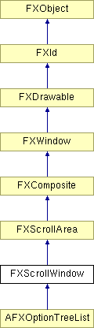

# FXScrollWindow

滚动窗口组件用于滚动任意的子窗口。当用户界面的某些部分需要滚动时（例如当应用程序需要在小屏幕上运行时），可以使用滚动窗口。

### FXScrollWindow(p, opts=0, x=0, y=0, w=0, h=0)

构造一个滚动窗口。
| **参数** | **类型** | **默认值** | **描述** |
| --- | --- | --- | --- |
| p | FXComposite |  |  |
| opts | Int | 0 |  |
| x | Int | 0 |  |
| y | Int | 0 |  |
| w | Int | 0 |  |
| h | Int | 0 |  |

### contentWindow()

返回指向内容窗口的指针。

### create()

创建服务器端资源。

从 FXComposite 重新实现。

### getContentHeight()

返回内容的高度。

从 FXScrollArea 重新实现。

在 AFXOptionTreeList 中重新实现。

### getContentWidth()

返回内容的宽度。

从 FXScrollArea 重新实现。

在 AFXOptionTreeList 中重新实现。

### moveContents(x, y)

将内容移动到指定位置。

从 FXScrollArea 重新实现。

在 AFXOptionTreeList 中重新实现。
| **参数** | **类型** | **默认值** | **描述** |
| --- | --- | --- | --- |
| x | Int |  |  |
| y | Int |  |  |

