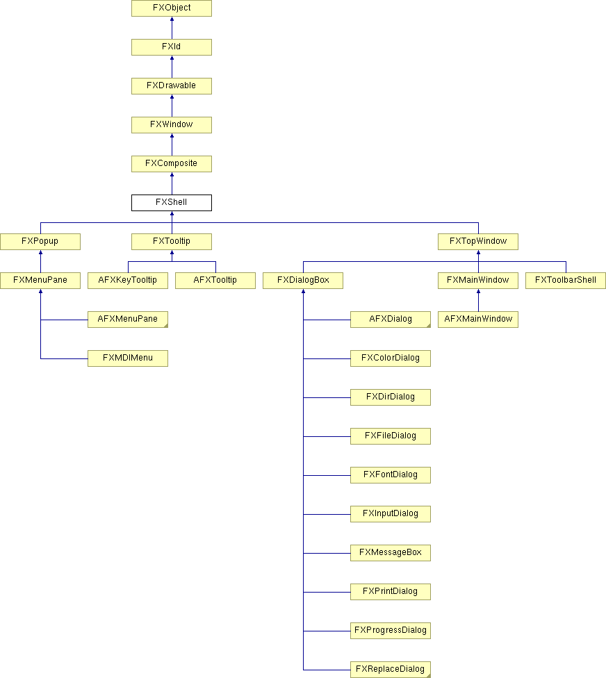

# FXShell

根窗口的子窗口。

### create()

创建服务器端资源。

从 FXComposite 重新实现。

在 FXPrintDialog、FXToolbarShell、FXTooltip、FXTopWindow、AFXManagerMenuPane、AFXMainWindow 和 AFXDialog 中重新实现。

### recalc()

将此窗口的布局标记为脏。

从 FXWindow 重新实现。

