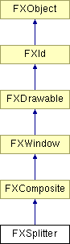

# FXSplitter

分裂器窗口用于交互式地重新划分两个或多个子面板的空间。空间可以水平或垂直细分。当分裂器本身调整大小时，最右侧（最底部）的子窗口将被调整大小，除非分裂器窗口是反向的；如果分裂器是反向的，则最左侧（最顶部）的子窗口将被调整大小而不是。分裂器组件在调整面板大小时向其目标发送 SEL_CHANGED；在调整交互结束时，它发送 SEL_COMMAND 以表示调整操作完成。正常情况下，子窗口可以从0开始调整大小；但是，如果在水平方向的分裂器中，子窗口具有 LAYOUT_FILL_X 与 LAYOUT_FIX_WIDTH 的组合，则它不会缩小到其默认宽度以下，除非该子窗口是最后一个可见组件（或者当 SPLITTER_REVERSED 选项传递给分裂器时是第一个可见组件）。在垂直方向的分裂器中，具有 LAYOUT_FILL_Y 和 LAYOUT_FIX_HEIGHT 的子窗口的行为类似。这些选项仅影响交互式调整大小。

### FXSplitter(p, opts=SPLITTER_NORMAL, x=0, y=0, w=0, h=0)

构造新的分裂器组件。
| **参数** | **类型** | **默认值** | **描述** |
| --- | --- | --- | --- |
| p | FXComposite |  |  |
| opts | Int | SPLITTER_NORMAL |  |
| x | Int | 0 |  |
| y | Int | 0 |  |
| w | Int | 0 |  |
| h | Int | 0 |  |

### FXSplitter(p, tgt, sel, opts=SPLITTER_NORMAL, x=0, y=0, w=0, h=0)

构造新的分裂器组件，它将通知目标关于大小的变化。
| **参数** | **类型** | **默认值** | **描述** |
| --- | --- | --- | --- |
| p | FXComposite |  |  |
| tgt | FXObject |  |  |
| sel | Int |  |  |
| opts | Int | SPLITTER_NORMAL |  |
| x | Int | 0 |  |
| y | Int | 0 |  |
| w | Int | 0 |  |
| h | Int | 0 |  |

### getDefaultHeight()

获取默认高度。

从 FXComposite 重新实现。

### getDefaultWidth()

获取默认宽度。

从 FXComposite 重新实现。

### getSplitterStyle()

返回当前分裂器样式。

### setSplitterStyle(style)

更改分裂器样式。
| **参数** | **类型** | **默认值** | **描述** |
| --- | --- | --- | --- |
| style | Int |  |  |

### 全局标志

### **分裂器选项**

| **SPLITTER_HORIZONTAL** | 水平分裂。 |
| --- | --- |
| **SPLITTER_VERTICAL** | 垂直分裂。 |
| **SPLITTER_REVERSED** | 反向锚定。 |
| **SPLITTER_TRACKING** | 分裂期间连续跟踪。 |

