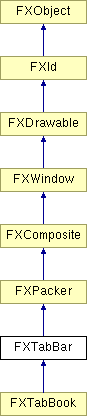

# FXTabBar

标签栏布局管理器将标签项并排放置，并使活动标签项高于相邻标签项。标签栏可以将其标签项放在顶部或底部（水平排列），或放在左侧或右侧（垂直排列）。

### FXTabBar(p, tgt=None, sel=0, opts=TABBOOK_NORMAL, x=0, y=0, w=0, h=0, pl=DEFAULT_SPACING, pr=DEFAULT_SPACING, pt=DEFAULT_SPACING, pb=DEFAULT_SPACING)

构造标签栏。
| **参数** | **类型** | **默认值** | **描述** |
| --- | --- | --- | --- |
| p | FXComposite |  |  |
| tgt | FXObject | None |  |
| sel | Int | 0 |  |
| opts | Int | TABBOOK_NORMAL |  |
| x | Int | 0 |  |
| y | Int | 0 |  |
| w | Int | 0 |  |
| h | Int | 0 |  |
| pl | Int | DEFAULT_SPACING |  |
| pr | Int | DEFAULT_SPACING |  |
| pt | Int | DEFAULT_SPACING |  |
| pb | Int | DEFAULT_SPACING |  |

### create()

为此窗口创建所有服务器端资源 // CAE。

从 FXComposite 重新实现。

### getCurrent()

返回当前活动的标签项。

### getDefaultHeight()

返回默认高度。

从 FXPacker 重新实现。

在 FXTabBook 中重新实现。

### getDefaultWidth()

返回默认宽度。

从 FXPacker 重新实现。

在 FXTabBook 中重新实现。

### getTabStyle()

返回标签栏样式。

### setCurrent(panel, notify=False)

更改当前活动的标签项；这会使活动标签项略微高于相邻标签项。
| **参数** | **类型** | **默认值** | **描述** |
| --- | --- | --- | --- |
| panel | Int |  |  |
| notify | Bool | False |  |

### setTabStyle(style)

更改标签样式。
| **参数** | **类型** | **默认值** | **描述** |
| --- | --- | --- | --- |
| style | Int |  |  |

### 类标志

### ** **

| **ID_OPEN_ITEM** | 从 FXTabItems 之一发送。 |
| --- | --- |
| **ID_OPEN_FIRST** | 切换到面板 ID_OPEN_FIRST+i。 |

### 全局标志

### **Tab Book 选项**

| **TABBOOK_TOPTABS** | 标签在顶部（默认）。 |
| --- | --- |
| **TABBOOK_BOTTOMTABS** | 标签在底部。 |
| **TABBOOK_SIDEWAYS** | 标签在左侧。 |
| **TABBOOK_LEFTTABS** | 标签在左侧。 |
| **TABBOOK_RIGHTTABS** | 标签在右侧。 |

