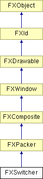

# FXSwitcher

Switcher 布局管理器自动排列其子窗口，使其中一个位于顶部；所有其他子窗口都被隐藏。Switcher 提供了一种通过将多个 GUI 面板放置在同一空间中来节省屏幕空间的方法，根据上下文选择显示哪个面板。Switcher 忽略其子项的所有布局提示：所有子项都根据 switcher 布局管理器自身的大小进行拉伸。当使用 SWITCHER_HCOLLAPSE 或 SWITCHER_VCOLLAPSE 选项时，Switcher 的默认大小基于当前子项的宽度或高度，而不是所有子项的最大宽度或高度。

### FXSwitcher(p, opts=0, x=0, y=0, w=0, h=0, pl=DEFAULT_SPACING, pr=DEFAULT_SPACING, pt=DEFAULT_SPACING, pb=DEFAULT_SPACING)

构造 switcher 布局管理器。
| **参数** | **类型** | **默认值** | **描述** |
| --- | --- | --- | --- |
| p | FXComposite |  |  |
| opts | Int | 0 |  |
| x | Int | 0 |  |
| y | Int | 0 |  |
| w | Int | 0 |  |
| h | Int | 0 |  |
| pl | Int | DEFAULT_SPACING |  |
| pr | Int | DEFAULT_SPACING |  |
| pt | Int | DEFAULT_SPACING |  |
| pb | Int | DEFAULT_SPACING |  |

### getCurrent()

返回当前位于顶部的子窗口的索引。

### getDefaultHeight()

返回默认高度。

从 FXPacker 重新实现。

### getDefaultWidth()

返回默认宽度。

从 FXPacker 重新实现。

### setCurrent(index, notify=False)

将索引处的子窗口置于顶部。
| **参数** | **类型** | **默认值** | **描述** |
| --- | --- | --- | --- |
| index | Int |  |  |
| notify | Bool | False |  |

### 类标志

### **ID，用于标识 switcher 的子项；这些 ID 可用于通过使用 MKUINT(id, SEL_COMMAND) 向 switcher 发送消息来设置当前子项。**

| **ID_OPEN_FIRST** | 第一个子项的 ID。 |
| --- | --- |
| **ID_OPEN_SECOND** | 第二个子项的 ID。 |
| **ID_OPEN_THIRD** | 第三个子项的 ID。 |
| **ID_OPEN_FOURTH** | 第四个子项的 ID。 |
| **ID_OPEN_FIFTH** | 第五个子项的 ID。 |
| **ID_OPEN_SIXTH** | 第六个子项的 ID。 |
| **ID_OPEN_SEVENTH** | 第七个子项的 ID。 |
| **ID_OPEN_EIGHTH** | 第八个子项的 ID。 |
| **ID_OPEN_NINETH** | 第九个 子项的 ID。 |
| **ID_OPEN_TENTH** | 第十个子项的 ID。 |

### 全局标志

### **Switcher 选项**

| **SWITCHER_HCOLLAPSE** | 水平折叠到当前子项的宽度。 |
| --- | --- |
| **SWITCHER_VCOLLAPSE** | 垂直折叠到当前子项的高度。 |

