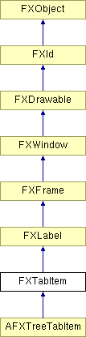

# FXTabItem

选项卡项放置在选项卡栏或选项卡簿中。当选择时，选项卡项向其父窗口发送一条消息，并使自身成为活动选项卡，并略高于其他选项卡。在选项卡簿中，激活一个选项卡项也会使相应的面板升到顶部。

### FXTabItem(p, text, ic=None, opts=TAB_TOP_NORMAL, x=0, y=0, w=0, h=0, pl=6, pr=6, pt=DEFAULT_PAD, pb=DEFAULT_PAD)

构造一个选项卡项。
| **参数** | **类型** | **默认值** | **描述** |
| --- | --- | --- | --- |
| p | FXTabBar |  |  |
| text | String |  |  |
| ic | FXIcon | None |  |
| opts | Int | TAB_TOP_NORMAL |  |
| x | Int | 0 |  |
| y | Int | 0 |  |
| w | Int | 0 |  |
| h | Int | 0 |  |
| pl | Int | 6 |  |
| pr | Int | 6 |  |
| pt | Int | DEFAULT_PAD |  |
| pb | Int | DEFAULT_PAD |  |

### canFocus()

返回 True，因为选项卡项可以接收焦点。

从 FXWindow 重新实现。

### 全局标志

### **影响边框的选项卡项方向**

| **TAB_TOP** | 顶部选项卡。 |
| --- | --- |
| **TAB_LEFT** | 左侧选项卡。 |
| **TAB_RIGHT** | 右侧选项卡。 |
| **TAB_BOTTOM** | 底部选项卡。 |

