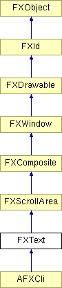

# FXText

多行文本组件

### FXText(p, tgt=None, sel=0, opts=0, x=0, y=0, w=0, h=0)

构造多行文本组件。

| **参数** | **类型** | **默认值** | **描述** |
| --- | --- | --- | --- |
| p | FXComposite |  |  |
| tgt | FXObject | None |  |
| sel | Int | 0 |  |
| opts | Int | 0 |  |
| x | Int | 0 |  |
| y | Int | 0 |  |
| w | Int | 0 |  |
| h | Int | 0 |  |

### appendText(text, n, notify=False)

在缓冲区末尾追加 n 个字符的文本。

| **参数** | **类型** | **默认值** | **描述** |
| --- | --- | --- | --- |
| text | String |  |  |
| n | Int |  |  |
| notify | Bool | False |  |

### canFocus()

返回 True，因为文本组件可以接收焦点。

从 FXWindow 重新实现。

### create()

创建服务器端资源。

从 FXComposite 重新实现。

### detach()

分离服务器端资源。

从 FXComposite 重新实现。

### disable()

禁用文本组件。

从 FXWindow 重新实现。

### enable()

启用文本组件。

从 FXWindow 重新实现。

### extractText(text, pos, n)

从位置 pos 提取 n 个字符的文本。

| **参数** | **类型** | **默认值** | **描述** |
| --- | --- | --- | --- |
| text | String |  |  |
| pos | Int |  |  |
| n | Int |  |  |

### getBarColor()

返回条形颜色。

### getBarColumns()

返回用于行号的列数。

### getChar(pos)

获取文本缓冲区中位置 pos 处的字符。

| **参数** | **类型** | **默认值** | **描述** |
| --- | --- | --- | --- |
| pos | Int |  |  |

### getContentHeight()

获取默认高度。

从 FXScrollArea 重新实现。

### getContentWidth()

获取默认宽度。

从 FXScrollArea 重新实现。

### getCursorCol()

返回光标列，即缩进位置。

### getCursorColor()

返回光标颜色。

### getCursorPos()

返回光标位置。

### getCursorRow()

返回光标行。

### getDefaultHeight()

返回默认高度。

从 FXScrollArea 重新实现。

### getDefaultWidth()

返回默认宽度。

从 FXScrollArea 重新实现。

### getFont()

返回文本字体。

### getLength()

返回缓冲区长度。

### getMarginBottom()

返回底部边距。

### getMarginLeft()

返回左侧边距。

### getMarginRight()

返回右侧边距。

### getMarginTop()

返回顶部边距。

### getNumberColor()

返回行号颜色。

### getPosAt(x, y)

返回给定可见 x,y 坐标处的文本位置。

| **参数** | **类型** | **默认值** | **描述** |
| --- | --- | --- | --- |
| x | Int |  |  |
| y | Int |  |  |

### getSelBackColor()

返回选定的背景颜色。

### getSelEndPos()

返回 selendpos。

### getSelStartPos()

返回 selstartpos。

### getSelTextColor()

返回选定文本颜色。

### getText()

返回组件中的文本。

### getText(text, n)

检索文本到缓冲区。

| **参数** | **类型** | **默认值** | **描述** |
| --- | --- | --- | --- |
| text | String |  |  |
| n | Int |  |  |

### getTextColor()

返回文本颜色。

### getTopLine()

返回顶线的位置。

### getVisCols()

返回可见列数。

### getVisRows()

返回可见行数。

### insertText(pos, text, n, notify=False)

在位置 pos 处将 n 个字符的文本插入缓冲区。

| **参数** | **类型** | **默认值** | **描述** |
| --- | --- | --- | --- |
| pos | Int |  |  |
| text | String |  |  |
| n | Int |  |  |
| notify | Bool | False |  |

### isEditable()

如果文本可编辑则返回 True。

### isModified()

如果文本被修改过则返回 True。

### isPosSelected(pos)

如果位置 pos 被选中则返回 True。

| **参数** | **类型** | **默认值** | **描述** |
| --- | --- | --- | --- |
| pos | Int |  |  |

### killSelection(notify=False)

取消选择文本。

| **参数** | **类型** | **默认值** | **描述** |
| --- | --- | --- | --- |
| notify | Bool | False |  |

### lineEnd(pos)

返回包含位置 pos 的行尾的位置。

| **参数** | **类型** | **默认值** | **描述** |
| --- | --- | --- | --- |
| pos | Int |  |  |

### lineStart(pos)

返回包含位置 pos 的行首的位置。

| **参数** | **类型** | **默认值** | **描述** |
| --- | --- | --- | --- |
| pos | Int |  |  |

### makePositionVisible(pos)

滚动文本以使给定位置可见。

| **参数** | **类型** | **默认值** | **描述** |
| --- | --- | --- | --- |
| pos | Int |  |  |

### moveContents(x, y)

滚动内容。

从 FXScrollArea 重新实现。

| **参数** | **类型** | **默认值** | **描述** |
| --- | --- | --- | --- |
| x | Int |  |  |
| y | Int |  |  |

### nextLine(pos, nl=1)

返回下一行的开始。

| **参数** | **类型** | **默认值** | **描述** |
| --- | --- | --- | --- |
| pos | Int |  |  |
| nl | Int | 1 |  |

### nextRow(pos, nr=1)

返回下一行的开始。

| **参数** | **类型** | **默认值** | **描述** |
| --- | --- | --- | --- |
| pos | Int |  |  |
| nr | Int | 1 |  |

### position(x, y, w, h)

在父窗口的坐标系统中移动并调整此窗口的大小。

从 FXWindow 重新实现。

| **参数** | **类型** | **默认值** | **描述** |
| --- | --- | --- | --- |
| x | Int |  |  |
| y | Int |  |  |
| w | Int |  |  |
| h | Int |  |  |

### prevLine(pos, nl=1)

返回上一行的开始。

| **参数** | **类型** | **默认值** | **描述** |
| --- | --- | --- | --- |
| pos | Int |  |  |
| nl | Int | 1 |  |

### prevRow(pos, nr=1)

返回上一行的开始。

| **参数** | **类型** | **默认值** | **描述** |
| --- | --- | --- | --- |
| pos | Int |  |  |
| nr | Int | 1 |  |

### recalc()

需要重新计算大小。

从 FXWindow 重新实现。

### removeText(pos, n, notify=False)

从缓冲区中位置 pos 处删除 n 个字符的文本。

| **参数** | **类型** | **默认值** | **描述** |
| --- | --- | --- | --- |
| pos | Int |  |  |
| n | Int |  |  |
| notify | Bool | False |  |

### replaceText(pos, m, text, n, notify=False)

用 n 个字符替换位置 pos 处的 m 个字符。

| **参数** | **类型** | **默认值** | **描述** |
| --- | --- | --- | --- |
| pos | Int |  |  |
| m | Int |  |  |
| text | String |  |  |
| n | Int |  |  |
| notify | Bool | False |  |

### resize(w, h)

将窗口调整为指定的宽度和高度。

从 FXWindow 重新实现。

| **参数** | **类型** | **默认值** | **描述** |
| --- | --- | --- | --- |
| w | Int |  |  |
| h | Int |  |  |

### rowEnd(pos)

返回行尾。

| **参数** | **类型** | **默认值** | **描述** |
| --- | --- | --- | --- |
| pos | Int |  |  |

### rowStart(pos)

返回行首。

| **参数** | **类型** | **默认值** | **描述** |
| --- | --- | --- | --- |
| pos | Int |  |  |

### setBarColor(clr)

更改条形颜色。

| **参数** | **类型** | **默认值** | **描述** |
| --- | --- | --- | --- |
| clr | FXColor |  |  |

### setBarColumns(cols)

更改用于行号的列数。

| **参数** | **类型** | **默认值** | **描述** |
| --- | --- | --- | --- |
| cols | Int |  |  |

### setBottomLine(pos)

使包含 pos 的行成为底行。

| **参数** | **类型** | **默认值** | **描述** |
| --- | --- | --- | --- |
| pos | Int |  |  |

### setCursorCol(col, notify=False)

设置光标列。

| **参数** | **类型** | **默认值** | **描述** |
| --- | --- | --- | --- |
| col | Int |  |  |
| notify | Bool | False |  |

### setCursorColor(clr)

更改光标颜色。

| **参数** | **类型** | **默认值** | **描述** |
| --- | --- | --- | --- |
| clr | FXColor |  |  |

### setCursorPos(pos, notify=False)

设置光标位置。

| **参数** | **类型** | **默认值** | **描述** |
| --- | --- | --- | --- |
| pos | Int |  |  |
| notify | Bool | False |  |

### setCursorRow(row, notify=False)

设置光标行。

| **参数** | **类型** | **默认值** | **描述** |
| --- | --- | --- | --- |
| row | Int |  |  |
| notify | Bool | False |  |

### setEditable(edit=True)

设置可编辑标志。

| **参数** | **类型** | **默认值** | **描述** |
| --- | --- | --- | --- |
| edit | Bool | True |  |

### setFont(fnt)

更改文本字体。

| **参数** | **类型** | **默认值** | **描述** |
| --- | --- | --- | --- |
| fnt | FXFont |  |  |

### setMarginBottom(pb)

更改底部边距。

| **参数** | **类型** | **默认值** | **描述** |
| --- | --- | --- | --- |
| pb | Int |  |  |

### setMarginLeft(pl)

更改左侧边距。

| **参数** | **类型** | **默认值** | **描述** |
| --- | --- | --- | --- |
| pl | Int |  |  |

### setMarginRight(pr)

更改右侧边距。

| **参数** | **类型** | **默认值** | **描述** |
| --- | --- | --- | --- |
| pr | Int |  |  |

### setMarginTop(pt)

更改顶部边距。

| **参数** | **类型** | **默认值** | **描述** |
| --- | --- | --- | --- |
| pt | Int |  |  |

### setModified(mod=True)

设置修改标志。

| **参数** | **类型** | **默认值** | **描述** |
| --- | --- | --- | --- |
| mod | Bool | True |  |

### setNumberColor(clr)

更改行号颜色。

| **参数** | **类型** | **默认值** | **描述** |
| --- | --- | --- | --- |
| clr | FXColor |  |  |

### setSelBackColor(clr)

更改选定背景颜色。

| **参数** | **类型** | **默认值** | **描述** |
| --- | --- | --- | --- |
| clr | FXColor |  |  |

### setSelection(pos, len, notify=False)

从给定位置 pos 开始选择 len 个字符。

| **参数** | **类型** | **默认值** | **描述** |
| --- | --- | --- | --- |
| pos | Int |  |  |
| len | Int |  |  |
| notify | Bool | False |  |

### setSelTextColor(clr)

更改选定文本颜色。

| **参数** | **类型** | **默认值** | **描述** |
| --- | --- | --- | --- |
| clr | FXColor |  |  |

### setText(text, notify=False)

更改文本。

| **参数** | **类型** | **默认值** | **描述** |
| --- | --- | --- | --- |
| text | String |  |  |
| notify | Bool | False |  |

### setText(text, n, notify=False)

将缓冲区中的文本更改为新文本。

| **参数** | **类型** | **默认值** | **描述** |
| --- | --- | --- | --- |
| text | String |  |  |
| n | Int |  |  |
| notify | Bool | False |  |

### setTextColor(clr)

更改文本颜色。

| **参数** | **类型** | **默认值** | **描述** |
| --- | --- | --- | --- |
| clr | FXColor |  |  |

### setTopLine(pos)

使包含 pos 的行成为顶线。

| **参数** | **类型** | **默认值** | **描述** |
| --- | --- | --- | --- |
| pos | Int |  |  |

### setVisCols(cols)

更改可见列数。

| **参数** | **类型** | **默认值** | **描述** |
| --- | --- | --- | --- |
| cols | Int |  |  |

### setVisRows(rows)

更改可见行数。

| **参数** | **类型** | **默认值** | **描述** |
| --- | --- | --- | --- |
| rows | Int |  |  |

### 全局标志

### **文本组件选项**

| **TEXT_READONLY** | 文本不可编辑。 |
| --- | --- |
| **TEXT_WORDWRAP** | 在单词边界处换行。 |
| **TEXT_OVERSTRIKE** | 重写模式。 |
| **TEXT_FIXEDWRAP** | 固定换行列。 |
| **TEXT_NO_TABS** | 为制表符插入空格。 |
| **TEXT_AUTOINDENT** | 自动缩进。 |
| **TEXT_SHOWACTIVE** | 显示活动行。 |

### **选择模式**

| **SELECT_CHARS** | 选择字符。 |
| --- | --- |
| **SELECT_WORDS** | 选择单词。 |
| **SELECT_LINES** | 选择行。 |
