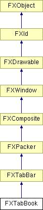

# FXTabBook

标签簿布局管理器排列成对子项；偶数编号的子项（0、2、4、...）通常是标签项，放在顶部。奇数编号的子项通常是布局管理器，放在下面；所有奇数编号的子项彼此堆叠在一起，类似于 switcher 窗口。当用户按下其中一个标签项时，该标签项会上升到相邻标签之上，相应的面板也会置于顶部。因此，标签簿可以通过将多个面板堆叠在一起并使用标签项来选择所需面板，从而在很小的空间中呈现许多 GUI 控件。

### FXTabBook(p, tgt=None, sel=0, opts=TABBOOK_NORMAL, x=0, y=0, w=0, h=0, pl=DEFAULT_SPACING, pr=DEFAULT_SPACING, pt=DEFAULT_SPACING, pb=DEFAULT_SPACING)

构造标签簿。
| **参数** | **类型** | **默认值** | **描述** |
| --- | --- | --- | --- |
| p | FXComposite |  |  |
| tgt | FXObject | None |  |
| sel | Int | 0 |  |
| opts | Int | TABBOOK_NORMAL |  |
| x | Int | 0 |  |
| y | Int | 0 |  |
| w | Int | 0 |  |
| h | Int | 0 |  |
| pl | Int | DEFAULT_SPACING |  |
| pr | Int | DEFAULT_SPACING |  |
| pt | Int | DEFAULT_SPACING |  |
| pb | Int | DEFAULT_SPACING |  |

### getDefaultHeight()

返回默认高度。

从 FXTabBar 重新实现。

### getDefaultWidth()

返回默认宽度。

从 FXTabBar 重新实现。

