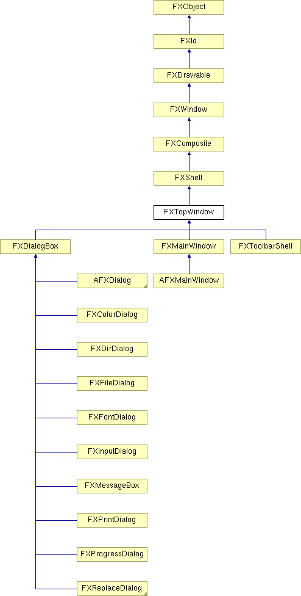

# FXTopWindow

所有顶级窗口的抽象基类

### create()

创建服务器端资源。

从 FXShell 重新实现。

在 FXPrintDialog、FXToolbarShell、AFXMainWindow 和 AFXDialog 中重新实现。

### deiconify()

解除窗口的图标化。

### detach()

分离此窗口的服务器端资源。

从 FXComposite 重新实现。

### getDecorations()

返回当前标题和边框装饰。

### getDefaultHeight()

返回此窗口的默认高度。

从 FXComposite 重新实现。

在 FXToolbarShell 和 AFXMainWindow 中重新实现。

### getDefaultWidth()

返回此窗口的默认宽度。

从 FXComposite 重新实现。

在 FXToolbarShell 和 AFXMainWindow 中重新实现。

### getHSpacing()

返回子窗口之间的水平间距。

### getIcon()

返回窗口图标。

### getMiniIcon()

返回窗口迷你（标题）图标。

### getPackingHints()

返回子窗口的打包提示。

### getPadBottom()

获取底部内部填充。

### getPadLeft()

获取左侧内部填充。

### getPadRight()

获取右侧内部填充。

### getPadTop()

获取顶部内部填充。

### getTitle()

返回窗口标题。

### getVSpacing()

返回子窗口之间的垂直间距。

### hide()

隐藏此窗口。

从 FXWindow 重新实现。

在 AFXManagerMenuDB、AFXDialog 和 AFXMessageDialog 中重新实现。

### iconify()

图标化窗口。

### isIconified()

如果窗口已被图标化则返回 True。

### killFocus()

从此窗口移除焦点。

从 FXShell 重新实现。

### move(x, y)

在父窗口的坐标系统中将此窗口移动到指定位置。

从 FXWindow 重新实现。
| **参数** | **类型** | **默认值** | **描述** |
| --- | --- | --- | --- |
| x | Int |  |  |
| y | Int |  |  |

### place(placement)

根据 placement 定位窗口。
| **参数** | **类型** | **默认值** | **描述** |
| --- | --- | --- | --- |
| placement | Int |  |  |

### position(x, y, w, h)

在父窗口的坐标系统中移动并调整此窗口的大小。

从 FXWindow 重新实现。
| **参数** | **类型** | **默认值** | **描述** |
| --- | --- | --- | --- |
| x | Int |  |  |
| y | Int |  |  |
| w | Int |  |  |
| h | Int |  |  |

### resize(w, h)

将窗口调整为指定的宽度和高度。

从 FXWindow 重新实现。
| **参数** | **类型** | **默认值** | **描述** |
| --- | --- | --- | --- |
| w | Int |  |  |
| h | Int |  |  |

### setDecorations(decorations)

更改标题和边框装饰。
| **参数** | **类型** | **默认值** | **描述** |
| --- | --- | --- | --- |
| decorations | Int |  |  |

### setFocus()

将焦点移到此窗口。

从 FXShell 重新实现。

### setHSpacing(hs)

更改子窗口之间的水平间距。
| **参数** | **类型** | **默认值** | **描述** |
| --- | --- | --- | --- |
| hs | Int |  |  |

### setIcon(ic)

更改窗口图标。
| **参数** | **类型** | **默认值** | **描述** |
| --- | --- | --- | --- |
| ic | FXIcon |  |  |

### setMiniIcon(ic)

更改窗口迷你（标题）图标。
| **参数** | **类型** | **默认值** | **描述** |
| --- | --- | --- | --- |
| ic | FXIcon |  |  |

### setPackingHints(ph)

更改子窗口的打包提示。
| **参数** | **类型** | **默认值** | **描述** |
| --- | --- | --- | --- |
| ph | Int |  |  |

### setPadBottom(pb)

更改底部填充。
| **参数** | **类型** | **默认值** | **描述** |
| --- | --- | --- | --- |
| pb | Int |  |  |

### setPadLeft(pl)

更改左侧填充。
| **参数** | **类型** | **默认值** | **描述** |
| --- | --- | --- | --- |
| pl | Int |  |  |

### setPadRight(pr)

更改右侧填充。
| **参数** | **类型** | **默认值** | **描述** |
| --- | --- | --- | --- |
| pr | Int |  |  |

### setPadTop(pt)

更改顶部填充。
| **参数** | **类型** | **默认值** | **描述** |
| --- | --- | --- | --- |
| pt | Int |  |  |

### setTitle(name)

更改窗口标题。
| **参数** | **类型** | **默认值** | **描述** |
| --- | --- | --- | --- |
| name | String |  |  |

### setVSpacing(vs)

更改子窗口之间的垂直间距。
| **参数** | **类型** | **默认值** | **描述** |
| --- | --- | --- | --- |
| vs | Int |  |  |

### show(placement)

以给定的 placement 显示此窗口。
| **参数** | **类型** | **默认值** | **描述** |
| --- | --- | --- | --- |
| placement | Int |  |  |

### show()

显示此窗口。

从 FXWindow 重新实现。

在 AFXDialog、AFXFileDialog 和 AFXMessageDialog 中重新实现。

### 类标志

### ** **

| **ID_ICONIFY** | 图标化窗口。 |
| --- | --- |
| **ID_DEICONIFY** | 解除窗口的图标化。 |
| **ID_QUERY_DOCK** | 工具栏请求停靠。 |

### 全局标志

### **标题和边框装饰**

| **DECOR_NONE** | 无边框窗口。 |
| --- | --- |
| **DECOR_TITLE** | 窗口标题。 |
| **DECOR_MINIMIZE** | 最小化按钮。 |
| **DECOR_MAXIMIZE** | 最大化按钮。 |
| **DECOR_CLOSE** | 关闭按钮。 |
| **DECOR_BORDER** | 边框。 |
| **DECOR_RESIZE** | 调整大小手柄。 |
| **DECOR_MENU** | 窗口菜单。 |

### **初始窗口位置**

| **PLACEMENT_DEFAULT** | 放置在默认大小和位置。 |
| --- | --- |
| **PLACEMENT_VISIBLE** | 放置窗口使其完全可见。 |
| **PLACEMENT_CURSOR** | 放置在光标位置。 |
| **PLACEMENT_OWNER** | 放置在其所有者中心。 |
| **PLACEMENT_SCREEN** | 放置在屏幕中心。 |
| **PLACEMENT_MAXIMIZED** | 放置使其最大化到屏幕大小。 |

