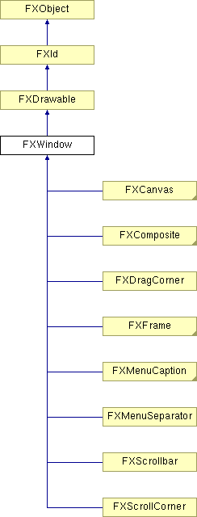

# FXWindow

所有窗口的基类。

### FXWindow(p, opts=0, x=0, y=0, w=0, h=0)

构造函数。
| **参数** | **类型** | **默认值** | **描述** |
| --- | --- | --- | --- |
| p | FXComposite |  |  |
| opts | Int | 0 |  |
| x | Int | 0 |  |
| y | Int | 0 |  |
| w | Int | 0 |  |
| h | Int | 0 |  |

### canFocus()

如果此窗口是可以接收焦点的控件，则返回 True。

在 FXArrowButton、FXButton、FXCanvas、FXCheckButton、FXColorWell、FXDockHandler、FXIconList、FXImageView、FXList、FXMDIChild、FXMenuButton、FXMenuCascade、FXMenuCommand、FXMenuTitle、FXOption、FXOptionMenu、FXRadioButton、FXSlider、FXTabItem、FXTable、FXText、FXTextField、FXToggleButton、FXToolbarTab、FXTreeList、AFXBaseTable、AFXFloatSpinner、AFXFlyoutButton、AFXFlyoutItem 和 AFXSlider 中重新实现。

### childAtIndex(index)

返回指定索引处的子窗口，如果索引为负或超出范围则返回 NULL。

在 AFXOptionTreeItem 中重新实现。
| **参数** | **类型** | **默认值** | **描述** |
| --- | --- | --- | --- |
| index | Int |  |  |

### containsChild(child)

如果指定窗口是此窗口的子窗口则返回 True。
| **参数** | **类型** | **默认值** | **描述** |
| --- | --- | --- | --- |
| child | FXWindow |  |  |

### create()

为此窗口创建所有服务器端资源。

从 FXId 重新实现。

在 FXColorBar、FXColorSelector、FXColorWell、FXColorWheel、FXComboBox、FXComposite、FXDirBox、FXDirList、FXDockTitle、FXDriveBox、FXFileList、FXFontSelector、FXGLCanvas、FXGLViewer、FXGroupBox、FXHeader、FXIconList、FXImageView、FXLabel、FXList、FXListBox、FXMDIChild、FXMenuButton、FXMenuCaption、FXMenuCascade、FXProgressBar、FXMenuTitle、FXOptionMenu、FXPrintDialog、FXRootWindow、FXScrollWindow、FXShell、FXSpinner、FXStatusline、FXTabBar、FXTable、FXText、FXTextField、FXToggleButton、FXToolbarShell、FXTooltip、FXTopWindow、FXTreeList、FXTreeListBox、AFXManagerMenuPane、AFXMainWindow、AFXPromptArea、AFXBaseTable、AFXColorButton、AFXColorFlyout、AFXComboBox、AFXDialog、AFXFloatSpinner、AFXFlyoutButton、AFXListBox、AFXNote、AFXOptionTreeItem、AFXPrimFloatSpinner、AFXProgressBar、AFXSpinner、AFXTable、AFXTextField 和 AFXVerticalAligner 中重新实现。

### destroy()

销毁此窗口的服务器端资源。

从 FXId 重新实现。

在 FXComboBox、FXComposite、FXDirBox、FXDirList、FXDriveBox、FXFileList、FXGLCanvas、FXListBox、FXMenuCascade、FXOptionMenu、FXRootWindow、FXTreeList、FXTreeListBox、AFXManagerMenuCascade、AFXColorFlyout 和 AFXTable 中重新实现。

### detach()

分离此窗口的服务器端资源。

从 FXId 重新实现。

在 FXColorBar、FXColorWell、FXColorWheel、FXComboBox、FXComposite、FXDirBox、FXDirList、FXDockTitle、FXDriveBox、FXFileList、FXGLCanvas、FXGLViewer、FXGroupBox、FXHeader、FXIconList、FXImageView、FXLabel、FXList、FXListBox、FXMDIChild、FXMenuButton、FXMenuCaption、FXMenuCascade、FXProgressBar、FXMenuTitle、FXOptionMenu、FXRootWindow、FXStatusline、FXTable、FXText、FXToggleButton、FXTooltip、FXTopWindow、FXTreeList、FXTreeListBox、AFXBaseTable、AFXColorFlyout、AFXFlyoutButton、AFXNote 和 AFXTable 中重新实现。

### disable()

禁用窗口接收鼠标和键盘事件。

在 FXArrowButton、FXComboBox、FXGroupBox、FXLabel、FXListBox、FXMenuCaption、FXScrollCorner、FXSlider、FXSpinner、FXText、FXTextField、FXToolbarTab、FXTreeListBox、AFXAutoComputeGroup、AFXManagerMenuDB、AFXColorButton、AFXColorFlyout、AFXComboBox、AFXFloatSpinner、AFXFlyoutButton、AFXList、AFXListBox、AFXNote、AFXOptionTreeItem、AFXPrimFloatSpinner、AFXSlider、AFXSpinner、AFXTable 和 AFXTextField 中重新实现。

### enable()

启用窗口接收鼠标和键盘事件。

在 FXArrowButton、FXComboBox、FXGroupBox、FXLabel、FXListBox、FXMenuCaption、FXScrollCorner、FXSlider、FXSpinner、FXText、FXTextField、FXToolbarTab、FXTreeListBox、AFXAutoComputeGroup、AFXManagerMenuDB、AFXColorButton、AFXColorFlyout、AFXComboBox、AFXFloatSpinner、AFXFlyoutButton、AFXList、AFXListBox、AFXNote、AFXOptionTreeItem、AFXPrimFloatSpinner、AFXSlider、AFXSpinner、AFXTable 和 AFXTextField 中重新实现。

### forceRefresh()

强制更新此窗口及其子窗口的 GUI。

### getBackColor()

获取背景颜色。

在 FXComboBox 和 FXListBox 中重新实现。

### getCursorPosition()

返回一个表示光标在窗口中相对位置的序列 (status, x, y, mouseButtonState)。

### getDefaultHeight()

返回此窗口的默认高度。

在 FX4Splitter、FXArrowButton、FXCheckButton、FXColorBar、FXColorWell、FXColorWheel、FXComboBox、FXComposite、FXDial、FXDockSite、FXDockTitle、FXDragCorner、FXFrame、FXGroupBox、FXHeader、FXHorizontalFrame、FXLabel、FXList、FXListBox、FXMDIDeleteButton、FXMDIRestoreButton、FXMDIMaximizeButton、FXMDIMinimizeButton、FXMDIWindowButton、FXMDIChild、FXMatrix、FXMenuButton、FXMenuCaption、FXMenuCommand、FXProgressBar、FXMenuSeparator、FXMenuTitle、FXOption、FXOptionMenu、FXPacker、FXPopup、FXRadioButton、FXRootWindow、FXScrollArea、FXScrollbar、FXHorizontalSeparator、FXVerticalSeparator、FXSlider、FXSpinner、FXSplitter、FXStatusbar、FXStatusline、FXSwitcher、FXTabBar、FXTabBook、FXTable、FXText、FXTextField、FXToggleButton、FXToolbar、FXToolbarGrip、FXToolbarShell、FXToolbarTab、FXTooltip、FXTopWindow、FXTreeList、FXTreeListBox、FXVerticalFrame、AFXMainWindow、AFXToolbarGroup、AFXBaseTable、AFXList、AFXOptionTreeList、AFXPrimFloatSpinner、AFXProgressBar、AFXSlider、AFXTable、AFXTreeTable 和 AFXVerticalAligner 中重新实现。

### getDefaultWidth()

返回此窗口的默认宽度。

在 FX4Splitter、FXArrowButton、FXCheckButton、FXColorBar、FXColorWell、FXColorWheel、FXComboBox、FXComposite、FXDial、FXDockSite、FXDockTitle、FXDragCorner、FXFrame、FXGroupBox、FXHeader、FXHorizontalFrame、FXLabel、FXList、FXListBox、FXMDIDeleteButton、FXMDIRestoreButton、FXMDIMaximizeButton、FXMDIMinimizeButton、FXMDIWindowButton、FXMDIChild、FXMatrix、FXMenuButton、FXMenuCaption、FXMenuCommand、FXProgressBar、FXMenuSeparator、FXMenuTitle、FXOption、FXOptionMenu、FXPacker、FXPopup、FXRadioButton、FXRootWindow、FXScrollArea、FXScrollbar、FXHorizontalSeparator、FXVerticalSeparator、FXSlider、FXSpinner、FXSplitter、FXStatusbar、FXStatusline、FXSwitcher、FXTabBar、FXTabBook、FXTable、FXText、FXTextField、FXToggleButton、FXToolbar、FXToolbarGrip、FXToolbarShell、FXToolbarTab、FXTooltip、FXTopWindow、FXTreeList、FXTreeListBox、FXVerticalFrame、AFXMainWindow、AFXToolbarGroup、AFXBaseTable、AFXOptionTreeItem、AFXOptionTreeList、AFXPrimFloatSpinner、AFXProgressBar、AFXSlider、AFXTable、AFXTextField、AFXTreeTable 和 AFXVerticalAligner 中重新实现。

### getFirst()

返回此窗口的第一个子窗口的指针（如果有）。

在 AFXOptionTreeItem 中重新实现。

### getHeightForWidth(givenwidth)

返回给定宽度的所需高度。

在 FXDockSite 中重新实现。
| **参数** | **类型** | **默认值** | **描述** |
| --- | --- | --- | --- |
| givenwidth | Int |  |  |

### getKey()

返回窗口键。

### getLast()

返回此窗口的最后一个子窗口的指针（如果有）。

在 AFXOptionTreeItem 中重新实现。

### getLayoutHints()

获取此窗口的布局提示。

### getNext()

返回下一个（兄弟）窗口的指针（如果有）。

在 AFXOptionTreeItem 中重新实现。

### getOwner()

返回所有者窗口的指针。

在 AFXMenuCascade、AFXMenuCommand、AFXMenuPane、AFXMenuTitle、AFXToolbarGroup 和 AFXToolboxGroup 中重新实现。

### getParent()

返回父窗口的指针。

在 AFXOptionTreeItem 中重新实现。

### getPrev()

返回上一个（兄弟）窗口的指针（如果有）。

在 AFXOptionTreeItem 中重新实现。

### getRoot()

返回根窗口的指针。

### getSelector()

获取此窗口的消息标识符。

### getShell()

返回 shell 窗口的指针。

### getTarget()

获取此窗口的消息目标对象（如果有）。

### getWidthForHeight(givenheight)

返回给定高度的所需宽度。

在 FXDockSite 中重新实现。
| **参数** | **类型** | **默认值** | **描述** |
| --- | --- | --- | --- |
| givenheight | Int |  |  |

### getX()

获取此窗口的 x 坐标，在父窗口的坐标系统中。

### getY()

获取此窗口的 y 坐标，在父窗口的坐标系统中。

### grab(confineTo=None)

将鼠标捕获到此窗口；即使光标在此窗口之外，未来的鼠标事件也将报告给此窗口。
| **参数** | **类型** | **默认值** | **描述** |
| --- | --- | --- | --- |
| confineTo | FXWindow | None |  |

### grabbed()

如果窗口已被捕获则返回 True。

### hasFocus()

如果此窗口有焦点则返回 True。

### hide()

隐藏此窗口。

在 FXTopWindow、AFXManagerMenuDB、AFXMenuTitle、AFXToolbarGroup、AFXToolbarGroupRender、AFXToolbarGroupVisibility、AFXDialog、AFXFlyoutItem、AFXMessageDialog、AFXOptionTreeItem 和 AFXProgressBar 中重新实现。

### indexOfChild(window)

返回指定子窗口的索引（从零开始），如果窗口不是子窗口或为 NULL 则返回 -1。
| **参数** | **类型** | **默认值** | **描述** |
| --- | --- | --- | --- |
| window | FXWindow |  |  |

### isActive()

如果窗口处于活动状态则返回 True。

在 AFXToolbarGroup 中重新实现。

### isChildOf(window)

如果指定窗口是此窗口的父窗口则返回 True。
| **参数** | **类型** | **默认值** | **描述** |
| --- | --- | --- | --- |
| window | FXWindow |  |  |

### isDefault()

如果这是默认窗口则返回 True。

### isEnabled()

如果此窗口能够接收鼠标和键盘事件则返回 True。

### isInitial()

如果这是初始默认窗口则返回 True。

### linkAfter(sibling)

在窗口列表中将此窗口链接到 sibling 之后。
| **参数** | **类型** | **默认值** | **描述** |
| --- | --- | --- | --- |
| sibling | FXWindow |  |  |

### linkBefore(sibling)

在窗口列表中将此窗口链接到 sibling 之前。
| **参数** | **类型** | **默认值** | **描述** |
| --- | --- | --- | --- |
| sibling | FXWindow |  |  |

### move(x, y)

在父窗口的坐标系统中将此窗口移动到指定位置。

在 FXMDIChild、FXRootWindow 和 FXTopWindow 中重新实现。
| **参数** | **类型** | **默认值** | **描述** |
| --- | --- | --- | --- |
| x | Int |  |  |
| y | Int |  |  |

### numChildren()

返回此窗口的子窗口数量。

在 AFXOptionTreeItem 中重新实现。

### position(x, y, w, h)

在父窗口的坐标系统中移动并调整此窗口的大小。

在 FXIconList、FXMDIChild、FXRootWindow、FXText 和 FXTopWindow 中重新实现。
| **参数** | **类型** | **默认值** | **描述** |
| --- | --- | --- | --- |
| x | Int |  |  |
| y | Int |  |  |
| w | Int |  |  |
| h | Int |  |  |

### recalc()

将此窗口的布局标记为脏。

在 FXIconList、FXList、FXMDIClient、FXRootWindow、FXShell、FXTable、FXText、FXTreeList、AFXBaseTable、AFXSlider 和 AFXTable 中重新实现。

### repaint()

如果被标记但尚未绘制，则绘制整个窗口。

### repaint(x, y, w, h)

如果被标记但尚未绘制，则绘制给定区域。
| **参数** | **类型** | **默认值** | **描述** |
| --- | --- | --- | --- |
| x | Int |  |  |
| y | Int |  |  |
| w | Int |  |  |
| h | Int |  |  |

### resize(w, h)

将窗口调整到指定的宽度和高度。

从 FXDrawable 重新实现。

在 FXIconList、FXMDIChild、FXRootWindow、FXText 和 FXTopWindow 中重新实现。
| **参数** | **类型** | **默认值** | **描述** |
| --- | --- | --- | --- |
| w | Int |  |  |
| h | Int |  |  |

### setBackColor(clr)

设置窗口背景颜色。

在 FXComboBox 和 FXListBox 中重新实现。
| **参数** | **类型** | **默认值** | **描述** |
| --- | --- | --- | --- |
| clr | FXColor |  |  |

### setCursorPosition(x, y)

将光标移动到新位置。
| **参数** | **类型** | **默认值** | **描述** |
| --- | --- | --- | --- |
| x | Int |  |  |
| y | Int |  |  |

### setFocus()

将焦点移至此窗口。

在 FXButton、FXColorWell、FXIconList、FXList、FXMenuCascade、FXMenuCommand、FXMenuTitle、FXOption、FXPopup、FXRootWindow、FXShell、FXTable、FXText、FXTextField、FXTopWindow、FXTreeList、AFXBaseTable、AFXFlyoutItem 和 AFXTextField 中重新实现。

### setHeight(h)

设置窗口高度。
| **参数** | **类型** | **默认值** | **描述** |
| --- | --- | --- | --- |
| h | Int |  |  |

### setInitial(enable=True)

将此窗口设为初始默认窗口。
| **参数** | **类型** | **默认值** | **描述** |
| --- | --- | --- | --- |
| enable | Bool | True |  |

### setKey(k)

更改窗口键。
| **参数** | **类型** | **默认值** | **描述** |
| --- | --- | --- | --- |
| k | Int |  |  |

### setLayoutHints(lout)

设置此窗口的布局提示。
| **参数** | **类型** | **默认值** | **描述** |
| --- | --- | --- | --- |
| lout | Int |  |  |

### setSelector(sel)

设置此窗口的消息标识符。
| **参数** | **类型** | **默认值** | **描述** |
| --- | --- | --- | --- |
| sel | Int |  |  |

### setTarget(t)

设置此窗口的消息目标对象。
| **参数** | **类型** | **默认值** | **描述** |
| --- | --- | --- | --- |
| t | FXObject |  |  |

### setWidth(w)

设置窗口宽度。
| **参数** | **类型** | **默认值** | **描述** |
| --- | --- | --- | --- |
| w | Int |  |  |

### setX(x)

设置此窗口的 x 坐标，在父窗口的坐标系统中。
| **参数** | **类型** | **默认值** | **描述** |
| --- | --- | --- | --- |
| x | Int |  |  |

### setY(y)

设置此窗口的 y 坐标，在父窗口的坐标系统中。
| **参数** | **类型** | **默认值** | **描述** |
| --- | --- | --- | --- |
| y | Int |  |  |

### show()

显示此窗口。

在 FXTooltip、FXTopWindow、AFXMenuTitle、AFXToolbarGroup、AFXToolbarGroupRender、AFXToolbarGroupVisibility、AFXDialog、AFXFileDialog、AFXMessageDialog、AFXOptionTreeItem、AFXProgressBar 和 AFXSlider 中重新实现。

### shown()

如果窗口已显示则返回 True。

### translateCoordinatesTo(tox, toy, towindow, fromx, fromy)

将坐标从此窗口的坐标空间转换到 towindow 的坐标空间。
| **参数** | **类型** | **默认值** | **描述** |
| --- | --- | --- | --- |
| tox | Int |  |  |
| toy | Int |  |  |
| towindow | FXWindow |  |  |
| fromx | Int |  |  |
| fromy | Int |  |  |

### ungrab()

释放鼠标捕获。

### update()

将整个窗口客户区域标记为脏。

### update(x, y, w, h)

将指定矩形标记为脏，即需要重绘。
| **参数** | **类型** | **默认值** | **描述** |
| --- | --- | --- | --- |
| x | Int |  |  |
| y | Int |  |  |
| w | Int |  |  |
| h | Int |  |  |

### 全局标志

### **子窗口的布局提示**

| **LAYOUT_NORMAL** | 默认布局模式。 |
| --- | --- |
| **LAYOUT_SIDE_TOP** | 打包到顶部（默认）。 |
| **LAYOUT_SIDE_BOTTOM** | 打包到底部。 |
| **LAYOUT_SIDE_LEFT** | 打包到左侧。 |
| **LAYOUT_SIDE_RIGHT** | 打包到右侧。 |
| **LAYOUT_FILL_COLUMN** | 矩阵列可拉伸。 |
| **LAYOUT_FILL_ROW** | 矩阵行可拉伸。 |
| **LAYOUT_LEFT** | 贴在左侧（默认）。 |
| **LAYOUT_RIGHT** | 贴在右侧。 |
| **LAYOUT_CENTER_X** | 水平居中。 |
| **LAYOUT_FIX_X** | X 固定。 |
| **LAYOUT_TOP** | 贴在顶部（默认）。 |
| **LAYOUT_BOTTOM** | 贴在底部。 |
| **LAYOUT_CENTER_Y** | 垂直居中。 |
| **LAYOUT_FIX_Y** | Y 固定 CAE：从 FOX 1.4.34 复制以支持可停靠工具栏。 |
| **LAYOUT_DOCK_SAME** | 如果合适则停靠在同一工具栏上。 |
| **LAYOUT_DOCK_NEXT** | 停靠在下一个工具栏上 LAYOUT_RESERVED_1 = 0x00000040，LAYOUT_RESERVED_2 = 0x00000080， |
| **LAYOUT_RESERVED_1** | CAE 结束。 |
| **LAYOUT_FIX_WIDTH** | 宽度固定。 |
| **LAYOUT_FIX_HEIGHT** | 高度固定。 |
| **LAYOUT_MIN_WIDTH** | 最小宽度为默认。 |
| **LAYOUT_MIN_HEIGHT** | 最小高度为默认。 |
| **LAYOUT_FILL_X** | 水平拉伸或收缩。 |
| **LAYOUT_FILL_Y** | 垂直拉伸或收缩。 |
| **LAYOUT_EXPLICIT** | 显式放置。 |

### **框架边框外观样式（用于子类）**

| **FRAME_NONE** | 默认无框架。 |
| --- | --- |
| **FRAME_SUNKEN** | 下沉边框。 |
| **FRAME_RAISED** | 凸起边框。 |
| **FRAME_THICK** | 粗边框。 |
| **FRAME_GROOVE** | 凹槽或蚀刻边框。 |
| **FRAME_RIDGE** | 脊状或浮雕边框。 |
| **FRAME_LINE** | 简单线条边框。 |
| **FRAME_NORMAL** | 常规凸起/粗边框。 |

### **打包样式（用于打包器）**

| **PACK_NORMAL** | 默认每个都有自己的大小。 |
| --- | --- |
| **PACK_UNIFORM_HEIGHT** | 统一高度。 |
| **PACK_UNIFORM_WIDTH** | 统一宽度。 |

### **背景样式**

| **BACKGROUND_NORMAL** | 默认。 |
| --- | --- |
| **BACKGROUND_H_GRADIENT** | 水平渐变背景。 |
| **BACKGROUND_V_GRADIENT** | 垂直渐变背景。 |
| **BACKGROUND_PLAIN** | 纯色背景。 |

