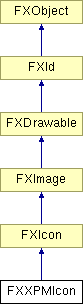

# FXXPMIcon

X Pixmap 图标。

### FXXPMIcon(a, pix=None, clr=FXRGB(192, 192, 192), opts=0, w=1, h=1)

从编译的 X Pixmap 格式构造图标。
| **参数** | **类型** | **默认值** | **描述** |
| --- | --- | --- | --- |
| a | FXApp |  |  |
| pix | String | None |  |
| clr | FXColor | FXRGB(192, 192, 192) |  |
| opts | Int | 0 |  |
| w | Int | 1 |  |
| h | Int | 1 |  |

