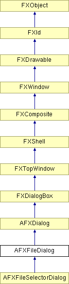

# AFXFileDialog

该类包含文件选择对话框。

### AFXFileDialog(owner, title, pathNameKw, readOnlyKw, tgt=None, sel=0, mode=AFXSELECTFILE_ANY, patterns=*, patternIndexTgt=None)

创建在与 widget 重叠时始终遮挡其所有者 widget 的对话框的构造函数。构造函数期望一个字符串关键字来存储选定的文件名。如果对话框允许多选，则字符串关键字包含所有选定文件的逗号分隔路径名。
| **参数** | **类型** | **默认值** | **描述** |
| --- | --- | --- | --- |
| owner | FXWindow |  | 父 widget。 |
| title | String |  | 对话框标题。 |
| pathNameKw | AFXStringKeyword |  | 路径名关键字。 |
| readOnlyKw | AFXBoolKeyword |  | 只读关键字。 |
| tgt | FXObject | None | 消息目标。 |
| sel | Int | 0 | 消息 ID。 |
| mode | Int | AFXSELECTFILE_ANY | 文件选择模式。 |
| patterns | String | * | 文件过滤器模式。 |
| patternIndexTgt | AFXIntTarget | None | 在对话框被张贴时用于选择文件过滤器模式的索引。 |

### AFXFileDialog(title, pathNameKw, readOnlyKw, tgt=None, sel=0, mode=AFXSELECTFILE_ANY, patterns=*, patternIndexTgt=None)

创建在与主窗口重叠时始终遮挡主窗口的对话框的构造函数。构造函数期望一个字符串关键字来存储选定的文件名。如果对话框允许多选，则字符串关键字包含所有选定文件的逗号分隔路径名。
| **参数** | **类型** | **默认值** | **描述** |
| --- | --- | --- | --- |
| title | String |  | 对话框标题。 |
| pathNameKw | AFXStringKeyword |  | 路径名关键字。 |
| readOnlyKw | AFXBoolKeyword |  | 只读关键字。 |
| tgt | FXObject | None | 消息目标。 |
| sel | Int | 0 | 消息 ID。 |
| mode | Int | AFXSELECTFILE_ANY | 文件选择模式。 |
| patterns | String | * | 文件过滤器模式。 |
| patternIndexTgt | AFXIntTarget | None | 在对话框被张贴时用于选择文件过滤器模式的索引。 |

### AFXFileDialog(owner, title, pathNameTgt, readOnlyKw, tgt=None, sel=0, mode=AFXSELECTFILE_ANY, patterns=*, patternIndexTgt=None)

创建在与 widget 重叠时始终遮挡其所有者 widget 的对话框的构造函数。构造函数期望一个字符串目标来存储选定的文件名。如果对话框允许多选，则字符串目标包含所有选定文件的逗号分隔路径名。
| **参数** | **类型** | **默认值** | **描述** |
| --- | --- | --- | --- |
| owner | FXWindow |  | 父 widget。 |
| title | String |  | 对话框标题。 |
| pathNameTgt | AFXStringTarget |  | 路径名目标。 |
| readOnlyKw | AFXBoolKeyword |  | 只读关键字。 |
| tgt | FXObject | None | 消息目标。 |
| sel | Int | 0 | 消息 ID。 |
| mode | Int | AFXSELECTFILE_ANY | 文件选择模式。 |
| patterns | String | * | 文件过滤器模式。 |
| patternIndexTgt | AFXIntTarget | None | 在对话框被张贴时用于选择文件过滤器模式的索引。 |

### AFXFileDialog(title, pathNameTgt, readOnlyKw, tgt=None, sel=0, mode=AFXSELECTFILE_ANY, patterns=*, patternIndexTgt=None)

创建在与主窗口重叠时始终遮挡主窗口的对话框的构造函数。构造函数期望一个字符串目标来存储选定的文件名。如果对话框允许多选，则字符串目标包含所有选定文件的逗号分隔路径名。
| **参数** | **类型** | **默认值** | **描述** |
| --- | --- | --- | --- |
| title | String |  | 对话框标题。 |
| pathNameTgt | AFXStringTarget |  | 路径名目标。 |
| readOnlyKw | AFXBoolKeyword |  | 只读关键字。 |
| tgt | FXObject | None | 消息目标。 |
| sel | Int | 0 | 消息 ID。 |
| mode | Int | AFXSELECTFILE_ANY | 文件选择模式。 |
| patterns | String | * | 文件过滤器模式。 |
| patternIndexTgt | AFXIntTarget | None | 在对话框被张贴时用于选择文件过滤器模式的索引。 |

### getCurrentPattern()

返回当前模式号。

### getDirectory()

返回当前目录。

### getFileBoxStyle()

返回文件列表样式。

### getFilename()

返回文件名。

### getFilenames()

返回以空字符串终止的选定文件名列表，如果没有选择则返回 0。

### getItemSpace()

返回条目间距（以像素为单位）。

### getPattern()

返回文件模式。

### getPatternList()

返回模式列表。

### getPatternText(patno)

返回给定模式号的模式文本。
| **参数** | **类型** | **默认值** | **描述** |
| --- | --- | --- | --- |
| patno | Int |  |  |

### getPressedButtonId()

返回用户在对话框中按下的按钮的 ID。

### getReadOnly()

返回只读状态。

### getReadOnlyPatterns()

返回强制启用只读按钮的模式。

### getSelectMode()

返回文件选择模式。

### setCurrentPattern(n)

设置当前活动模式。
| **参数** | **类型** | **默认值** | **描述** |
| --- | --- | --- | --- |
| n | Int |  |  |

### setDirectory(path)

设置当前目录。
| **参数** | **类型** | **默认值** | **描述** |
| --- | --- | --- | --- |
| path | String |  |  |

### setFileBoxStyle(style)

设置文件列表样式。
| **参数** | **类型** | **默认值** | **描述** |
| --- | --- | --- | --- |
| style | Int |  |  |

### setFilename(path)

设置文件名。
| **参数** | **类型** | **默认值** | **描述** |
| --- | --- | --- | --- |
| path | String |  |  |

### setItemSpace(s)

设置条目间距（以像素为单位）。
| **参数** | **类型** | **默认值** | **描述** |
| --- | --- | --- | --- |
| s | Int |  |  |

### setPattern(ptrn)

设置文件模式。
| **参数** | **类型** | **默认值** | **描述** |
| --- | --- | --- | --- |
| ptrn | String |  |  |

### setPatternList(patterns)

设置文件模式列表。
| **参数** | **类型** | **默认值** | **描述** |
| --- | --- | --- | --- |
| patterns | String |  |  |

### setPatternListMaxVisible(maxVisible)

设置文件模式列表的最大可见条目数。
| **参数** | **类型** | **默认值** | **描述** |
| --- | --- | --- | --- |
| maxVisible | Int |  |  |

### setPatternText(patno, text)

设置模式号的模式文本。
| **参数** | **类型** | **默认值** | **描述** |
| --- | --- | --- | --- |
| patno | Int |  |  |
| text | String |  |  |

### setReadOnly(state)

设置只读按钮的初始状态。
| **参数** | **类型** | **默认值** | **描述** |
| --- | --- | --- | --- |
| state | Bool |  |  |

### setReadOnlyPatterns(patterns)

设置强制显示只读按钮的模式；用换行符分隔条目。

| **参数** | **类型** | **默认值** | **描述** |
| --- | --- | --- | --- |
| patterns | String |  |  |

### setSelectMode(mode)

设置文件选择模式。
| **参数** | **类型** | **默认值** | **描述** |
| --- | --- | --- | --- |
| mode | Int |  |  |

### show()

张贴对话框。

从 AFXDialog 重新实现。

### showModal(occludedWindow=None)

将对话框作为模态对话框张贴。对话框相对于给定 widget 或其所有者 widget（如果给出 0）居中。
| **参数** | **类型** | **默认值** | **描述** |
| --- | --- | --- | --- |
| occludedWindow | FXWindow | None | 要被遮挡的 widget（0 表示所有者 widget）。 |

### shownReadOnly()

如果显示了只读按钮，则返回 True。

### showReadOnly(show)

显示只读按钮。
| **参数** | **类型** | **默认值** | **描述** |
| --- | --- | --- | --- |
| show | Bool |  |  |

