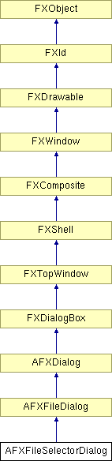

# AFXFileSelectorDialog

该类扩展了 FXFileDialog 类，旨在与模式基础设施配合使用。

### AFXFileSelectorDialog(form, title, pathNameKw, readOnlyKw, mode=AFXSELECTFILE_ANY, patterns=*, patternIndexTgt=None)

通常用于创建由模式张贴的对话框的构造函数（例如，通过 getFirstDialog）；pathName 使用关键字。如果对话框允许多选，则 pathName 关键字包含所有选定文件的逗号分隔路径名。
| **参数** | **类型** | **默认值** | **描述** |
| --- | --- | --- | --- |
| form | AFXForm |  | 表单。 |
| title | String |  | 对话框标题。 |
| pathNameKw | AFXStringKeyword |  | 路径名关键字。 |
| readOnlyKw | AFXBoolKeyword |  | 只读关键字。 |
| mode | Int | AFXSELECTFILE_ANY | 文件选择模式。 |
| patterns | String | * | 文件过滤器模式。 |
| patternIndexTgt | AFXIntTarget | None | 在对话框被张贴时用于选择文件过滤器模式的索引。 |

### AFXFileSelectorDialog(owner, title, pathNameKw, readOnlyKw, mode=AFXSELECTFILE_ANY, patterns=*, patternIndexTgt=None)

通常用于创建从另一个对话框张贴的对话框的构造函数（例如，从"选择..."按钮）；pathName 使用关键字。如果对话框允许多选，则 pathName 关键字包含所有选定文件的逗号分隔路径名。
| **参数** | **类型** | **默认值** | **描述** |
| --- | --- | --- | --- |
| owner | FXWindow |  | 所有者 |
| title | String |  | 对话框标题。 |
| pathNameKw | AFXStringKeyword |  | 路径名关键字。 |
| readOnlyKw | AFXBoolKeyword |  | 只读关键字。 |
| mode | Int | AFXSELECTFILE_ANY | 文件选择模式。 |
| patterns | String | * | 文件过滤器模式。 |
| patternIndexTgt | AFXIntTarget | None | 在对话框被张贴时用于选择文件过滤器模式的索引。 |

### AFXFileSelectorDialog(form, title, pathNameTgt, readOnlyKw, mode=AFXSELECTFILE_ANY, patterns=*, patternIndexTgt=None)

通常用于创建由模式张贴的对话框的构造函数（例如，通过 getFirstDialog）；pathName 使用目标。如果对话框允许多选，则 pathName 目标包含所有选定文件的逗号分隔路径名。
| **参数** | **类型** | **默认值** | **描述** |
| --- | --- | --- | --- |
| form | AFXForm |  | 表单。 |
| title | String |  | 对话框标题。 |
| pathNameTgt | AFXStringTarget |  | 路径名目标。 |
| readOnlyKw | AFXBoolKeyword |  | 只读关键字。 |
| mode | Int | AFXSELECTFILE_ANY | 文件选择模式。 |
| patterns | String | * | 文件过滤器模式。 |
| patternIndexTgt | AFXIntTarget | None | 在对话框被张贴时用于选择文件过滤器模式的索引。 |

### AFXFileSelectorDialog(owner, title, pathNameTgt, readOnlyKw, mode=AFXSELECTFILE_ANY, patterns=*, patternIndexTgt=None)

通常用于创建从另一个对话框张贴的对话框的构造函数（例如，从"选择..."按钮）；pathName 使用目标。如果对话框允许多选，则 pathName 目标包含所有选定文件的逗号分隔路径名。
| **参数** | **类型** | **默认值** | **描述** |
| --- | --- | --- | --- |
| owner | FXWindow |  | 所有者 |
| title | String |  | 对话框标题。 |
| pathNameTgt | AFXStringTarget |  | 路径名目标。 |
| readOnlyKw | AFXBoolKeyword |  | 只读关键字。 |
| mode | Int | AFXSELECTFILE_ANY | 文件选择模式。 |
| patterns | String | * | 文件过滤器模式。 |
| patternIndexTgt | AFXIntTarget | None | 在对话框被张贴时用于选择文件过滤器模式的索引。 |

### 全局标志

### **文件选择模式**

| **AFXSELECTFILE_ANY** | 单个文件，存在的或不存在（用于保存）。 |
| --- | --- |
| **AFXSELECTFILE_EXISTING** | 存在的文件（用于加载）。 |
| **AFXSELECTFILE_MULTIPLE** | 多个存在的文件。 |
| **AFXSELECTFILE_MULTIPLE_ALL** | 多个存在的文件或目录。 |
| **AFXSELECTFILE_DIRECTORY** | 存在的目录。 |
| **AFXSELECTFILE_REMOTE_HOST** | 允许在远程主机上打开文件。 |

