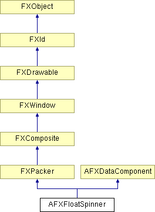

# AFXFloatSpinner

用于创建带标签微调器的便捷类。标签字段可以是标签或复选按钮（AFXFLOATSPINNER_CHECKBUTTON 选项）。

### AFXFloatSpinner(p, ncols, labelText, tgt=None, sel=0, opts=0, x=0, y=0, w=0, h=0, pl=DEFAULT_PAD, pr=DEFAULT_PAD, pt=DEFAULT_PAD, pb=DEFAULT_PAD)

构造函数。
| **参数** | **类型** | **默认值** | **描述** |
| --- | --- | --- | --- |
| p | FXComposite |  | 父 widget。 |
| ncols | Int |  | 微调器中的列数。 |
| labelText | String |  | 位于微调器前的标签。 |
| tgt | FXObject | None | 消息目标。 |
| sel | Int | 0 | 消息 ID。 |
| opts | Int | 0 | 选项和提示。 |
| x | Int | 0 | 原点 X 坐标。 |
| y | Int | 0 | 原点 Y 坐标。 |
| w | Int | 0 | widget 的宽度。 |
| h | Int | 0 | widget 的高度。 |
| pl | Int | DEFAULT_PAD | 左边距。 |
| pr | Int | DEFAULT_PAD | 右边距。 |
| pt | Int | DEFAULT_PAD | 顶边距。 |
| pb | Int | DEFAULT_PAD | 底边距。 |

### canFocus()

如果微调器可以接收焦点，则返回 True。

从 FXWindow 重新实现。

### create()

创建微调器。

从 FXComposite 重新实现。

### disable()

禁用微调器。

从 FXWindow 重新实现。

### enable()

启用微调器。

从 FXWindow 重新实现。

### getCheck()

返回复选按钮或单选按钮的状态。

### getHelpText()

返回状态栏帮助文本。

### getIncrement()

返回微调器增量。

### getLabelFont()

返回标签字体。

### getLabelText()

返回标签字符串。

### getRange()

返回表示 widget 允许的最小和最大值的浮点数序列（low, high）。

### getTipText()

返回工具提示消息。

### getValue()

返回微调器值。

### isCheckStateChanged()

如果复选按钮或单选按钮的状态自上次编程设置以来已被用户更改，则返回 True。

### isEditable()

如果微调器的输入字段可以编辑，则返回 True。

### isReadOnlyState()

如果微调器设置为只读状态，则返回 True。

### setCheck(state)

设置复选按钮或单选按钮的状态。
| **参数** | **类型** | **默认值** | **描述** |
| --- | --- | --- | --- |
| state | Bool |  | 按钮状态。 |

### setCheckButtonSelector(sel)

设置复选按钮或单选按钮的消息 ID。
| **参数** | **类型** | **默认值** | **描述** |
| --- | --- | --- | --- |
| sel | Int |  | 选择器。 |

### setCheckButtonTarget(tgt)

设置复选按钮或单选按钮的消息目标。
| **参数** | **类型** | **默认值** | **描述** |
| --- | --- | --- | --- |
| tgt | FXObject |  | 目标。 |

### setEditable(edit=True)

设置微调器输入字段的可编辑状态。
| **参数** | **类型** | **默认值** | **描述** |
| --- | --- | --- | --- |
| edit | Bool | True | 可编辑状态。 |

### setHelpText(text)

设置状态栏帮助文本。
| **参数** | **类型** | **默认值** | **描述** |
| --- | --- | --- | --- |
| text | String |  | 帮助文本。 |

### setIncrement(incr)

设置微调器增量。
| **参数** | **类型** | **默认值** | **描述** |
| --- | --- | --- | --- |
| incr | Float |  | 增量。 |

### setLabelFont(fnt)

设置标签字体。
| **参数** | **类型** | **默认值** | **描述** |
| --- | --- | --- | --- |
| fnt | FXFont |  | 标签字体。 |

### setLabelText(txt)

设置标签字符串。
| **参数** | **类型** | **默认值** | **描述** |
| --- | --- | --- | --- |
| txt | String |  | 标签文本。 |

### setRange(low, high)

设置微调器范围。
| **参数** | **类型** | **默认值** | **描述** |
| --- | --- | --- | --- |
| low | Float |  | 最小值。 |
| high | Float |  | 最大值。 |

### setReadOnlyState(edit=True)

设置微调器的只读状态。
| **参数** | **类型** | **默认值** | **描述** |
| --- | --- | --- | --- |
| edit | Bool | True | 只读状态。 |

### setTipText(text)

设置工具提示消息。
| **参数** | **类型** | **默认值** | **描述** |
| --- | --- | --- | --- |
| text | String |  | 工具提示文本。 |

### setValue(val, notify=False)

设置微调器值。
| **参数** | **类型** | **默认值** | **描述** |
| --- | --- | --- | --- |
| val | Float |  | 值。 |
| notify | Bool | False | 通知标志。 |

### 类标志

### ** **

| **ID_BUTTON** | 复选按钮或单选按钮的 ID。 |
| --- | --- |
| **ID_SPINNER** | 微调器的 ID。 |

### 全局标志

### **AFX 浮点微调器选项的标志。**

| **AFXFLOATSPINNER_CHECKBUTTON** | 使用复选按钮而不是标签。 |
| --- | --- |
| **AFXFLOATSPINNER_RADIOBUTTON** | 使用单选按钮而不是标签。 |
| **AFXFLOATSPINNER_VERTICAL** | 将标签或按钮置于微调器上方。 |
| **AFXFLOATSPINNER_READONLY** | 将微调器配置为只读状态。 |

