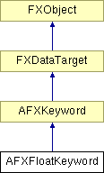

# AFXFloatKeyword

该类专为具有浮点值的命令关键字设计。

### AFXFloatKeyword(command, name, isRequired=False, defaultValue=FLOAT_DEFAULT, precision=6)

构造函数。
| **参数** | **类型** | **默认值** | **描述** |
| --- | --- | --- | --- |
| command | AFXCommand |  | 宿主命令。 |
| name | String |  | 关键字名称。 |
| isRequired | Bool | False | 如果该关键字是命令的必需参数，则为 True。 |
| defaultValue | Float | FLOAT_DEFAULT | 默认值。 |
| precision | Int | 6 | 用于将关键字的浮点值转换为文本字符串的精度。 |

### getPrecision()

返回用于将关键字的浮点值转换为文本字符串的精度。

### getTypeName()

返回关键字类型的名称。

实现 AFXKeyword。

### getValue()

返回关键字的当前值，如果内容表达式无效则返回零。

### getValueAsString()

返回表示关键字当前值的文本字符串。

实现 AFXKeyword。

### isValueChanged()

如果关键字值与其之前的值不同，则返回 True。

实现 AFXKeyword。

### setDefaultValue(defaultValue)

设置关键字的默认值。
| **参数** | **类型** | **默认值** | **描述** |
| --- | --- | --- | --- |
| defaultValue | String |  | 默认值。 |

### setDefaultValue(defaultValue)

设置关键字的默认值。
| **参数** | **类型** | **默认值** | **描述** |
| --- | --- | --- | --- |
| defaultValue | Float |  | 默认值。 |

### setPrecision(precision)

设置用于将关键字的浮点值转换为文本字符串的精度。
| **参数** | **类型** | **默认值** | **描述** |
| --- | --- | --- | --- |
| precision | Int |  |  |

### setValue(newValue)

设置关键字的当前值。
| **参数** | **类型** | **默认值** | **描述** |
| --- | --- | --- | --- |
| newValue | String |  | 新值。 |

### setValue(newValue)

设置关键字的当前值。
| **参数** | **类型** | **默认值** | **描述** |
| --- | --- | --- | --- |
| newValue | Float |  | 新值。 |

### setValueToDefault(ignoreUnspecified=False)

将关键字值设置为其默认值。
| **参数** | **类型** | **默认值** | **描述** |
| --- | --- | --- | --- |
| ignoreUnspecified | Bool | False | 如果默认值未指定，则忽略设置值。 |

### setValueToPrevious()

将关键字值设置为其之前的值。

实现 AFXKeyword。

### syncPreviousValue()

将关键字之前的值设置为其当前值。

实现 AFXKeyword。

