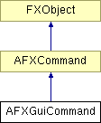

# AFXGuiCommand

该类专为由模式处理的 GUI 命令设计。

### AFXGuiCommand(mode, method, objectName='', registerQuery=False)

构造函数。
| **参数** | **类型** | **默认值** | **描述** |
| --- | --- | --- | --- |
| mode | AFXGuiMode |  | 宿主模式。 |
| method | String |  | 方法。 |
| objectName | String | '' | 对象名称。 |
| registerQuery | Bool | False | 如果应注册查询以便根据 kernel 状态更新命令的关键字值，则为 True。 |

### getMode()

检索命令的模式。

