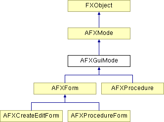

# AFXGuiMode

该类是模式的抽象基类。

### AFXGuiMode(owner)

构造函数。
| **参数** | **类型** | **默认值** | **描述** |
| --- | --- | --- | --- |
| owner | AFXGuiObjectManager |  | 模式的所有者（模块或工具集）。 |

### activate()

执行模式被激活时所需的任务。

在 AFXForm 和 AFXProcedure 中重新实现。

### cancel(tgt=None, msg=0)

请求取消模式。当取消操作完成（无论成功与否）时，目标将收到指定消息。如果取消操作成功完成，则消息数据指针将非零；如果取消操作因某种原因被放弃，则为零。
| **参数** | **类型** | **默认值** | **描述** |
| --- | --- | --- | --- |
| tgt | FXObject | None | 完成消息目标。 |
| msg | Int | 0 | 完成消息 ID。 |

### commit()

执行模式的对话框被提交时所需的任务。

在 AFXForm 和 AFXProcedure 中实现。

### continueMode()

必须在派生类中定义的虚方法——用于获取模式中的下一个对话框或步骤。

在 AFXForm 和 AFXProcedure 中实现。

### deactivate()

执行模式被停用时所需的任务。

在 AFXProcedureForm 和 AFXProcedure 中重新实现。

### destroyDialogs()

当模式被停用时销毁关联的对话框。此函数的确切行为由对话框的 getDeactivateAction() 方法的返回值控制。

### doCustomChecks()

此类提供了此方法的空实现；派生类应重新定义此方法以对用户输入执行其特定验证。

### doCustomTasks()

此类提供了此方法的空实现，在命令成功处理后调用。派生类应重新定义此方法以执行其特定任务，例如向主窗口写入确认消息。

### getCommandString()

返回包含由与模式关联的每个命令生成的命令列表的字符串。

### getCurrentDialog()

返回模式当前张贴的对话框（可能为 NULL）。

### getModeName()

返回模式的名称。

### getOwner()

返回模式的所有者（模块或工具集）。

### getPressedButtonId()

返回用户在当前张贴的对话框中按下的按钮的 ID。

### handleException(exc)

为给定异常张贴带有错误消息的对话框。派生类应重新定义此方法（如果需要不同地处理异常）。
| **参数** | **类型** | **默认值** | **描述** |
| --- | --- | --- | --- |
| exc | nex_Exception |  | 异常。 |

### handleKeywordException(exc)

为给定异常张贴带有错误消息的对话框，该异常由数据验证期间的关键字抛出。
| **参数** | **类型** | **默认值** | **描述** |
| --- | --- | --- | --- |
| exc | nex_Exception |  | 异常。 |

### isKeyword(object)

如果对象是模式的关键字之一，则返回 True。
| **参数** | **类型** | **默认值** | **描述** |
| --- | --- | --- | --- |
| object | FXObject |  |  |

### issueCommands(writeToReplay=True, writeToJournal=False)

根据当前状态生成命令，发送命令，并在必要时停用模式。如果命令未成功完成，将张贴带有错误消息的对话框。
| **参数** | **类型** | **默认值** | **描述** |
| --- | --- | --- | --- |
| writeToReplay | Bool | True | 如果命令应写入回放文件，则为 True；否则为 False。 |
| writeToJournal | Bool | False | 如果命令应写入日志文件，则为 True；否则为 False。 |

### okToCancel()

方法，指示如果上下文更改（例如，如果用户打开新数据库）对话框是否应被取消；基类实现返回 True，表示可以取消模式，派生类可以覆盖此方法并返回 False 以防止模式在上下文更改期间被取消。

### onKeywordsUpdated(command)

每当命令的对象在 Kernel 中更改时调用的钩子方法。默认情况下此函数不执行任何操作。
| **参数** | **类型** | **默认值** | **描述** |
| --- | --- | --- | --- |
| command | AFXGuiCommand |  | 触发查询的命令。 |

### registerDefaultsObject(command, objectName)

注册默认对象，该对象将在对话框中的"默认"按钮被按下时被查询。
| **参数** | **类型** | **默认值** | **描述** |
| --- | --- | --- | --- |
| command | AFXGuiCommand |  | 其关键字将用默认对象值填充的命令。 |
| objectName | String |  | 要查询的默认对象的名称。 |

### registerQueries()

向 GUI 基础设施注册模式的活动命令的查询，并注销非活动命令的查询。

### removeAllProxies()

注销查询并删除所有关联的代理。

### sendCommandString(command, writeToReplay=True, writeToJournal=False)

发送给定的命令字符串（可以包含多个命令，以命令分隔符分隔）。
| **参数** | **类型** | **默认值** | **描述** |
| --- | --- | --- | --- |
| command | String |  | 命令字符串。 |
| writeToReplay | Bool | True | 如果命令应写入回放文件，则为 True；否则为 False。 |
| writeToJournal | Bool | False | 如果命令应写入日志文件，则为 True；否则为 False。 |

### setModeName(name)

设置模式的名称。
| **参数** | **类型** | **默认值** | **描述** |
| --- | --- | --- | --- |
| name | String |  |  |

### unregisterAllQueries()

向 GUI 基础设施注销模式所有命令的查询。

### verify()

验证与模式关联的每个活动命令，如果任何命令包含无效数据的关键字则抛出异常。

### verifyCurrentKeywordValues()

检查当前对话框的活动命令的关键字是否包含有效数据，如果没有，则张贴带有错误消息的对话框。

在 AFXProcedure 中重新实现。

### verifyKeywordValues()

检查活动命令的关键字是否包含有效数据，如果没有，则张贴带有错误消息的对话框。

### 类标志

### **消息 ID。**

| **ID_DESTROY_DIALOGS** | 用于销毁对话框。 |
| --- | --- |
| **ID_HANDLE_BAILOUT** | 用于处理 bailout。 |

