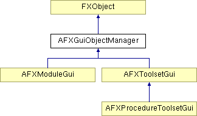

# AFXGuiObjectManager

此类是菜单栏、工具栏和工具箱中 GUI 组件管理的基础类。

### AFXGuiObjectManager()

构造函数。

### AFXGuiObjectManager(source)

未定义的复制构造函数（此类不具有复制语义）。
| **参数** | **类型** | **默认值** | **说明** |
| --- | --- | --- | --- |
| source | AFXGuiObjectManager |  | 要复制的对象。 |

### getDialog(widgetAlias)

返回具有指定窗口部件键的对话框。
| **参数** | **类型** | **默认值** | **说明** |
| --- | --- | --- | --- |
| widgetAlias | String |  | 对话框别名。 |

### getKernelInitializationCommand()

返回应为 kernel 中相应模块或工具集发送初始化命令的命令。在 GUI 模块首次切换到时由模块管理器调用。

### getToolbarGroup(name)

返回由给定名称参数指定的工具栏组。
| **参数** | **类型** | **默认值** | **说明** |
| --- | --- | --- | --- |
| name | String |  | 一个指定要获取的工具栏的 String。 |

### hide(location)

隐藏菜单栏、工具栏和工具箱中的 GUI 组件。
| **参数** | **类型** | **默认值** | **说明** |
| --- | --- | --- | --- |
| location | Int |  | GUI 组件所在的位置。 |

### registerAndShowDialog(dialog)

注册给定的对话框及其窗口部件键，并提交该对话框。
| **参数** | **类型** | **默认值** | **说明** |
| --- | --- | --- | --- |
| dialog | AFXDialog |  | 对话框。 |

### registerAndShowModalDialog(dialog)

注册给定的对话框及其窗口部件键，并将其作为模态对话框提交。
| **参数** | **类型** | **默认值** | **说明** |
| --- | --- | --- | --- |
| dialog | AFXDialog |  | 对话框。 |

### registerShortcutFunction(text, tgt, sel, ic=None, tipText='', displayedName='', typesToDisplay=0)

注册快捷方式函数；此函数将在 GUI 中可用，以便用户可以为其分配快捷键。
| **参数** | **类型** | **默认值** | **说明** |
| --- | --- | --- | --- |
| text | String |  | 用于在 GUI 中标识该函数的标签；要指定快捷键，请使用 "\t" 将其与标签分开。 |
| tgt | FXObject |  | 消息目标。 |
| sel | Int |  | 消息 ID。 |
| ic | FXIcon | None | 快捷键图标 |
| tipText | String | '' | 用于底部工具提示的文本 |
| displayedName | String | '' | 此函数所属模块的名称。 |
| typesToDisplay | Int | 0 | 指定模块中显示的对象类型的标志；参见 AFXModuleGui。 |

### sendCommandString(command, writeToReplay=True, writeToJournal=False)

发送给定的命令字符串（可以包含多个命令，用命令分隔符分隔）。
| **参数** | **类型** | **默认值** | **说明** |
| --- | --- | --- | --- |
| command | String |  | 命令字符串。 |
| writeToReplay | Bool | True | 如果命令应写入重放文件，则为 True；否则为 False。 |
| writeToJournal | Bool | False | 如果命令应写入日志文件，则为 True；否则为 False。 |

### show(location)

显示菜单栏、工具栏和工具箱中的 GUI 组件。
| **参数** | **类型** | **默认值** | **说明** |
| --- | --- | --- | --- |
| location | Int |  | GUI 组件所在的位置。 |

### unregisterDialog(widgetAlias)

从管理器中取消注册具有给定窗口部件键的对话框。
| **参数** | **类型** | **默认值** | **说明** |
| --- | --- | --- | --- |
| widgetAlias | String |  | 对话框别名。 |

### 类标志

### **消息 ID。**

| **ID_DESTROY_DIALOGS** | 用于销毁对话框。 |
| --- | --- |

### 全局标志

### **GUI 位置的标志。**

| **GUI_IN_NONE** | GUI 在标准位置没有组件。 |
| --- | --- |
| **GUI_IN_MENUBAR** | GUI 在菜单栏中有组件。 |
| **GUI_IN_TOOL_PANE** | GUI 在 Tools 下拉窗格中有组件。 |
| **GUI_IN_TOOLBAR** | GUI 在工具栏中有组件。 |
| **GUI_IN_TOOLBOX** | GUI 在工具箱中有组件。 |

