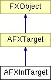

# AFXIntTarget

此类专为整数目标而设计。

### AFXIntTarget(initialValue=0)

构造函数。
| **参数** | **类型** | **默认值** | **说明** |
| --- | --- | --- | --- |
| initialValue | Int | 0 | 初始值。 |

### getTypeName()

返回目标类型的名称（"Int"）。

实现 AFXTarget。

### getValue()

返回目标的当前值。

### setValue(newValue)

设置目标的当前值。
| **参数** | **类型** | **默认值** | **说明** |
| --- | --- | --- | --- |
| newValue | Int |  | 新值。 |

