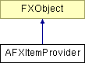

# AFXItemProvider

此类提供了一种向组件（如 AFXComboBox 和 AFXList）供应项目的方式。

### AFXItemProvider(initialItems='')

构造函数。
| **参数** | **类型** | **默认值** | **说明** |
| --- | --- | --- | --- |
| initialItems | String | '' | 包含初始项目的序列字符串。 |

### append(str)

将字符串追加到项目字符串。
| **参数** | **类型** | **默认值** | **说明** |
| --- | --- | --- | --- |
| str | String |  |  |

### append(ch)

将字符追加到项目字符串。
| **参数** | **类型** | **默认值** | **说明** |
| --- | --- | --- | --- |
| ch | String |  |  |

### empty()

如果项目字符串为空则返回 True。

### getItems()

返回包含提供器所有项目的序列字符串。

### getVersion()

返回提供器项目的版本。

### reset(sz=0)

清除项目字符串的内容并重新分配空间。
| **参数** | **类型** | **默认值** | **说明** |
| --- | --- | --- | --- |
| sz | Int | 0 |  |

### setItems(newItems)

设置提供器的所有项目，先清除任何现有项目。
| **参数** | **类型** | **默认值** | **说明** |
| --- | --- | --- | --- |
| newItems | String |  | 包含新项目的序列字符串。 |

