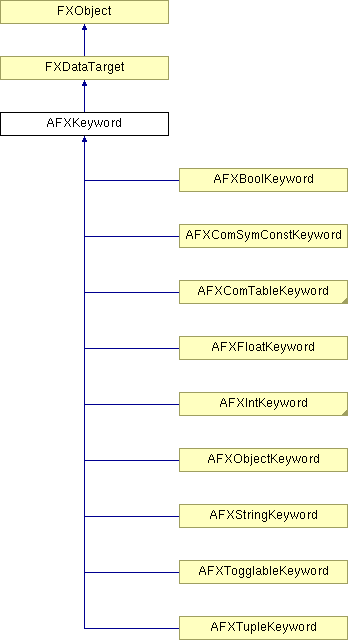

# AFXKeyword

此类是所有命令关键字的抽象基类。

### AFXKeyword(command, name, isRequired=False)

构造函数。
| **参数** | **类型** | **默认值** | **说明** |
| --- | --- | --- | --- |
| command | AFXCommand |  | 宿主命令，如果创建不与命令关联的关键字，则为 NULL。 |
| name | String |  | 关键字名称。 |
| isRequired | Bool | False | 如果关键字是命令的必需参数，则为 True。 |

### activate()

激活关键字；活动关键字将在命令生成期间被处理。

### deactivate()

停用关键字；非活动关键字在命令生成期间不会被处理。

### getCommandSnippet()

根据关键字的当前值返回命令片段。

### getName()

返回关键字名称。

### getSetupCommands()

返回关键字的变量初始化命令（生成的命令字符串的一部分）。

### getTypeName()

返回关键字类型名称。

在 AFXBoolKeyword、AFXComSymConstKeyword、AFXComTableKeyword、AFXFloatKeyword、AFXIntKeyword、AFXObjectKeyword、AFXStringKeyword、AFXSymConstKeyword、AFXTogglableKeyword、AFXTupleKeyword 和 AFXTableKeyword 中实现。

### getValueAsString()

返回表示当前关键字值的文本字符串。

在 AFXBoolKeyword、AFXComSymConstKeyword、AFXComTableKeyword、AFXFloatKeyword、AFXIntKeyword、AFXObjectKeyword、AFXStringKeyword、AFXSymConstKeyword、AFXTogglableKeyword 和 AFXTupleKeyword 中实现。

### isActive()

如果关键字处于活动状态，则返回 True。

### isRequired()

如果关键字是宿主命令的必需参数，则返回 True；如果关键字是可选的，则返回 False。

### isValueChanged()

如果关键字值与其之前的值不同，则返回 True。

在 AFXBoolKeyword、AFXComSymConstKeyword、AFXComTableKeyword、AFXFloatKeyword、AFXIntKeyword、AFXObjectKeyword、AFXStringKeyword、AFXTogglableKeyword 和 AFXTupleKeyword 中实现。

### setRequired(val)

将此对象设置为主机命令的必需关键字。
| **参数** | **类型** | **默认值** | **说明** |
| --- | --- | --- | --- |
| val | Bool |  |  |

### setSetupCommands(cmds)

设置关键字所需的变量初始化命令。
| **参数** | **类型** | **默认值** | **说明** |
| --- | --- | --- | --- |
| cmds | String |  |  |

### setValueToDefault(ignoreUnspecified=False)

将关键字值设置为其默认值。
| **参数** | **类型** | **默认值** | **说明** |
| --- | --- | --- | --- |
| ignoreUnspecified | Bool | False | 如果默认值为指定，则忽略设置值。 |

### setValueToPrevious()

将关键字值设置为其之前的值。

在 AFXBoolKeyword、AFXComSymConstKeyword、AFXComTableKeyword、AFXFloatKeyword、AFXIntKeyword、AFXObjectKeyword、AFXStringKeyword、AFXTogglableKeyword 和 AFXTupleKeyword 中实现。

### syncPreviousValue()

将关键字的前一个值设置为其当前值。

在 AFXBoolKeyword、AFXComSymConstKeyword、AFXComTableKeyword、AFXFloatKeyword、AFXIntKeyword、AFXObjectKeyword、AFXStringKeyword、AFXTogglableKeyword 和 AFXTupleKeyword 中实现。

### 类标志

### **消息 ID。**

| **ID_ACTIVATE** | 用于激活关键字。 |
| --- | --- |
| **ID_DEACTIVATE** | 用于停用关键字。 |

