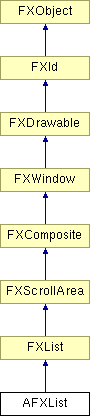

# AFXList

此类是一个列表窗口部件，允许在可滚动窗口中显示项目。

### AFXList(p, nvis, tgt=None, sel=0, opts=0, x=0, y=0, w=0, h=0)

构造函数。
| **参数** | **类型** | **默认值** | **说明** |
| --- | --- | --- | --- |
| p | FXComposite |  | 父窗口部件。 |
| nvis | Int |  | 可见项目数。 |
| tgt | FXObject | None | 消息目标。 |
| sel | Int | 0 | 消息 ID。 |
| opts | Int | 0 | 选项和提示。 |
| x | Int | 0 | 原点的 X 坐标。 |
| y | Int | 0 | 原点的 Y 坐标。 |
| w | Int | 0 | 窗口部件的宽度。 |
| h | Int | 0 | 窗口部件的高度。 |

### appendItem(text, icon=None, sel=0)

在列表末尾添加一个新项目。
| **参数** | **类型** | **默认值** | **说明** |
| --- | --- | --- | --- |
| text | String |  |  |
| icon | FXIcon | None |  |
| sel | Int | 0 |  |

### disable()

禁用列表。

从 FXWindow 重新实现。

### enable()

启用列表。

从 FXWindow 重新实现。

### getAutoCommit()

返回自动提交标志。

### getDefaultHeight()

返回列表的默认高度。

从 FXList 重新实现。

### getItemIndexForData(data)

返回具有关联数据的第一个项目的索引，如果未找到则返回 -1。
| **参数** | **类型** | **默认值** | **说明** |
| --- | --- | --- | --- |
| data |  |  |  |

### getItemProvider()

返回列表项目的供应者。

### getSingleSelection()

返回唯一选中项目的索引。如果选中多个项目或没有选中的项目，则返回 -1。

### insertItem(index, text, icon=None, sel=0)

在给定索引处插入一个新项目。
| **参数** | **类型** | **默认值** | **说明** |
| --- | --- | --- | --- |
| index | Int |  |  |
| text | String |  |  |
| icon | FXIcon | None |  |
| sel | Int | 0 |  |

### replaceItem(index, text, icon=None, sel=0)

替换给定索引处的项目。
| **参数** | **类型** | **默认值** | **说明** |
| --- | --- | --- | --- |
| index | Int |  |  |
| text | String |  |  |
| icon | FXIcon | None |  |
| sel | Int | 0 |  |

### setAutoCommit(commit)

设置用于处理双击的自动提交选项。此选项默认处于开启状态。
| **参数** | **类型** | **默认值** | **说明** |
| --- | --- | --- | --- |
| commit | Bool |  |  |

### setItemProvider(cp)

设置列表项目的供应者。
| **参数** | **类型** | **默认值** | **说明** |
| --- | --- | --- | --- |
| cp | FXObject |  |  |

### 全局标志

### **AFX 列表选项的标志。**

| **AFXLIST_NO_AUTOCOMMIT** | 双击时不自动提交。 |
| --- | --- |

