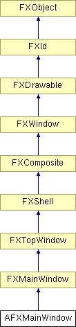

# AFXMainWindow

此类负责构建主窗口的组件。它还提供对所构建组件的访问方法。

### AFXMainWindow(app, title, icon=None, miniIcon=None, opts=DECOR_ALL, x=0, y=0, w=0, h=0)

构造函数。
| **参数** | **类型** | **默认值** | **说明** |
| --- | --- | --- | --- |
| app | FXApp |  | FXApp 对象。 |
| title | String |  | 主窗口标题。 |
| icon | FXIcon | None | 主窗口图标。 |
| miniIcon | FXIcon | None | 最小化图标。 |
| opts | Int | DECOR_ALL | 主窗口选项。 |
| x | Int | 0 | 主窗口的 X 位置。 |
| y | Int | 0 | 主窗口的 Y 位置。 |
| w | Int | 0 | 主窗口的宽度。 |
| h | Int | 0 | 主窗口的高度。 |

### appendApplicableModuleForTreeTab(name, moduleName)

将模块名称追加到树标签适用的模块列表中。
| **参数** | **类型** | **默认值** | **说明** |
| --- | --- | --- | --- |
| name | String |  | 标签项的名称。 |
| moduleName | String |  | 要追加到标签适用模块列表的模块名称。 |

### appendTreeTab(text, name)

将新标签项追加到树工具集标签手册中，并返回新标签项管理的垂直框架；在构造完其所有子窗口部件后，必须在该垂直框架上调用 create()。
| **参数** | **类型** | **默认值** | **说明** |
| --- | --- | --- | --- |
| text | String |  | 要在新标签项中显示的文本。 |
| name | String |  | 新标签项的名称。 |

### appendVisibleModuleForTreeTab(name, moduleName)

将模块追加到树标签可见的模块列表中。
| **参数** | **类型** | **默认值** | **说明** |
| --- | --- | --- | --- |
| name | String |  | 标签项的名称。 |
| moduleName | String |  | 要追加到标签可见模块列表的模块名称。 |

### create()

创建窗口系统资源的虚拟基类方法。

从 FXTopWindow 重新实现。

### getContextBar()

返回上下文栏容器的指针。

### getCurrentTreeTab()

返回当前标签项。

### getDefaultHeight()

返回默认主窗口高度。

从 FXTopWindow 重新实现。

### getDefaultWidth()

返回默认主窗口宽度。

从 FXTopWindow 重新实现。

### getDisplayedNameAtIndex(index)

返回列表中给定位置的显示名称。
| **参数** | **类型** | **默认值** | **说明** |
| --- | --- | --- | --- |
| index | Int |  | 模块列表中的位置。 |

### getDrawingAreaHeight()

以像素为单位返回绘图区域的高度。

### getDrawingAreaWidth()

以像素为单位返回绘图区域的宽度。

### getHelpToolset()

返回帮助工具集的指针。

### getMenubar()

返回菜单栏的指针。

### getModule(name)

返回由给定名称参数指定的模块。
| **参数** | **类型** | **默认值** | **说明** |
| --- | --- | --- | --- |
| name | String |  | 一个指定要获取的模块的 String。 |

### getModuleName(displayedName)

返回给定显示名称的模块名称。
| **参数** | **类型** | **默认值** | **说明** |
| --- | --- | --- | --- |
| displayedName | String |  | 显示的模块名称（英文）。 |

### getNumModules()

返回模块数量。

### getPluginToolset()

返回 Plugin 工具集。

### getSelectorFromFunction(function)

返回给定快捷键函数的选择器。如果未找到则抛出异常。
| **参数** | **类型** | **默认值** | **说明** |
| --- | --- | --- | --- |
| function | String |  | 一个指定在"自定义"对话框中显示的函数的 String。 |

### getTargetFromFunction(function)

返回给定快捷键函数的目标。如果未找到则抛出异常。
| **参数** | **类型** | **默认值** | **说明** |
| --- | --- | --- | --- |
| function | String |  | 一个指定在"自定义"对话框中显示的函数的 String。 |

### getToolbox()

返回模块工具箱容器的指针。

### getToolMenuPane()

返回工具菜单窗格的指针。

### getToolMenuTitle()

返回 Tools 菜单标题的指针。

### getToolset(name)

返回由给定名称参数指定的工具集。
| **参数** | **类型** | **默认值** | **说明** |
| --- | --- | --- | --- |
| name | String |  | 一个以本地语言指定要获取的工具集的 String。 |

### getToolsetKernelInitializationCommands()

返回应初始化 kernel 中与主窗口注册的工具集对应的工具集的命令字符串。

### getWorkDirectory()

返回当前工作目录。

### hideCli()

隐藏命令行界面。

### hideMessageArea()

隐藏消息区域界面。

### makeCustomToolsets()

此方法没有基类实现；自定义工具可用于构造 Abaqus/CAE 工具集或从 Abaqus/CAE 工具集派生的工具集；在此方法中构造这些工具集是必要的，以确保该工具集可供注册该工具集的标准 Abaqus/CAE 模块使用，并避免在使用自定义工具集时创建重复的窗口部件。

### registerHelpToolset(tool, opts)

注册 Help 工具集。
| **参数** | **类型** | **默认值** | **说明** |
| --- | --- | --- | --- |
| tool | AFXToolsetGui |  | 正在注册的工具集的指针。 |
| opts | Int |  | 创建工具集 GUI 组件的选项。 |

### registerModule(displayedName, i18nName, moduleImportName, givingTranslation)

缺少说明
| **参数** | **类型** | **默认值** | **说明** |
| --- | --- | --- | --- |
| displayedName | String |  |  |
| i18nName | String |  |  |
| moduleImportName | String |  | 将用于导入此模块的名称。 |
| givingTranslation | Bool |  |  |

### registerModule(displayedName, i18nName, moduleImportName, kernelInitializationCommand)

缺少说明
| **参数** | **类型** | **默认值** | **说明** |
| --- | --- | --- | --- |
| displayedName | String |  |  |
| i18nName | String |  |  |
| moduleImportName | String |  | 将用于导入此模块的名称。 |
| kernelInitializationCommand | String |  |  |

### registerModule(displayedName, moduleImportName)

注册模块以使其在模块组合框中可用；为 Abaqus 模块使用预定义的初始化字符串。
| **参数** | **类型** | **默认值** | **说明** |
| --- | --- | --- | --- |
| displayedName | String |  | 将显示在上下文栏中 Module 组合框中的名称。 |
| moduleImportName | String |  | 将用于导入此模块的名称。 |

### registerModule(displayedName, moduleImportName, kernelInitializationCommand)

注册模块以使其在模块组合框中可用；还注册在首次加载模块时要发送到 kernel 的初始化字符串。
| **参数** | **类型** | **默认值** | **说明** |
| --- | --- | --- | --- |
| displayedName | String |  | 将显示在上下文栏中 Module 组合框中的名称。 |
| moduleImportName | String |  | 将用于导入此模块的名称。 |
| kernelInitializationCommand | String |  | 加载模块时发送到 kernel 的 Python 命令。 |

### registerToolset(tool, opts)

注册始终在主窗口中可用的工具集。
| **参数** | **类型** | **默认值** | **说明** |
| --- | --- | --- | --- |
| tool | AFXGuiObjectManager |  | 正在注册的对象的指针。 |
| opts | Int |  | 创建工具集 GUI 组件的选项。 |

### setApplicabilityForTreeTab(name, moduleNames)

设置给定树标签适用的模块。切换模块时，如果当前标签适用于新模块，它将保持当前状态。创建树标签时，它适用于所有模块——使用此方法将适用性仅设置为某些模块。
| **参数** | **类型** | **默认值** | **说明** |
| --- | --- | --- | --- |
| name | String |  | 标签项的名称。 |
| moduleNames | String |  | 一个包含用逗号分隔的模块名称的 String。 |

### setCurrentTreeTab(name)

将树工具集标签手册的当前标签项设置为给定名称指定的标签项。
| **参数** | **类型** | **默认值** | **说明** |
| --- | --- | --- | --- |
| name | String |  | 要设置为当前的标签项的名称。 |

### setVisibilityForTreeTab(name, moduleNames)

设置树标签可见的模块。切换模块时，如果标签未指定在新模块中可见，则该标签将被隐藏；否则它将显示。创建树标签时，它在所有模块中可见——使用此方法将可见性仅设置为某些模块。
| **参数** | **类型** | **默认值** | **说明** |
| --- | --- | --- | --- |
| name | String |  | 标签项的名称。 |
| moduleNames | String |  | 一个包含用逗号分隔的模块名称的 String。 |

### setWorkDirectory(directory)

设置当前工作目录。
| **参数** | **类型** | **默认值** | **说明** |
| --- | --- | --- | --- |
| directory | String |  | 一个指定新工作目录的 String。 |

### showCli()

显示命令行界面。

### showMessageArea()

显示消息区域界面。

### writeToMessageArea(message)

将字符串写入消息区域。
| **参数** | **类型** | **默认值** | **说明** |
| --- | --- | --- | --- |
| message | String |  |  |

### 类标志

### **消息 ID。**

| **ID_QUIT** | 用于处理退出消息。 |
| --- | --- |
| **ID_TAB** | 用于处理标签切换。 |
| **ID_TOGGLE_MODEL_TREE** | 切换模型树的可见性。 |
| **ID_LAST** | 不使用，不删除；供派生类使用。 |

