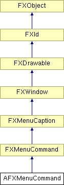

# AFXMenuCommand

此类提供创建 FXMenuCommand 并对其进行各种管理活动的接口。它将使用实用方法，以便正确管理模块和工具集的菜单命令。

### AFXMenuCommand(owner, p, label, ic=None, tgt=None, sel=0)

构造函数。
| **参数** | **类型** | **默认值** | **说明** |
| --- | --- | --- | --- |
| owner | AFXGuiObjectManager |  | 菜单命令的创建者。 |
| p | FXComposite |  | 父窗口部件。 |
| label | String |  | 菜单按钮的标签。 |
| ic | FXIcon | None | 菜单按钮图标。 |
| tgt | FXObject | None | 消息目标。 |
| sel | Int | 0 | 消息 ID。 |

### getOwner()

返回菜单命令的所有者。

从 FXWindow 重新实现。

