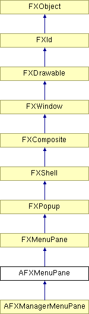

# AFXMenuPane

此类提供用于创建 FXMenuPane 并对其执行各种管理活动的接口。

### AFXMenuPane(owner)

构造函数。
| **参数** | **类型** | **默认值** | **说明** |
| --- | --- | --- | --- |
| owner | AFXGuiObjectManager |  | 窗格的管理器。 |

### getOwner()

返回菜单窗格的所有者。

从 FXWindow 重实现。

