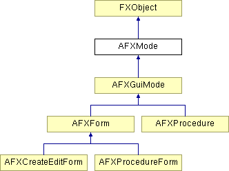

# AFXMode

此类是模式的基类。

### AFXMode()

构造函数。

### getCommand(index)

返回给定索引处的命令（如果索引超出范围则返回 0）。
| **参数** | **类型** | **默认值** | **说明** |
| --- | --- | --- | --- |
| index | Int |  | 命令索引（从零开始）。 |

### getNumCommands()

返回与该模式关联的命令数。

### isActive()

如果该模式处于活动状态，则返回 True。

### 类标志

### **消息 ID。**

| **ID_ACTIVATE** | 激活该模式。 |
| --- | --- |
| **ID_COMMIT** | 提交该模式。 |
| **ID_CANCEL** | 取消该模式。 |
| **ID_DEACTIVATE** | 停用该模式。 |
| **ID_GET_NEXT** | 获取下一步/对话框。 |
| **ID_RESUME** | 恢复该模式。 |
| **ID_SET_DEFAULTS** | 设置默认值。 |
| **ID_SUSPEND** | 挂起该模式。 |
| **ID_CMD_ACTIVATED** | 指示命令被激活。 |
| **ID_CMD_DEACTIVATED** | 指示命令被停用。 |
| **ID_CMD_MODIFIED** | 指示命令被修改。 |

