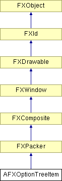

# AFXOptionTreeItem

此类是带有复选按钮的树窗口部件。

### AFXOptionTreeItem(p, label, tgt=None, sel=0, opts=0, x=0, y=0, w=0, h=0, pl=DEFAULT_SPACING, pr=DEFAULT_SPACING, pt=DEFAULT_SPACING, pb=DEFAULT_SPACING, hs=DEFAULT_SPACING, vs=DEFAULT_SPACING)

构造函数，创建顶级（根）树项目。
| **参数** | **类型** | **默认值** | **说明** |
| --- | --- | --- | --- |
| p | FXComposite |  | 父窗口部件。 |
| label | String |  | 标签文本。 |
| tgt | FXObject | None | 消息目标。 |
| sel | Int | 0 | 消息 ID。 |
| opts | Int | 0 | 选项和提示。 |
| x | Int | 0 | 原点的 X 坐标。 |
| y | Int | 0 | 原点的 Y 坐标。 |
| w | Int | 0 | 窗口部件的宽度。 |
| h | Int | 0 | 窗口部件的高度。 |
| pl | Int | DEFAULT_SPACING | 左边距。 |
| pr | Int | DEFAULT_SPACING | 右边距。 |
| pt | Int | DEFAULT_SPACING | 顶部边距。 |
| pb | Int | DEFAULT_SPACING | 底部边距。 |
| hs | Int | DEFAULT_SPACING | 水平间距。 |
| vs | Int | DEFAULT_SPACING | 垂直间距。 |

### addItemAfter(label, tgt=None, sel=0)

在树项目之后（下方）作为兄弟项创建新树项目。
| **参数** | **类型** | **默认值** | **说明** |
| --- | --- | --- | --- |
| label | String |  | 项目标签。 |
| tgt | FXObject | None | 项目目标。 |
| sel | Int | 0 | 项目选择器。 |

### addItemBefore(label, tgt=None, sel=0)

在树项目之前（上方）作为兄弟项创建新树项目。
| **参数** | **类型** | **默认值** | **说明** |
| --- | --- | --- | --- |
| label | String |  | 项目标签。 |
| tgt | FXObject | None | 项目目标。 |
| sel | Int | 0 | 项目选择器。 |

### addItemFirst(label, tgt=None, sel=0)

作为树项目的第一个子项创建新树项目。
| **参数** | **类型** | **默认值** | **说明** |
| --- | --- | --- | --- |
| label | String |  | 项目标签。 |
| tgt | FXObject | None | 项目目标。 |
| sel | Int | 0 | 项目选择器。 |

### addItemLast(label, tgt=None, sel=0)

作为树项目的最后一个子项创建新树项目。
| **参数** | **类型** | **默认值** | **说明** |
| --- | --- | --- | --- |
| label | String |  | 项目标签。 |
| tgt | FXObject | None | 项目目标。 |
| sel | Int | 0 | 项目选择器。 |

### childAtIndex(index)

返回给定索引处的子树。
| **参数** | **类型** | **默认值** | **说明** |
| --- | --- | --- | --- |
| index | Int |  | 索引。 |

### collapse()

折叠（隐藏）子项。

### computeDefaultArrowSize()

计算箭头按钮的默认大小。

### containsChild(tree)

检查给定树是否为此对象的子项。
| **参数** | **类型** | **默认值** | **说明** |
| --- | --- | --- | --- |
| tree | AFXOptionTreeItem |  | 项目。 |

### create()

创建树项目。

从 FXComposite 重新实现。

### disable()

禁用树项目。

从 FXWindow 重新实现。

### enable()

启用树项目。

从 FXWindow 重新实现。

### expand()

展开（显示）子项。

### getArrowSize()

返回箭头按钮的大小。

### getCheck()

返回树项目的复选状态。

### getDefaultWidth()

返回树项目的默认宽度。

从 FXPacker 重新实现。

### getFirst()

返回第一个子树。

从 FXWindow 重新实现。

### getLast()

返回最后一个子树。

从 FXWindow 重新实现。

### getNext()

返回下一个兄弟树。

从 FXWindow 重新实现。

### getParent()

返回父树窗口部件，如果树项目是根则返回 NULL。

从 FXWindow 重新实现。

### getPrev()

返回上一个兄弟树。

从 FXWindow 重新实现。

### getText()

返回树项目复选按钮中显示的标签文本。

### hasVisibleChildren()

检查树项目是否有任何可见的子项。

### hide()

隐藏树项目。

从 FXWindow 重新实现。

### indexOfChild(tree)

返回直接子树的索引，如果未找到则返回 -1。
| **参数** | **类型** | **默认值** | **说明** |
| --- | --- | --- | --- |
| tree | AFXOptionTreeItem |  | 项目。 |

### isChildOf(tree)

检查此对象是否包含在给定树中。
| **参数** | **类型** | **默认值** | **说明** |
| --- | --- | --- | --- |
| tree | AFXOptionTreeItem |  | 项目。 |

### isExpanded()

检查树项目是否显示其子项。

### numChildren()

返回子树的数目。

从 FXWindow 重新实现。

### setArrowSize(size)

为此对象及其所有子项设置箭头按钮的大小。
| **参数** | **类型** | **默认值** | **说明** |
| --- | --- | --- | --- |
| size | Int |  | 大小。 |

### setCheck(check, notify, propagating=False)

设置树项目及其子项的复选状态，可选择通知目标。
| **参数** | **类型** | **默认值** | **说明** |
| --- | --- | --- | --- |
| check | Int |  | 复选状态。 |
| notify | Bool |  | 通知标志。 |
| propagating | Bool | False | 传播标志。 |

### setCheck(check=True)

设置树项目及其子项的复选状态。
| **参数** | **类型** | **默认值** | **说明** |
| --- | --- | --- | --- |
| check | Int | True | 复选状态。 |

### setText(txt)

设置树项目复选按钮中显示的标签文本。
| **参数** | **类型** | **默认值** | **说明** |
| --- | --- | --- | --- |
| txt | String |  | 标签文本。 |

### show()

显示树项目。

从 FXWindow 重新实现。

### updateCheck(notify)

更新树项目及其祖先的复选状态。
| **参数** | **类型** | **默认值** | **说明** |
| --- | --- | --- | --- |
| notify | Bool |  | 通知标志。 |

### 类标志

### **消息 ID。**

| **ID_TOGGLEEXPAND** | 切换子项框架的显示。 |
| --- | --- |
| **ID_CHECKSTATE** | 表示此对象的复选状态。 |
| **ID_SUBTREE** | 子树的容器。 |
| **ID_EXPAND** | 展开带子项的框架。 |
| **ID_COLLAPSE** | 折叠带子项的框架。 |

