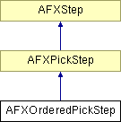

# AFXOrderedPickStep

此类用于在 GUI 过程中提供拾取步骤。

### AFXOrderedPickStep(owner, keyword, prompt, entitiesToPick, highlightLevel=1)

构造函数。
| **参数** | **类型** | **默认值** | **说明** |
| --- | --- | --- | --- |
| owner | AFXProcedure |  | 创建步骤的过程。 |
| keyword | AFXObjectKeyword |  | 包含拾取变量的对象关键字。作为 AFXGuiCommand 的一部分。 |
| prompt | String |  | 在提示区域显示的步骤提示。 |
| entitiesToPick | Int |  | 要拾取的实体类型。 |
| highlightLevel | Int | 1 | 高亮级别。 |

### onCancel()

当步骤被取消时调用。

从 AFXPickStep 重实现。

### onExecute()

调用以执行 getFirstStep 和 getNextStep 返回的步骤。

从 AFXPickStep 重实现。

### reset()

允许步骤在循环时重置其任何数据（如果需要）。

从 AFXPickStep 重实现。

