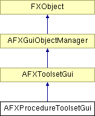

# AFXProcedureToolsetGui

此类是用于过程步骤（例如 Sketch 工具集）的工具集 GUI 的基类，并提供管理工具集 GUI 项目的接口。与 AFXProcedureToolsetGuiData 类结合使用时，它提供了一种在步骤执行时覆盖菜单栏、工具栏和工具箱 GUI 项目的机制。

### AFXProcedureToolsetGui()

反序列化。

### AFXProcedureToolsetGui(toolsetName)

构造函数。
| **参数** | **类型** | **默认值** | **说明** |
| --- | --- | --- | --- |
| toolsetName | String |  | 从派生工具集传入的工具集名称。 |

### swapInToolsetItems()

交换入工具集的 GUI 项目。

### swapOutToolsetItems()

交换出工具集的 GUI 项目。

### 类标志

### ** **

| **ID_LAST** | 不使用，不删除；供派生类使用。 |
| --- | --- |

