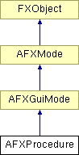

# AFXProcedure

此类为编写过程提供了基础。

### AFXProcedure(owner, type=NORMAL)

构造函数。
| **参数** | **类型** | **默认值** | **说明** |
| --- | --- | --- | --- |
| owner | AFXGuiObjectManager |  | 过程的所有者（模块或工具集）。 |
| type | typeEnum | NORMAL |  |

### activate()

激活模式。

从 AFXGuiMode 重实现。

### cancel(tgt=None, msg=0)

根据 checkCancel 结果尝试取消过程。
| **参数** | **类型** | **默认值** | **说明** |
| --- | --- | --- | --- |
| tgt | FXObject | None | 完成消息目标。 |
| msg | Int | 0 | 完成消息ID。 |

### checkBackup()

如果可以备份则返回 1，否则返回 0。

### checkCancel()

返回 BAILOUT_NOTOK、BAILOUT_OK、BAILOUT_WIP（写入消息区域）或 BAILOUT_SAVE（使用三按钮保存对话框）。

### commit()

当当前对话框调用 done 或 value changed 时提交过程。

实现 AFXGuiMode。

### continueMode()

用于获取模式中的下一步。

实现 AFXGuiMode。

### deactivate()

停用模式。

从 AFXGuiMode 重实现。

### getCurrentStep()

返回当前步骤。

### getFirstStep()

返回要执行的第一个步骤。

### getLoopStep()

返回过程在处理其命令后应循环返回的步骤；如果返回零（默认行为），则过程不会循环。

### getNextStep(previousStep)

返回要执行的下一个步骤；如果返回零，则过程将处理其命令。
| **参数** | **类型** | **默认值** | **说明** |
| --- | --- | --- | --- |
| previousStep | AFXStep |  | 上一步。 |

### getNumSteps()

返回步骤堆栈中的步骤数量。

### handleException(exc)

如果在发出命令时发生错误，则调用此方法。它可以在派生类中重实现以执行特殊的错误处理。
| **参数** | **类型** | **默认值** | **说明** |
| --- | --- | --- | --- |
| exc | nex_Exception |  | 异常。 |

### onBackup()

当过程备份一个步骤时调用。

### onCancel()

当过程取消时调用。

### onCmdBackup(sender, sel, ptr)

处理备份按钮激活的消息处理程序。
| **参数** | **类型** | **默认值** | **说明** |
| --- | --- | --- | --- |
| sender | FXObject |  | 发送者。 |
| sel | Int |  | 选择器。 |
| ptr | String |  | 数据。 |

### onCmdHandle2BtnBailout(sender, sel, ptr)

处理用户两按钮退出选择的消息处理程序。
| **参数** | **类型** | **默认值** | **说明** |
| --- | --- | --- | --- |
| sender | FXObject |  | 发送者。 |
| sel | Int |  | 选择器。 |
| ptr | String |  | 数据。 |

### onCmdHandleBailout(sender, sel, ptr)

处理用户三按钮退出选择的消息处理程序。
| **参数** | **类型** | **默认值** | **说明** |
| --- | --- | --- | --- |
| sender | FXObject |  | 发送者。 |
| sel | Int |  | 选择器。 |
| ptr | String |  | 数据。 |

### onResume()

当过程恢复时调用。

### onSuspend()

当过程暂停时调用。

### onValueChanged()

当过程步骤的值发生变化时调用。

### setCurrentDb(db)

设置模式的当前对话框。AFXDialogStep 会为此设置过程。
| **参数** | **类型** | **默认值** | **说明** |
| --- | --- | --- | --- |
| db | AFXDialog |  | 对话框。 |

### setSelectionOptions(pickDepth=CLOSEST, pickScope=ALL, dragShape=RECTANGLE, dragScope=INSIDE_CROSSING, isoLines=True)

设置用于拾取的选择选项。
| **参数** | **类型** | **默认值** | **说明** |
| --- | --- | --- | --- |
| pickDepth | pickDepthEnum | CLOSEST | 拾取的屏幕深度。 |
| pickScope | pickScopeEnum | ALL | 实体类型。 |
| dragShape | dragShapeEnum | RECTANGLE | 拖动窗口形状。 |
| dragScope | dragScopeEnum | INSIDE_CROSSING | 拖动窗口范围。 |
| isoLines | Bool | True | 如果为 True，则在曲面上显示等值线。 |

### verifyCurrentKeywordValues()

检查当前对话框的活动命令的关键字是否包含有效数据，如果没有，则发布带有错误消息的对话框。

从 AFXGuiMode 重实现。

### 类标志

### **消息ID。**

| **ID_HANDLE_2BTN_BAILOUT** | 处理退出的ID。 |
| --- | --- |
| **ID_BACKUP** | 备份按钮的ID。 |

### **拖动范围标志。**

| **INSIDE** | 只拾取拖动形状内部的实体。 |
| --- | --- |
| **INSIDE_CROSSING** | 拾取拖动形状内部和跨越的实体。 |
| **CROSSING** | 只拾取跨越拖动形状的实体。 |
| **OUTSIDE_CROSSING** | 拾取拖动形状外部和跨越的实体。 |
| **OUTSIDE** | 只拾取拖动形状外部的实体。 |

### **拖动形状标志。**

| **RECTANGLE** | 使用矩形拖动形状。 |
| --- | --- |
| **CIRCLE** | 使用圆形拖动形状。 |
| **POLYGON** | 使用多边形拖动形状。 |

### **拾取深度标志。**

| **CLOSEST** | 只拾取离屏幕最近的实体。 |
| --- | --- |
| **INFINITE** | 拾取任意深度的实体。 |

### **拾取范围标志。**

| **INTERIOR** | 只拾取内部实体。 |
| --- | --- |
| **EXTERIOR** | 只拾取外部实体。 |
| **ALL** | 拾取所有实体。 |

### **激活操作标志。**

| **NORMAL** | 取消当前正在运行的过程（默认）。 |
| --- | --- |
| **SUBPROCEDURE** | 暂停当前正在运行的过程。 |

