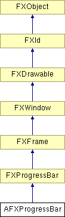

# AFXProgressBar

此类包含一个进度条，可以多种不同样式呈现工作进度。

### AFXProgressBar(p, tgt=None, sel=0, opts=FRAME_SUNKEN| FRAME_THICK, x=0, y=0, w=0, h=0, pl=DEFAULT_PAD, pr=DEFAULT_PAD, pt=DEFAULT_PAD, pb=DEFAULT_PAD)

构造函数。
| **参数** | **类型** | **默认值** | **说明** |
| --- | --- | --- | --- |
| p | FXComposite |  | 父组件。 |
| tgt | FXObject | None | 消息目标。 |
| sel | Int | 0 | 消息ID。 |
| opts | Int | FRAME_SUNKEN| FRAME_THICK | 选项和提示。 |
| x | Int | 0 | 起点X坐标。 |
| y | Int | 0 | 起点Y坐标。 |
| w | Int | 0 | 组件宽度。 |
| h | Int | 0 | 组件高度。 |
| pl | Int | DEFAULT_PAD | 左边距（边距）。 |
| pr | Int | DEFAULT_PAD | 右边距（边距）。 |
| pt | Int | DEFAULT_PAD | 顶部边距。 |
| pb | Int | DEFAULT_PAD | 底部边距。 |

### create()

创建进度条。

从 FXProgressBar 重实现。

### getBarStyle()

返回进度条样式。

从 FXProgressBar 重实现。

### getDefaultHeight()

返回默认高度。

从 FXProgressBar 重实现。

### getDefaultWidth()

返回默认宽度。

从 FXProgressBar 重实现。

### getNumCursorBoxes()

返回显示的光标框数量。

### getProgress()

返回当前进度。

从 FXProgressBar 重实现。

### getTotal()

返回总进度。

从 FXProgressBar 重实现。

### hide()

隐藏进度条。

从 FXWindow 重实现。

### hideNumber()

隐藏进度条迭代或百分比文本。

从 FXProgressBar 重实现。

### setBarStyle(style)

设置进度条样式。
| **参数** | **类型** | **默认值** | **说明** |
| --- | --- | --- | --- |
| style | Int |  | 样式标志。 |

### setNumCursorBoxes(nb)

设置要显示的光标框数量。
| **参数** | **类型** | **默认值** | **说明** |
| --- | --- | --- | --- |
| nb | Int |  | 框数量。 |

### setProgress(value)

设置当前进度，该进度被迭代或百分比模式下的进度条使用；在扫描器模式下，进度值被进度条忽略。

从 FXProgressBar 重实现。
| **参数** | **类型** | **默认值** | **说明** |
| --- | --- | --- | --- |
| value | Int |  |  |

### setTotal(value)

设置总进度，该进度被迭代或百分比模式下的进度条使用；在扫描器模式下，进度值被进度条忽略。

从 FXProgressBar 重实现。
| **参数** | **类型** | **默认值** | **说明** |
| --- | --- | --- | --- |
| value | Int |  |  |

### show()

显示进度条。

从 FXWindow 重实现。

### showNumber(style=AFXPROGRESSBAR_PERCENTAGE)

显示进度迭代或百分比文本。
| **参数** | **类型** | **默认值** | **说明** |
| --- | --- | --- | --- |
| style | Int | AFXPROGRESSBAR_PERCENTAGE | 样式标志。 |

### 类标志

### **消息ID。**

| **ID_TIMER** | 计时器的ID。 |
| --- | --- |

### 全局标志

### **进度条样式标志。**

| **AFXPROGRESSBAR_PERCENTAGE** | 百分比完成模式。 |
| --- | --- |
| **AFXPROGRESSBAR_HORIZONTAL** | 水平显示。 |
| **AFXPROGRESSBAR_VERTICAL** | 垂直显示。 |
| **AFXPROGRESSBAR_SCANNER** | 扫描器模式。 |
| **AFXPROGRESSBAR_ITERATOR** | 迭代器模式。 |

