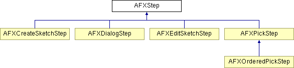

# AFXStep

此类是 GUI 过程中使用的步骤的基类。

### AFXStep(prompt, owner)

构造函数。
| **参数** | **类型** | **默认值** | **说明** |
| --- | --- | --- | --- |
| prompt | String |  | 提示。 |
| owner | AFXProcedure |  | 所有者。 |

### onCancel()

当步骤被取消时调用。

在 AFXCreateSketchStep、AFXDialogStep、AFXEditSketchStep、AFXOrderedPickStep 和 AFXPickStep 中重实现。

### onDone()

当步骤完成时调用。

### onExecute()

调用以执行 getFirstStep 和 getNextStep 返回的步骤。

在 AFXCreateSketchStep、AFXDialogStep、AFXEditSketchStep、AFXOrderedPickStep 和 AFXPickStep 中重实现。

### onResume()

当步骤恢复时调用。

在 AFXCreateSketchStep、AFXDialogStep、AFXEditSketchStep 和 AFXPickStep 中重实现。

### onSuspend()

当步骤被暂停时调用。

在 AFXCreateSketchStep、AFXDialogStep、AFXEditSketchStep 和 AFXPickStep 中重实现。

### onValueChanged()

当步骤的值发生变化时调用。

### reset()

允许步骤在循环时重置其任何数据（如果需要）。

在 AFXOrderedPickStep 和 AFXPickStep 中重实现。

