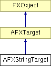

# AFXStringTarget

此类专为字符串目标设计。

### AFXStringTarget(initialValue='')

构造函数。
| **参数** | **类型** | **默认值** | **说明** |
| --- | --- | --- | --- |
| initialValue | String | '' | 初始值。 |

### getTypeName()

返回目标类型的名称（"String"）。

实现 AFXTarget。

### getValue()

返回目标的当前值。

### setValue(newValue)

设置目标的当前值。
| **参数** | **类型** | **默认值** | **说明** |
| --- | --- | --- | --- |
| newValue | String |  | 新值。 |

