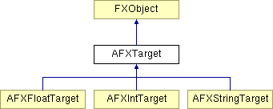

# AFXTarget

此类是所有目标对象的基类。

### AFXTarget()

构造函数。

### connect(value)

将数据与字符串变量关联。
| **参数** | **类型** | **默认值** | **描述** |
| --- | --- | --- | --- |
| value | String |  | 要关联的变量。 |

### connect(value)

将数据与浮点变量关联。
| **参数** | **类型** | **默认值** | **描述** |
| --- | --- | --- | --- |
| value | Float |  | 要关联的变量。 |

### connect(value)

将数据与整数变量关联。
| **参数** | **类型** | **默认值** | **描述** |
| --- | --- | --- | --- |
| value | Int |  | 要关联的变量。 |

### getSelector()

返回此目标对象的消息 ID。

### getTarget()

返回此目标对象的目标。

### getType()

返回目标类型；此方法在 Abaqus 6.6 中已弃用，其使用应由 getTypeName() 替代。

### getTypeName()

返回目标类型的名称。

在 AFXFloatTarget、AFXIntTarget 和 AFXStringTarget 中实现。

### setSelector(msgId)

设置此目标对象的消息 ID。
| **参数** | **类型** | **默认值** | **描述** |
| --- | --- | --- | --- |
| msgId | Int |  | 消息 ID。 |

### setTarget(target)

设置此目标对象的目标。
| **参数** | **类型** | **默认值** | **描述** |
| --- | --- | --- | --- |
| target | FXObject |  | 目标。 |

### 类标志

### **消息 ID。**

| **ID_LAST** | 最后一个 ID。 |
| --- | --- |

### **目标类型的标志。**

| **UNSPECIFIED** | 未指定。 |
| --- | --- |
| **INT** | 整数。 |
| **FLOAT** | 浮点数。 |
| **STRING** | 字符串。 |

