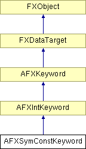

# AFXSymConstKeyword

此类专为具有符号常量值的命令关键字而设计。

### AFXSymConstKeyword(command, name, isRequired=False, defaultValue=0)

构造函数。
| **参数** | **类型** | **默认值** | **描述** |
| --- | --- | --- | --- |
| command | AFXCommand |  | 宿主命令。 |
| name | String |  | 关键字名称。 |
| isRequired | Bool | False | 如果关键字是命令的必需参数，则为 True。 |
| defaultValue | Int | 0 | 默认值。 |

### getTypeName()

返回关键字类型的名称。

从 AFXIntKeyword 重新实现。

### getValueAsString()

返回表示关键字当前值的文本字符串。

从 AFXIntKeyword 重新实现。

### setDefaultValue(defaultValue)

设置关键字的默认值。
| **参数** | **类型** | **默认值** | **描述** |
| --- | --- | --- | --- |
| defaultValue | Int |  | 默认值。 |

### setDefaultValueByString(defaultValueString)

设置关键字的默认值（如果给定的文本字符串有效则返回 True）。
| **参数** | **类型** | **默认值** | **描述** |
| --- | --- | --- | --- |
| defaultValueString | String |  | 文本字符串形式的默认值。 |

### setDefaultValueByString(defaultValueString)

设置关键字的默认值（如果给定的文本字符串有效则返回 True）。
| **参数** | **类型** | **默认值** | **描述** |
| --- | --- | --- | --- |
| defaultValueString | String |  | 文本字符串形式的默认值。 |

### setValue(newValue)

设置关键字的当前值。
| **参数** | **类型** | **默认值** | **描述** |
| --- | --- | --- | --- |
| newValue | Int |  | 新值。 |

### setValueByString(newValueString)

设置关键字的当前值（如果给定的文本字符串有效则返回 True）。
| **参数** | **类型** | **默认值** | **描述** |
| --- | --- | --- | --- |
| newValueString | String |  | 文本字符串形式的新值。 |

### setValueByString(newValueString)

设置关键字的当前值（如果给定的文本字符串有效则返回 True）。
| **参数** | **类型** | **默认值** | **描述** |
| --- | --- | --- | --- |
| newValueString | String |  | 文本字符串形式的新值。 |

### setValueToDefault(ignoreUnspecified=False)

将关键字值设置为其默认值。
| **参数** | **类型** | **默认值** | **描述** |
| --- | --- | --- | --- |
| ignoreUnspecified | Bool | False | 如果默认值为 unspecified，则忽略设置值。 |

