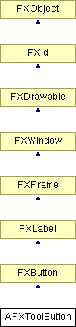

# AFXToolButton

此类包含一个用于工具栏或工具箱的按钮。

### AFXToolButton(p, label, icon=None, tgt=None, sel=0, asToggle=True)

构造函数。
| **参数** | **类型** | **默认值** | **描述** |
| --- | --- | --- | --- |
| p | FXComposite |  | 父 widget。 |
| label | String |  | 按钮标签。 |
| icon | FXIcon | None | 按钮图标。 |
| tgt | FXObject | None | 消息目标。 |
| sel | Int | 0 | 消息 ID。 |
| asToggle | Bool | True | 允许切换关闭行为。 |

