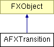

# AFXTransition

此类专为有限状态转换而设计，GUI（主要是对话框）可以定义这些转换以根据状态变化执行操作。构造函数的 前三个参数（keyword、op 和 refValue）定义了一个表达式（keyword.getValue() op refValue）。将关键字的当前值与参考值进行比较。当表达式求值为 True 时，将向指定的消息目标发送带有给定选择器的消息。

### AFXTransition(boolKeyword, op, refValue, tgt, sel, ptr=None)

构造函数。
| **参数** | **类型** | **默认值** | **描述** |
| --- | --- | --- | --- |
| boolKeyword | AFXBoolKeyword |  | 关键字。 |
| op | Operator |  | 运算符类型。 |
| refValue | Bool |  | 参考值。 |
| tgt | FXObject |  | 消息目标。 |
| sel | Int |  | 消息选择器。 |
| ptr | String | None | 消息数据。 |

### AFXTransition(floatKeyword, op, refValue, tgt, sel, ptr=None)

构造函数。
| **参数** | **类型** | **默认值** | **描述** |
| --- | --- | --- | --- |
| floatKeyword | AFXFloatKeyword |  | 关键字。 |
| op | Operator |  | 运算符类型。 |
| refValue | Float |  | 参考值。 |
| tgt | FXObject |  | 消息目标。 |
| sel | Int |  | 消息选择器。 |
| ptr | String | None | 消息数据。 |

### AFXTransition(intKeyword, op, refValue, tgt, sel, ptr=None)

构造函数。
| **参数** | **类型** | **默认值** | **描述** |
| --- | --- | --- | --- |
| intKeyword | AFXIntKeyword |  | 关键字。 |
| op | Operator |  | 运算符类型。 |
| refValue | Int |  | 参考值。 |
| tgt | FXObject |  | 消息目标。 |
| sel | Int |  | 消息选择器。 |
| ptr | String | None | 消息数据。 |

### AFXTransition(togKeyword, op, refValue, tgt, sel, ptr=None)

构造函数。
| **参数** | **类型** | **默认值** | **描述** |
| --- | --- | --- | --- |
| togKeyword | AFXTogglableKeyword |  | 关键字。 |
| op | Operator |  | 运算符类型。 |
| refValue | Bool |  | 参考值。 |
| tgt | FXObject |  | 消息目标。 |
| sel | Int |  | 消息选择器。 |
| ptr | String | None | 消息数据。 |

### AFXTransition(floatTarget, op, refValue, tgt, sel, ptr=None)

构造函数。
| **参数** | **类型** | **默认值** | **描述** |
| --- | --- | --- | --- |
| floatTarget | AFXFloatTarget |  | 目标。 |
| op | Operator |  | 运算符类型。 |
| refValue | Float |  | 参考值。 |
| tgt | FXObject |  | 消息目标。 |
| sel | Int |  | 消息选择器。 |
| ptr | String | None | 消息数据。 |

### AFXTransition(intTarget, op, refValue, tgt, sel, ptr=None)

构造函数。
| **参数** | **类型** | **默认值** | **描述** |
| --- | --- | --- | --- |
| intTarget | AFXIntTarget |  | 目标。 |
| op | Operator |  | 运算符类型。 |
| refValue | Int |  | 参考值。 |
| tgt | FXObject |  | 消息目标。 |
| sel | Int |  | 消息选择器。 |
| ptr | String | None | 消息数据。 |

### process(sender)

如果构造函数参数定义的表达式求值为 True，则返回 True 并发送消息；否则返回 False 且不执行任何操作。
| **参数** | **类型** | **默认值** | **描述** |
| --- | --- | --- | --- |
| sender | FXObject |  | 消息发送者。 |

### 类标志

### **指定转换运算符的标志。**

| **EQ** | 等于。 |
| --- | --- |
| **NE** | 不等于。 |
| **LT** | 小于。 |
| **LE** | 小于或等于。 |
| **GT** | 大于。 |
| **GE** | 大于或等于。 |

