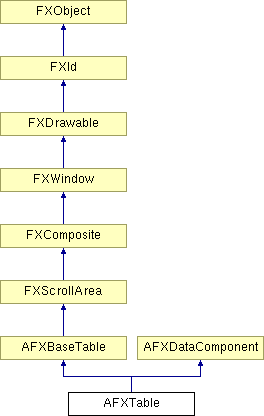

# AFXTable

此类实现一个可编辑的表。

### AFXTable(p, numVisRows, numVisColumns, numRows, numColumns, tgt=None, sel=0, opts=AFXTABLE_NORMAL, x=0, y=0, w=0, h=0, pl=4, pr=4, pt=DEFAULT_MARGIN, pb=DEFAULT_MARGIN)

构造函数。
| **参数** | **类型** | **默认值** | **描述** |
| --- | --- | --- | --- |
| p | FXComposite |  | 父 widget。 |
| numVisRows | Int |  | 要显示的行数。 |
| numVisColumns | Int |  | 要显示的列数。 |
| numRows | Int |  | 总行数（包括前导行）。 |
| numColumns | Int |  | 总列数（包括前导列）。 |
| tgt | FXObject | None | 消息目标。 |
| sel | Int | 0 | 消息 ID。 |
| opts | Int | AFXTABLE_NORMAL | 选项和提示。 |
| x | Int | 0 | 原点 X 坐标。 |
| y | Int | 0 | 原点 Y 坐标。 |
| w | Int | 0 | 表 widget 的宽度。 |
| h | Int | 0 | 表 widget 的高度。 |
| pl | Int | 4 | 左边距。 |
| pr | Int | 4 | 右边距。 |
| pt | Int | DEFAULT_MARGIN | 顶部边距。 |
| pb | Int | DEFAULT_MARGIN | 底部边距。 |

### addList(text, opts=AFXTABLE_LIST_NORMAL)

向表添加一个只有文本项的列表，并返回列表 ID。列表项的文本字符串由给定文本中的制表符"\\t"分隔。该列表由类型为 LIST 的项使用。
| **参数** | **类型** | **默认值** | **描述** |
| --- | --- | --- | --- |
| text | String |  | 制表符"\\t"分隔的文本字符串（例如"0\\t50\\t100\\t150"）。 |
| opts | Int | AFXTABLE_LIST_NORMAL | 选项。 |

### addList(opts=AFXTABLE_LIST_NORMAL)

向表添加一个列表，并返回列表 ID。该列表由类型为 LIST 的项使用。
| **参数** | **类型** | **默认值** | **描述** |
| --- | --- | --- | --- |
| opts | Int | AFXTABLE_LIST_NORMAL | 列表标志。 |

### appendClientPopupItem(text, icon=None, tgt=None, sel=0, alias=None)

向 MB3 弹出菜单追加一个客户端项。
| **参数** | **类型** | **默认值** | **描述** |
| --- | --- | --- | --- |
| text | String |  | 标签、加速键和帮助字符串（例如"Cu&t\\tCtl+X\\tCut selection to clipboard."）。 |
| icon | FXIcon | None | 要显示的图标。 |
| tgt | FXObject | None | 消息目标。 |
| sel | Int | 0 | 消息 ID。 |
| alias | String | None | 项别名。 |

### appendClientPopupSeparator()

向 MB3 弹出菜单追加一个客户端分隔符。

### appendListItem(listId, text, icon=None)

向指定的表列表追加一个项；返回新项的索引。
| **参数** | **类型** | **默认值** | **描述** |
| --- | --- | --- | --- |
| listId | Int |  | 要追加到的列表的 ID。 |
| text | String |  | 项的文本。 |
| icon | FXIcon | None | 项的图标。 |

### beginEdit(row, column)

如果项可编辑，则将指定的项设置为编辑模式。
| **参数** | **类型** | **默认值** | **描述** |
| --- | --- | --- | --- |
| row | Int |  | 项的行索引。 |
| column | Int |  | 项的列索引。 |

### cancelEdit()

取消编辑模式。

### clearClientPopupItems()

从 MB3 弹出菜单中移除所有客户端项。

### clearContents(startRow, startColumn, endRow, endColumn, clearEditableOnly=True)

清除指定范围内各项的文本。
| **参数** | **类型** | **默认值** | **描述** |
| --- | --- | --- | --- |
| startRow | Int |  | 开始清除的行。 |
| startColumn | Int |  | 开始清除的列。 |
| endRow | Int |  | 结束清除的行。 |
| endColumn | Int |  | 结束清除的列。 |
| clearEditableOnly | Bool | True | 指定 True 仅清除可编辑项的文本。 |

### clearListItems(listId)

从指定的表列表中移除所有项。
| **参数** | **类型** | **默认值** | **描述** |
| --- | --- | --- | --- |
| listId | Int |  | 要清除的列表的 ID。 |

### create()

创建服务器端资源。

从 AFXBaseTable 重新实现。

### deleteColumns(startColumn, numColumns=1, notify=False)

从指定列开始删除列。
| **参数** | **类型** | **默认值** | **描述** |
| --- | --- | --- | --- |
| startColumn | Int |  | 起始列。 |
| numColumns | Int | 1 | 要删除的列数。 |
| notify | Bool | False | 指定 True 通知目标删除操作。 |

### deleteRows(startRow, numRows=1, notify=False)

从指定行开始删除行。
| **参数** | **类型** | **默认值** | **描述** |
| --- | --- | --- | --- |
| startRow | Int |  | 起始行。 |
| numRows | Int | 1 | 要删除的行数。 |
| notify | Bool | False | 指定 True 通知目标删除操作。 |

### deselectItem(row, column)

取消选择指定的项。
| **参数** | **类型** | **默认值** | **描述** |
| --- | --- | --- | --- |
| row | Int |  | 项的行索引。 |
| column | Int |  | 项的列索引。 |

### deselectRow(row)

取消选择行中的所有项。
| **参数** | **类型** | **默认值** | **描述** |
| --- | --- | --- | --- |
| row | Int |  | 行索引。 |

### destroy()

销毁服务器端资源。

从 FXComposite 重新实现。

### detach()

分离服务器端资源。

从 AFXBaseTable 重新实现。

### disable()

禁用表和表中的表项。

从 FXWindow 重新实现。

### disableItem(row, column)

禁用指定的项。
| **参数** | **类型** | **默认值** | **描述** |
| --- | --- | --- | --- |
| row | Int |  | 项的行索引。 |
| column | Int |  | 项的列索引。 |

### enable()

启用表和表中的表项。

从 FXWindow 重新实现。

### enableItem(row, column)

启用指定的项。
| **参数** | **类型** | **默认值** | **描述** |
| --- | --- | --- | --- |
| row | Int |  | 项的行索引。 |
| column | Int |  | 项的列索引。 |

### getColumnAtX(x)

返回指定 x 坐标处的列；如果 x 在表之外，则返回 -1。
| **参数** | **类型** | **默认值** | **描述** |
| --- | --- | --- | --- |
| x | Int |  | X 坐标。 |

### getColumnSortOrder(column)

返回给定列的排序顺序。
| **参数** | **类型** | **默认值** | **描述** |
| --- | --- | --- | --- |
| column | Int |  | 列索引。 |

### getColumnWidth(column)

返回指定列的宽度（像素）。
| **参数** | **类型** | **默认值** | **描述** |
| --- | --- | --- | --- |
| column | Int |  | 列索引。 |

### getCurrentColumn()

返回当前项的列索引。

从 AFXBaseTable 重新实现。

### getCurrentRow()

返回当前项的行索引。

从 AFXBaseTable 重新实现。

### getCurrentSortColumn()

返回当前排序列；如果没有则返回 -1。

### getDefaultColumnWidth()

返回表的默认列宽（像素）。

### getDefaultHeight()

返回表的默认高度。

从 AFXBaseTable 重新实现。

### getDefaultRowHeight()

返回表的默认行高（像素）。

### getDefaultWidth()

返回表的默认宽度。

从 AFXBaseTable 重新实现。

### getFont()

获取表中所有文本项的字体。

从 AFXBaseTable 重新实现。

### getGridColor()

获取表中网格线的颜色。

从 AFXBaseTable 重新实现。

### getItemBackColor(row, column)

获取项的背景颜色。
| **参数** | **类型** | **默认值** | **描述** |
| --- | --- | --- | --- |
| row | Int |  | 项的行索引。 |
| column | Int |  | 项的列索引。 |

### getItemBoolValue(row, column)

返回类型为 BOOL 的项的值。
| **参数** | **类型** | **默认值** | **描述** |
| --- | --- | --- | --- |
| row | Int |  | 项的行索引。 |
| column | Int |  | 项的列索引。 |

### getItemColor(row, column)

返回类型为 COLOR 的项的颜色。颜色可以是"As is"、"Default"，或者是"RRGGBB"形式的颜色十六进制规范（例如"#0A1B2C"）。
| **参数** | **类型** | **默认值** | **描述** |
| --- | --- | --- | --- |
| row | Int |  | 项的行索引。 |
| column | Int |  | 项的列索引。 |

### getItemFloatValue(row, column)

返回类型为 FLOAT 的项的值。
| **参数** | **类型** | **默认值** | **描述** |
| --- | --- | --- | --- |
| row | Int |  | 项的行索引。 |
| column | Int |  | 项的列索引。 |

### getItemIcon(row, column)

返回类型为 ICON 的项的图标。
| **参数** | **类型** | **默认值** | **描述** |
| --- | --- | --- | --- |
| row | Int |  | 项的行索引。 |
| column | Int |  | 项的列索引。 |

### getItemIntValue(row, column)

返回类型为 INT 的项的值。
| **参数** | **类型** | **默认值** | **描述** |
| --- | --- | --- | --- |
| row | Int |  | 项的行索引。 |
| column | Int |  | 项的列索引。 |

### getItemListId(row, column)

返回类型为 LIST 的项的列表 ID。
| **参数** | **类型** | **默认值** | **描述** |
| --- | --- | --- | --- |
| row | Int |  | 项的行索引。 |
| column | Int |  | 项的列索引。 |

### getItemListIndex(row, column)

返回类型为 LIST 的项的列表索引（选择）。
| **参数** | **类型** | **默认值** | **描述** |
| --- | --- | --- | --- |
| row | Int |  | 项的行索引。 |
| column | Int |  | 项的列索引。 |

### getItemProvider()

返回此对象的项提供者。

### getItemSelector(row, column)

返回项的消息 ID。
| **参数** | **类型** | **默认值** | **描述** |
| --- | --- | --- | --- |
| row | Int |  | 项的行索引。 |
| column | Int |  | 项的列索引。 |

### getItemTarget(row, column)

返回项的目标。
| **参数** | **类型** | **默认值** | **描述** |
| --- | --- | --- | --- |
| row | Int |  | 项的行索引。 |
| column | Int |  | 项的列索引。 |

### getItemText(row, column)

返回类型为 TEXT 的项的文本。
| **参数** | **类型** | **默认值** | **描述** |
| --- | --- | --- | --- |
| row | Int |  | 项的行索引。 |
| column | Int |  | 项的列索引。 |

### getItemTextColor(row, column)

返回项的文本颜色。
| **参数** | **类型** | **默认值** | **描述** |
| --- | --- | --- | --- |
| row | Int |  | 项的行索引。 |
| column | Int |  | 项的列索引。 |

### getItemType(row, column)

返回项的类型。
| **参数** | **类型** | **默认值** | **描述** |
| --- | --- | --- | --- |
| row | Int |  | 项的行索引。 |
| column | Int |  | 项的列索引。 |

### getItemValue(row, column)

返回任何类型项的文本形式值。
| **参数** | **类型** | **默认值** | **描述** |
| --- | --- | --- | --- |
| row | Int |  | 项的行索引。 |
| column | Int |  | 项的列索引。 |

### getLeadingColumns()

返回表中的前导列数。

从 AFXBaseTable 重新实现。

### getLeadingFont()

返回前导行和前导列的字体。

### getLeadingRows()

返回表中的前导行数。

从 AFXBaseTable 重新实现。

### getListItemIcon(listId, index)

返回指定表列表中指定索引处的项的图标。
| **参数** | **类型** | **默认值** | **描述** |
| --- | --- | --- | --- |
| listId | Int |  | 列表的 ID。 |
| index | Int |  | 要返回的项在列表中的索引。 |

### getListItemText(listId, index)

返回指定表列表中指定索引处的项的文本。
| **参数** | **类型** | **默认值** | **描述** |
| --- | --- | --- | --- |
| listId | Int |  | 列表的 ID。 |
| index | Int |  | 要返回的项在列表中的索引。 |

### getNumColumns()

返回表中的列数（包括前导列）。

从 AFXBaseTable 重新实现。

### getNumEmptyRowsAtBottom()

返回表底部空（非尾随）行的数量。

### getNumListItems(listId)

返回指定表列表中的项数。
| **参数** | **类型** | **默认值** | **描述** |
| --- | --- | --- | --- |
| listId | Int |  | 列表的 ID。 |

### getNumRows()

返回表中的行数（包括前导行）。

从 AFXBaseTable 重新实现。

### getPopupOptions()

返回弹出菜单中要显示的菜单项标志。

### getPreferredColumnWidth(column, excludeTitle=True)

返回列所需的宽度。
| **参数** | **类型** | **默认值** | **描述** |
| --- | --- | --- | --- |
| column | Int |  | 列索引。 |
| excludeTitle | Bool | True | 指定 True 以忽略列的前导项和尾随项的宽度。 |

### getPreferredRowHeight(row)

返回行所需的高度（适用于多行标签）。
| **参数** | **类型** | **默认值** | **描述** |
| --- | --- | --- | --- |
| row | Int |  | 行索引。 |

### getRowAtY(y)

返回指定 y 坐标处的行；如果 y 在表之外，则返回 -1。
| **参数** | **类型** | **默认值** | **描述** |
| --- | --- | --- | --- |
| y | Int |  | Y 坐标。 |

### getRowHeight(row)

返回指定行的高度（像素）。
| **参数** | **类型** | **默认值** | **描述** |
| --- | --- | --- | --- |
| row | Int |  | 行索引。 |

### getSelBackColor()

获取表的选中背景颜色。

从 AFXBaseTable 重新实现。

### getSelTextColor()

获取表的选中文本颜色。

从 AFXBaseTable 重新实现。

### getStretchableColumn()

返回可拉伸列的索引。

### getTableStyle()

返回仅与表相关的选项。

### getVisibleColumns()

获取表中可见列数。

从 AFXBaseTable 重新实现。

### getVisibleRows()

获取表中可见行数。

从 AFXBaseTable 重新实现。

### insertColumns(startColumn, numColumns=1, notify=False)

在指定位置插入列。
| **参数** | **类型** | **默认值** | **描述** |
| --- | --- | --- | --- |
| startColumn | Int |  | 起始列。 |
| numColumns | Int | 1 | 要插入的列数。 |
| notify | Bool | False | 指定 True 通知目标插入操作。 |

### insertRows(startRow, numRows=1, notify=False)

在指定位置插入行。
| **参数** | **类型** | **默认值** | **描述** |
| --- | --- | --- | --- |
| startRow | Int |  | 起始行。 |
| numRows | Int | 1 | 要插入的行数。 |
| notify | Bool | False | 指定 True 通知目标插入操作。 |

### isAnyItemInColumnSelected(column)

如果列中的任何项被选中，则返回 True。
| **参数** | **类型** | **默认值** | **描述** |
| --- | --- | --- | --- |
| column | Int |  | 列索引。 |

### isAnyItemInRowSelected(row)

如果行中的任何项被选中，则返回 True。
| **参数** | **类型** | **默认值** | **描述** |
| --- | --- | --- | --- |
| row | Int |  | 行索引。 |

### isColumnSelected(column)

如果列中的所有项都被选中，则返回 True。
| **参数** | **类型** | **默认值** | **描述** |
| --- | --- | --- | --- |
| column | Int |  | 列索引。 |

### isColumnSortable(column)

如果给定列的项可以排序，则返回 True。
| **参数** | **类型** | **默认值** | **描述** |
| --- | --- | --- | --- |
| column | Int |  | 列索引。 |

### isItemBool(row, column)

如果指定的项是 BOOL 类型，则返回 True。
| **参数** | **类型** | **默认值** | **描述** |
| --- | --- | --- | --- |
| row | Int |  | 项的行索引。 |
| column | Int |  | 项的列索引。 |

### isItemColor(row, column)

如果指定的项是 COLOR 类型，则返回 True。
| **参数** | **类型** | **默认值** | **描述** |
| --- | --- | --- | --- |
| row | Int |  | 项的行索引。 |
| column | Int |  | 项的列索引。 |

### isItemEditable(row, column)

如果项可编辑，则返回 True。
| **参数** | **类型** | **默认值** | **描述** |
| --- | --- | --- | --- |
| row | Int |  | 项的行索引。 |
| column | Int |  | 项的列索引。 |

### isItemEmpty(row, column)

如果指定的项没有值，则返回 True。此方法检查指定项的实际内容，不考虑项的空项策略。
| **参数** | **类型** | **默认值** | **描述** |
| --- | --- | --- | --- |
| row | Int |  | 项的行索引。 |
| column | Int |  | 项的列索引。 |

### isItemIcon(row, column)

如果指定的项是 ICON 类型，则返回 True。
| **参数** | **类型** | **默认值** | **描述** |
| --- | --- | --- | --- |
| row | Int |  | 项的行索引。 |
| column | Int |  | 项的列索引。 |

### isItemList(row, column)

如果指定的项是 LIST 类型，则返回 True。
| **参数** | **类型** | **默认值** | **描述** |
| --- | --- | --- | --- |
| row | Int |  | 项的行索引。 |
| column | Int |  | 项的列索引。 |

### isItemSelected(row, column)

如果指定的项被选中，则返回 True。
| **参数** | **类型** | **默认值** | **描述** |
| --- | --- | --- | --- |
| row | Int |  | 项的行索引。 |
| column | Int |  | 项的列索引。 |

### isItemText(row, column)

如果指定的项是 TEXT 类型，则返回 True。
| **参数** | **类型** | **默认值** | **描述** |
| --- | --- | --- | --- |
| row | Int |  | 项的行索引。 |
| column | Int |  | 项的列索引。 |

### isItemVisible(row, column)

如果指定的项可见，则返回 True。
| **参数** | **类型** | **默认值** | **描述** |
| --- | --- | --- | --- |
| row | Int |  | 项的行索引。 |
| column | Int |  | 项的列索引。 |

### isRowSelected(row)

如果行中的所有项都被选中，则返回 True。
| **参数** | **类型** | **默认值** | **描述** |
| --- | --- | --- | --- |
| row | Int |  | 行索引。 |

### killFocus()

从此窗口移除焦点。

从 AFXBaseTable 重新实现。

### killSelection(notify=False)

取消选择表中的所有项；如果此方法取消选择任何先前选中的项，则返回 True。
| **参数** | **类型** | **默认值** | **描述** |
| --- | --- | --- | --- |
| notify | Bool | False | 指定 True 通知目标选择更改（带有 SEL_DESELECTED 消息）。 |

### layout()

布置表内容。

从 AFXBaseTable 重新实现。

### makePositionVisible(row, column)

滚动以使指定的行、列完全可见。
| **参数** | **类型** | **默认值** | **描述** |
| --- | --- | --- | --- |
| row | Int |  | 项的行索引。 |
| column | Int |  | 项的列索引。 |

### makeRowVisible(row)

仅垂直滚动以使指定的行完全可见。
| **参数** | **类型** | **默认值** | **描述** |
| --- | --- | --- | --- |
| row | Int |  | 行索引。 |

### moveContents(x, y)

滚动内容。
| **参数** | **类型** | **默认值** | **描述** |
| --- | --- | --- | --- |
| x | Int |  | X 方向滚动的距离。 |
| y | Int |  | Y 方向滚动的距离。 |

### recalc()

传播大小更改。

从 AFXBaseTable 重新实现。

### removeListItem(listId, index)

从指定表列表中移除指定索引处的项；返回列表中剩余的项数。
| **参数** | **类型** | **默认值** | **描述** |
| --- | --- | --- | --- |
| listId | Int |  | 要移除的列表的 ID。 |
| index | Int |  | 要移除的列表项的索引。 |

### selectItem(row, column)

选择指定的项。
| **参数** | **类型** | **默认值** | **描述** |
| --- | --- | --- | --- |
| row | Int |  | 项的行索引。 |
| column | Int |  | 项的列索引。 |

### selectRow(row)

选择行中的所有项。
| **参数** | **类型** | **默认值** | **描述** |
| --- | --- | --- | --- |
| row | Int |  | 行索引。 |

### setColumnBoolIcons(column, trueIcon=None, falseIcon=None)

设置类型为 BOOL 的列中所有现有项和未来项的 True 和 False 图标。为列指定 -1 将更改表中的所有列并为表设置默认值。
| **参数** | **类型** | **默认值** | **描述** |
| --- | --- | --- | --- |
| column | Int |  | 列索引。 |
| trueIcon | FXIcon | None | 值为 True 时显示的图标；0 = 默认图标。 |
| falseIcon | FXIcon | None | 值为 False 时显示的图标；0 = 默认图标。 |

### setColumnBoolValue(column, value)

设置类型为 BOOL 的列中所有现有项和未来项的值。为列指定 -1 将更改表中的所有列并为表设置默认值。
| **参数** | **类型** | **默认值** | **描述** |
| --- | --- | --- | --- |
| column | Int |  | 列索引。 |
| value | Bool |  | 指定 True 或 False。 |

### setColumnColor(column, color)

设置类型为 COLOR 的列中所有现有项和未来项的颜色。颜色可以是"As is"、"Default"、"RRGGBB"形式的颜色十六进制规范（例如"#0A1B2C"），或者是预定义的颜色名称（例如"Red"）。为列指定 -1 将更改表中的所有列并为表设置默认值。
| **参数** | **类型** | **默认值** | **描述** |
| --- | --- | --- | --- |
| column | Int |  | 列索引。 |
| color | String |  | 颜色。 |

### setColumnColorItemDefault(column, color)

设置类型为 COLOR 的列中所有显示"As is"或"Default"的现有项和未来项的颜色弹出菜单中颜色项的颜色。颜色或者是"RRGGBB"形式的颜色十六进制规范（例如"#0A1B2C"），或者是预定义的颜色名称（例如"Red"）。为列指定 -1 将更改表中的所有列并为表设置默认值。
| **参数** | **类型** | **默认值** | **描述** |
| --- | --- | --- | --- |
| column | Int |  | 列索引。 |
| color | String |  | 颜色。 |

### setColumnColorOptions(column, opts)

设置类型为 COLOR 的列中所有现有项和未来项的颜色弹出选项。为列指定 -1 将更改表中的所有列并为表设置默认值。
| **参数** | **类型** | **默认值** | **描述** |
| --- | --- | --- | --- |
| column | Int |  | 列索引。 |
| opts | Int |  | 选项（参见 ColorFlyoutOptions）。 |

### setColumnEditable(column, editable)

设置列中所有现有项和未来项的可编辑性。为列指定 -1 将更改表中的所有列并为表设置默认值。
| **参数** | **类型** | **默认值** | **描述** |
| --- | --- | --- | --- |
| column | Int |  | 列索引。 |
| editable | Bool |  | 指定 True 为可编辑，False 为只读。 |

### setColumnFloatValue(column, value)

设置类型为 FLOAT 的列中所有现有项和未来项的值。为列指定 -1 将更改表中的所有列并为表设置默认值。
| **参数** | **类型** | **默认值** | **描述** |
| --- | --- | --- | --- |
| column | Int |  | 列索引。 |
| value | Float |  | 浮点值。 |

### setColumnIcon(column, icon=None)

设置类型为 ICON 的列中所有现有项和未来项的图标。为列指定 -1 将更改表中的所有列并为表设置默认值。
| **参数** | **类型** | **默认值** | **描述** |
| --- | --- | --- | --- |
| column | Int |  | 列索引。 |
| icon | FXIcon | None | 图标。 |

### setColumnIntValue(column, value)

设置类型为 INT 的列中所有现有项和未来项的值。为列指定 -1 将更改表中的所有列并为表设置默认值。
| **参数** | **类型** | **默认值** | **描述** |
| --- | --- | --- | --- |
| column | Int |  | 列索引。 |
| value | Int |  | 整数值。 |

### setColumnJustify(column, justify)

设置列中所有现有项和未来项的对齐方式。为列指定 -1 将更改表中的所有列并为表设置默认值。
| **参数** | **类型** | **默认值** | **描述** |
| --- | --- | --- | --- |
| column | Int |  | 列索引。 |
| justify | Int |  | 对齐方式（参见 ItemJustify）。 |

### setColumnListId(column, listId)

设置类型为 LIST 的列中所有现有项和未来项的列表 ID。为列指定 -1 将更改表中的所有列并为表设置默认值。
| **参数** | **类型** | **默认值** | **描述** |
| --- | --- | --- | --- |
| column | Int |  | 列索引。 |
| listId | Int |  | 列表 ID。 |

### setColumnListIndex(column, index)

设置类型为 LIST 的列中所有现有项和未来项的列表索引（选择）。为列指定 -1 将更改表中的所有列并为表设置默认值。
| **参数** | **类型** | **默认值** | **描述** |
| --- | --- | --- | --- |
| column | Int |  | 列索引。 |
| index | Int |  | 要选择的项的索引。 |

### setColumnSortable(column, sortable)

设置列是否可排序。为列指定 -1 将更改表中的所有列并为表设置默认值。
| **参数** | **类型** | **默认值** | **描述** |
| --- | --- | --- | --- |
| column | Int |  | 列索引。 |
| sortable | Bool |  | 指定 True 为可排序，否则为 False。 |

### setColumnSortOrder(column, order)

设置给定列的排序顺序。为列指定 -1 将更改表中的所有列并为表设置默认值。
| **参数** | **类型** | **默认值** | **描述** |
| --- | --- | --- | --- |
| column | Int |  | 列索引。 |
| order | Int |  | 排序顺序（参见 SortOrder）。 |

### setColumnText(column, text)

设置类型为 TEXT 的列中所有现有项和未来项的文本。为列指定 -1 将更改表中的所有列并为表设置默认值。
| **参数** | **类型** | **默认值** | **描述** |
| --- | --- | --- | --- |
| column | Int |  | 列索引。 |
| text | String |  | 文本。 |

### setColumnType(column, type)

设置列的类型。为列指定 -1 将更改表中的所有列并为表设置默认值。
| **参数** | **类型** | **默认值** | **描述** |
| --- | --- | --- | --- |
| column | Int |  | 列索引。 |
| type | Int |  | 类型（参见项类型的标志）。 |

### setColumnWidth(column, width)

设置指定列的宽度（像素）。为列指定 -1 将更改表中的所有非前导和非尾随列并为表设置默认值。为宽度指定 -1 将调整每个指定列的宽度以最佳适应其前导项和尾随项中当前显示的标题宽度。
| **参数** | **类型** | **默认值** | **描述** |
| --- | --- | --- | --- |
| column | Int |  | 列索引。 |
| width | Int |  | 宽度（像素）。 |

### setColumnWidthInChars(column, numChars)

设置指定列的宽度（字符数）。为列指定 -1 将更改表中的所有非前导和非尾随列并为表设置默认值。
| **参数** | **类型** | **默认值** | **描述** |
| --- | --- | --- | --- |
| column | Int |  | 列索引。 |
| numChars | Int |  | 宽度（字符数）。 |

### setCurrentItem(row, column)

将指定的项设置为当前项。
| **参数** | **类型** | **默认值** | **描述** |
| --- | --- | --- | --- |
| row | Int |  | 项的行索引。 |
| column | Int |  | 项的列索引。 |

### setCurrentSortColumn(column)

设置当前排序列。给定的列必须是可排序的；否则当前排序列不会更改。
| **参数** | **类型** | **默认值** | **描述** |
| --- | --- | --- | --- |
| column | Int |  | 列索引。 |

### setDefaultBoolIcons(trueIcon=None, falseIcon=None)

设置表的默认 True 和 False 图标（0 = 默认图标）。
| **参数** | **类型** | **默认值** | **描述** |
| --- | --- | --- | --- |
| trueIcon | FXIcon | None | 值为 True 时显示的图标；0 = 默认图标。 |
| falseIcon | FXIcon | None | 值为 False 时显示的图标；0 = 默认图标。 |

### setDefaultBoolValue(value)

设置表的默认布尔值。
| **参数** | **类型** | **默认值** | **描述** |
| --- | --- | --- | --- |
| value | Bool |  | 指定 True 或 False。 |

### setDefaultColor(color)

设置表中所有类型为 COLOR 的项的默认颜色。颜色可以是"As is"、"Default"、"RRGGBB"形式的颜色十六进制规范（例如"#0A1B2C"），或者是预定义的颜色名称（例如"Red"）。
| **参数** | **类型** | **默认值** | **描述** |
| --- | --- | --- | --- |
| color | String |  | 颜色。 |

### setDefaultColumnWidth(width)

设置所有列的默认宽度（像素）。
| **参数** | **类型** | **默认值** | **描述** |
| --- | --- | --- | --- |
| width | Int |  | 宽度（像素）。 |

### setDefaultFloatValue(value)

设置表的默认浮点值。
| **参数** | **类型** | **默认值** | **描述** |
| --- | --- | --- | --- |
| value | Float |  | 浮点值。 |

### setDefaultIntValue(value)

设置表的默认整数值。
| **参数** | **类型** | **默认值** | **描述** |
| --- | --- | --- | --- |
| value | Int |  | 整数值。 |

### setDefaultJustify(justify)

设置表的默认对齐方式。
| **参数** | **类型** | **默认值** | **描述** |
| --- | --- | --- | --- |
| justify | Int |  | 对齐方式（参见 ItemJustify）。 |

### setDefaultRowHeight(height)

设置所有行的默认高度（像素）。
| **参数** | **类型** | **默认值** | **描述** |
| --- | --- | --- | --- |
| height | Int |  | 高度（像素）。 |

### setDefaultText(text)

设置表的默认文本。
| **参数** | **类型** | **默认值** | **描述** |
| --- | --- | --- | --- |
| text | String |  | 文本。 |

### setDefaultType(type)

设置表的默认类型。
| **参数** | **类型** | **默认值** | **描述** |
| --- | --- | --- | --- |
| type | Int |  | 类型（参见项类型的标志）。 |

### setEmptyItemDefault(defaultVal)

设置表的空项（如果其空项策略包含 DEFAULT_IF_EMPTY）使用的默认值（文本形式）。
| **参数** | **类型** | **默认值** | **描述** |
| --- | --- | --- | --- |
| defaultVal | String |  | 文本形式的默认值。 |

### setEmptyItemPolicy(policy)

设置处理表空项的策略（参见 EmptyItemPolicy）。
| **参数** | **类型** | **默认值** | **描述** |
| --- | --- | --- | --- |
| policy | Int |  | 处理空项的标志（参见 EmptyItemPolicy）。 |

### setFont(font)

设置表中所有文本项的字体。
| **参数** | **类型** | **默认值** | **描述** |
| --- | --- | --- | --- |
| font | FXFont |  | 字体。 |

### setGridColor(color)

设置表中网格线的颜色。
| **参数** | **类型** | **默认值** | **描述** |
| --- | --- | --- | --- |
| color | FXColor |  | 颜色。 |

### setItemBackColor(row, column, color)

使用 FXColor 设置项的背景颜色。
| **参数** | **类型** | **默认值** | **描述** |
| --- | --- | --- | --- |
| row | Int |  | 项的行索引。 |
| column | Int |  | 项的列索引。 |
| color | FXColor |  | 颜色索引。 |

### setItemBackColor(row, column, color)

使用字符串设置项的背景颜色。
| **参数** | **类型** | **默认值** | **描述** |
| --- | --- | --- | --- |
| row | Int |  | 项的行索引。 |
| column | Int |  | 项的列索引。 |
| color | String |  | 颜色名称。 |

### setItemBoolIcons(row, column, trueIcon=None, falseIcon=None)

设置类型为 BOOL 的项的 True 和 False 图标。
| **参数** | **类型** | **默认值** | **描述** |
| --- | --- | --- | --- |
| row | Int |  | 项的行索引。 |
| column | Int |  | 项的列索引。 |
| trueIcon | FXIcon | None | 值为 True 时显示的图标；0 = 默认图标。 |
| falseIcon | FXIcon | None | 值为 False 时显示的图标；0 = 默认图标。 |

### setItemBoolValue(row, column, value)

设置类型为 BOOL 的项的值。
| **参数** | **类型** | **默认值** | **描述** |
| --- | --- | --- | --- |
| row | Int |  | 项的行索引。 |
| column | Int |  | 项的列索引。 |
| value | Bool |  | 指定 True 或 False。 |

### setItemColor(row, column, color)

设置类型为 COLOR 的项的颜色。颜色可以是"As is"、"Default"、"RRGGBB"形式的颜色十六进制规范（例如"#0A1B2C"），或者是预定义的颜色名称（例如"Red"）。
| **参数** | **类型** | **默认值** | **描述** |
| --- | --- | --- | --- |
| row | Int |  | 项的行索引。 |
| column | Int |  | 项的列索引。 |
| color | String |  | 颜色。 |

### setItemEditable(row, column, editable)

设置项的可编辑性。
| **参数** | **类型** | **默认值** | **描述** |
| --- | --- | --- | --- |
| row | Int |  | 项的行索引。 |
| column | Int |  | 项的列索引。 |
| editable | Bool |  | 指定 True 为可编辑，False 为只读。 |

### setItemFloatValue(row, column, value)

设置类型为 FLOAT 的项的值。
| **参数** | **类型** | **默认值** | **描述** |
| --- | --- | --- | --- |
| row | Int |  | 项的行索引。 |
| column | Int |  | 项的列索引。 |
| value | Float |  | 浮点值。 |

### setItemIcon(row, column, icon=None)

设置类型为 ICON 的项的图标。
| **参数** | **类型** | **默认值** | **描述** |
| --- | --- | --- | --- |
| row | Int |  | 项的行索引。 |
| column | Int |  | 项的列索引。 |
| icon | FXIcon | None | 图标。 |

### setItemIntValue(row, column, value)

设置类型为 INT 的项的值。
| **参数** | **类型** | **默认值** | **描述** |
| --- | --- | --- | --- |
| row | Int |  | 项的行索引。 |
| column | Int |  | 项的列索引。 |
| value | Int |  | 整数值。 |

### setItemJustify(row, column, justify)

设置项的对齐方式。
| **参数** | **类型** | **默认值** | **描述** |
| --- | --- | --- | --- |
| row | Int |  | 项的行索引。 |
| column | Int |  | 项的列索引。 |
| justify | Int |  | 对齐方式（参见 ItemJustify）。 |

### setItemListId(row, column, listId)

设置类型为 LIST 的项的列表 ID。
| **参数** | **类型** | **默认值** | **描述** |
| --- | --- | --- | --- |
| row | Int |  | 项的行索引。 |
| column | Int |  | 项的列索引。 |
| listId | Int |  | 列表 ID。 |

### setItemListIndex(row, column, index)

设置类型为 LIST 的项的列表索引（选择）。
| **参数** | **类型** | **默认值** | **描述** |
| --- | --- | --- | --- |
| row | Int |  | 项的行索引。 |
| column | Int |  | 项的列索引。 |
| index | Int |  | 要选择的项的索引。 |

### setItemProvider(ip)

设置此对象的项提供者。
| **参数** | **类型** | **默认值** | **描述** |
| --- | --- | --- | --- |
| ip | FXObject |  | 项提供者。 |

### setItemSpan(row, column, numRows, numColumns)

设置前导项以跨越多行或多列。
| **参数** | **类型** | **默认值** | **描述** |
| --- | --- | --- | --- |
| row | Int |  | 项的行索引。 |
| column | Int |  | 项的列索引。 |
| numRows | Int |  | 要跨越的行数。 |
| numColumns | Int |  | 要跨越的列数。 |

### setItemTarget(row, column, tgt, msg=0)

设置项的目标和消息 ID。
| **参数** | **类型** | **默认值** | **描述** |
| --- | --- | --- | --- |
| row | Int |  | 项的行索引。 |
| column | Int |  | 项的列索引。 |
| tgt | FXObject |  | 目标。 |
| msg | Int | 0 | 消息 ID。 |

### setItemText(row, column, text)

设置类型为 TEXT 的项的文本。
| **参数** | **类型** | **默认值** | **描述** |
| --- | --- | --- | --- |
| row | Int |  | 项的行索引。 |
| column | Int |  | 项的列索引。 |
| text | String |  | 文本。 |

### setItemTextColor(row, column, color)

使用 FXColor 设置项的文本颜色。
| **参数** | **类型** | **默认值** | **描述** |
| --- | --- | --- | --- |
| row | Int |  | 项的行索引。 |
| column | Int |  | 项的列索引。 |
| color | FXColor |  | 颜色索引。 |

### setItemTextColor(row, column, color)

使用字符串设置项的文本颜色。
| **参数** | **类型** | **默认值** | **描述** |
| --- | --- | --- | --- |
| row | Int |  | 项的行索引。 |
| column | Int |  | 项的列索引。 |
| color | String |  | 颜色名称。 |

### setItemType(row, column, type)

设置项的类型。
| **参数** | **类型** | **默认值** | **描述** |
| --- | --- | --- | --- |
| row | Int |  | 项的行索引。 |
| column | Int |  | 项的列索引。 |
| type | Int |  | 类型（参见项类型的标志）。 |

### setItemValue(row, column, valueText)

设置任何可以解释其值的文本字符串的类型的项的值。如果指定项的值设置成功，则返回 True。
| **参数** | **类型** | **默认值** | **描述** |
| --- | --- | --- | --- |
| row | Int |  | 项的行索引。 |
| column | Int |  | 项的列索引。 |
| valueText | String |  | 项的文本形式值。 |

### setLeadingColumnLabels(str, column=0)

设置前导列的标签。注意：必须使用此 API 设置标题列标签，否则标签将被自动编号覆盖。
| **参数** | **类型** | **默认值** | **描述** |
| --- | --- | --- | --- |
| str | String |  | 制表符"\\t"分隔的列表，也可以包含换行符，表示标签包含多行文本（例如"Young's\\nModulus\\tPoisson's\\nRatio"）。 |
| column | Int | 0 | 列，此列必须先前已被指定为前导列（参见 setLeadingColumns）。 |

### setLeadingColumns(numColumns)

设置前导列数。
| **参数** | **类型** | **默认值** | **描述** |
| --- | --- | --- | --- |
| numColumns | Int |  | 列数。 |

### setLeadingFont(font)

设置前导行和前导列的字体。
| **参数** | **类型** | **默认值** | **描述** |
| --- | --- | --- | --- |
| font | FXFont |  | 字体。 |

### setLeadingRowLabels(str, row=0)

设置前导行的标签。注意：必须使用此 API 设置标题行标签，否则标签将被自动编号覆盖。
| **参数** | **类型** | **默认值** | **描述** |
| --- | --- | --- | --- |
| str | String |  | 制表符"\\t"分隔的列表，也可以包含换行符，表示标签包含多行文本（例如"Young's\\nModulus\\tPoisson's\\nRatio"）。 |
| row | Int | 0 | 行，此行必须先前已被指定为前导行（参见 setLeadingRows）。 |

### setLeadingRows(numRows)

设置前导行数。
| **参数** | **类型** | **默认值** | **描述** |
| --- | --- | --- | --- |
| numRows | Int |  | 行数。 |

### setListMaxVisible(maxVisible)

设置所有表列表中可见项的最大数量。
| **参数** | **类型** | **默认值** | **描述** |
| --- | --- | --- | --- |
| maxVisible | Int |  | 可见项的最大数量。 |

### setPopupOptions(opts)

设置弹出菜单中要显示的菜单项。
| **参数** | **类型** | **默认值** | **描述** |
| --- | --- | --- | --- |
| opts | Int |  | 选项。 |

### setRowHeight(row, height)

设置指定行的高度（像素）。
| **参数** | **类型** | **默认值** | **描述** |
| --- | --- | --- | --- |
| row | Int |  | 行索引。 |
| height | Int |  | 高度（像素）。 |

### setSelBackColor(color)

设置表的选中背景颜色。
| **参数** | **类型** | **默认值** | **描述** |
| --- | --- | --- | --- |
| color | FXColor |  | 颜色索引。 |

### setSelTextColor(color)

设置表的选中文本颜色。
| **参数** | **类型** | **默认值** | **描述** |
| --- | --- | --- | --- |
| color | FXColor |  | 颜色索引。 |

### setStretchableColumn(column)

设置可拉伸列。（此方法仅对最后一列有效。）
| **参数** | **类型** | **默认值** | **描述** |
| --- | --- | --- | --- |
| column | Int |  | 列索引。 |

### setTableSize(numRows, numColumns, notify=False)

设置表的大小。
| **参数** | **类型** | **默认值** | **描述** |
| --- | --- | --- | --- |
| numRows | Int |  | 行数。 |
| numColumns | Int |  | 列数。 |
| notify | Bool | False | 指定 True 通知目标更改。 |

### setTableStyle(style)

设置表选项。
| **参数** | **类型** | **默认值** | **描述** |
| --- | --- | --- | --- |
| style | Int |  | 样式标志（参见 AFX 表选项的标志）。 |

### setVisibleColumns(visibleColumns)

设置表中可见列数。
| **参数** | **类型** | **默认值** | **描述** |
| --- | --- | --- | --- |
| visibleColumns | Int |  | 可见列数。 |

### setVisibleRows(visibleRows)

设置表中可见行数。
| **参数** | **类型** | **默认值** | **描述** |
| --- | --- | --- | --- |
| visibleRows | Int |  | 可见行数。 |

### shadeReadOnlyItems(shadeItems)

如果向方法传递 True，则使表对只读项使用不同的（通常是阴影色的）背景颜色。如果向方法传递 False，则表对可编辑项和只读项使用相同的常规背景颜色。
| **参数** | **类型** | **默认值** | **描述** |
| --- | --- | --- | --- |
| shadeItems | Bool |  | 指定 True 对只读项使用不同的背景颜色。 |

### showHorizontalGrid(on=True)

控制表中水平网格线的显示。
| **参数** | **类型** | **默认值** | **描述** |
| --- | --- | --- | --- |
| on | Bool | True | 如果应显示网格线，则为 True。 |

### showVerticalGrid(on=True)

控制表中垂直网格线的显示。
| **参数** | **类型** | **默认值** | **描述** |
| --- | --- | --- | --- |
| on | Bool | True | 如果应显示网格线，则为 True。 |

### 类标志

### **弹出菜单项的标志。**

| **POPUP_NONE** | 不显示弹出菜单。 |
| --- | --- |
| **POPUP_CUT** | 显示"剪切"菜单项。 |
| **POPUP_COPY** | 显示"复制"菜单项。 |
| **POPUP_PASTE** | 显示"粘贴"菜单项。 |
| **POPUP_EDIT** | 用于指定多个菜单项的便捷标志。 |
| **POPUP_INSERT_ROW** | 显示"在之前/之后插入行"菜单项。 |
| **POPUP_INSERT_COLUMN** | 显示"在之前/之后插入列"菜单项。 |
| **POPUP_DELETE_ROW** | 显示"删除行"菜单项。 |
| **POPUP_DELETE_COLUMN** | 显示"删除列"菜单项。 |
| **POPUP_CLEAR_CONTENTS** | 显示"清除内容"和"清除表"菜单项。 |
| **POPUP_MODIFY_ROW** | 用于指定多个菜单项的便捷标志。 |
| **POPUP_MODIFY_COLUMN** | 用于指定多个菜单项的便捷标志。 |
| **POPUP_MODIFY** | 用于指定多个菜单项的便捷标志。 |
| **POPUP_READ_FROM_FILE** | 显示"从文件读取"菜单项。 |
| **POPUP_WRITE_TO_FILE** | 显示"写入文件"菜单项。 |
| **POPUP_FILE** | 显示"从文件读取"和"写入文件"菜单项。 |
| **POPUP_ALL** | 显示所有菜单项。 |

### **消息 ID。**

| **ID_CUT_SEL** | 剪切按钮的 ID。 |
| --- | --- |
| **ID_COPY_SEL** | 复制按钮的 ID。 |
| **ID_PASTE_SEL** | 粘贴按钮的 ID。 |
| **ID_ADD_COLUMN** | 插入列按钮的 ID。 |
| **ID_ADD_ROW** | 插入行按钮的 ID。 |
| **ID_DELETE_COLUMNS** | 删除列按钮的 ID。 |
| **ID_DELETE_ROWS** | 删除行按钮的 ID。 |
| **ID_CLEAR_SEL** | 清除内容按钮的 ID。 |
| **ID_CLEAR_TABLE** | 清除表按钮的 ID。 |
| **ID_READ_SEL** | 从文件读取按钮的 ID。 |
| **ID_WRITE** | 写入文件按钮的 ID。 |
| **ID_FILE_DB** | 从文件读取按钮使用的 ASCII 文件数据读取对话框的 ID。 |
| **ID_READ_WARNING** | "数据被截断"警告对话框的 ID。 |
| **ID_WRITE_FILE_DB** | 写入文件按钮使用的文件选择对话框的 ID。 |
| **ID_CONFIRM_WRITE** | "确定覆盖？"警告对话框的 ID。 |

### **颜色弹出按钮的标志（用于类型为 COLOR 的项）。**

| **COLOR_INCLUDE_COLOR_ONLY** | 颜色项的弹出按钮中没有 As Is 和 Default。 |
| --- | --- |
| **COLOR_INCLUDE_AS_IS** | 颜色项的弹出按钮中有 As Is。 |
| **COLOR_INCLUDE_DEFAULT** | 颜色项的弹出按钮中有 Default。 |
| **COLOR_INCLUDE_ALL** | 颜色项的弹出按钮中有 As Is 和 Default。这是默认选项。 |

### **AFXTable 值检索和错误检查 API 处理空项方式的标志**

| **DISALLOW_EMPTY** | 不允许项为空（默认）。 |
| --- | --- |
| **ALLOW_EMPTY** | 允许项为空。 |
| **DEFAULT_IF_EMPTY** | 允许项为空，并使用该项的默认值。 |
| **IGNORE_BOTTOM_EMPTY_ROWS** | 排除表底部的空行（默认）。 |
| **KEEP_BOTTOM_EMPTY_ROWS** | 包含表底部的空行。 |

### **项对齐的标志。**

| **LEFT** | 左对齐。 |
| --- | --- |
| **RIGHT** | 右对齐。 |
| **CENTER** | 居中对齐（水平）。 |
| **TOP** | 顶部对齐。 |
| **BOTTOM** | 底部对齐。 |
| **MIDDLE** | 中间对齐（垂直）。 |

### **项类型的标志。**

| **TEXT** | 项通过文本字段接受文本字符串。 |
| --- | --- |
| **FLOAT** | 项通过文本字段接受浮点数。 |
| **INT** | 项通过文本字段接受整数。 |
| **LIST** | 项从列表接受输入。 |
| **BOOL** | 项是布尔值；显示为图标。 |
| **ICON** | 项显示图标，不接受输入。 |
| **COLOR** | 项通过颜色弹出按钮接受颜色选择。 |

### **实数格式的标志。**

| **GENERAL** | 通用。 |
| --- | --- |
| **SCIENTIFIC** | 科学计数法。 |
| **AUTOMATIC** | 自动。 |

### **对列中的项进行排序的标志。**

| **SORT_INACTIVE** | 当前该列不活动排序。 |
| --- | --- |
| **SORT_ASCENDING** | 按升序排列该列的项。 |
| **SORT_DESCENDING** | 按降序排列该列的项。 |

### 全局标志

### **AFX 表选项的标志。**

| **AFXTABLE_COLUMN_RESIZABLE** | 允许用户调整列大小。 |
| --- | --- |
| **AFXTABLE_ROW_RESIZABLE** | 允许用户调整行大小。 |
| **AFXTABLE_RESIZE** | 允许用户调整行和列的大小。 |
| **AFXTABLE_NO_COLUMN_SELECT** | 禁止列选择（选择列中的标题/页脚项会选中整列）。 |
| **AFXTABLE_NO_ROW_SELECT** | 禁止行选择（选择行中的标题/页脚项会选中整行）。 |
| **AFXTABLE_ROW_MODE** | 选择行中的任何项会选中整行。 |
| **AFXTABLE_EXTENDED_SELECT** | 使用扩展选择模式，允许选择多项并允许用户拖动选择一系列项。 |
| **AFXTABLE_SINGLE_SELECT** | 使用单一选择模式，最多允许选择一项。 |
| **AFXTABLE_BROWSE_SELECT** | 使用浏览选择模式，强制始终只选择一项。 |
| **AFXTABLE_EDITABLE** | 表可编辑。 |
| **AFXTABLE_NORMAL** | 默认表选项——使用扩展选择模式，列可调整大小，布局填充 X 和 Y 方向。 |

### **表的列表标志（用于类型为 LIST 的项）。**

| **AFXTABLE_LIST_PRESELECT_NONE** | 不预选择任何列表项。 |
| --- | --- |

