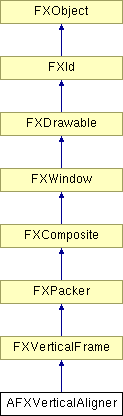

# AFXVerticalAligner

此类用于自动垂直对齐其子"容器"widget（例如 AFXTextField 或 AFXComboBox）。垂直对齐器的每个子项的容器中第一个 widget 的宽度被设置为所有垂直对齐器子项中最宽第一个 widget 的宽度。

### AFXVerticalAligner(p, opts=0, x=0, y=0, w=0, h=0, pl=0, pr=0, pt=0, pb=0, hs=DEFAULT_SPACING, vs=DEFAULT_SPACING)

构造函数。
| **参数** | **类型** | **默认值** | **描述** |
| --- | --- | --- | --- |
| p | FXComposite |  | 父 widget。 |
| opts | Int | 0 | 选项和提示。 |
| x | Int | 0 | 原点 X 坐标。 |
| y | Int | 0 | 原点 Y 坐标。 |
| w | Int | 0 | widget 宽度。 |
| h | Int | 0 | widget 高度。 |
| pl | Int | 0 | 左边距。 |
| pr | Int | 0 | 右边距。 |
| pt | Int | 0 | 顶部边距。 |
| pb | Int | 0 | 底部边距。 |
| hs | Int | DEFAULT_SPACING | 水平间距。 |
| vs | Int | DEFAULT_SPACING | 垂直间距。 |

### create()

创建对齐器。

从 FXComposite 重新实现。

### getDefaultHeight()

返回默认高度。

从 FXVerticalFrame 重新实现。

### getDefaultWidth()

返回默认宽度。

从 FXVerticalFrame 重新实现。

